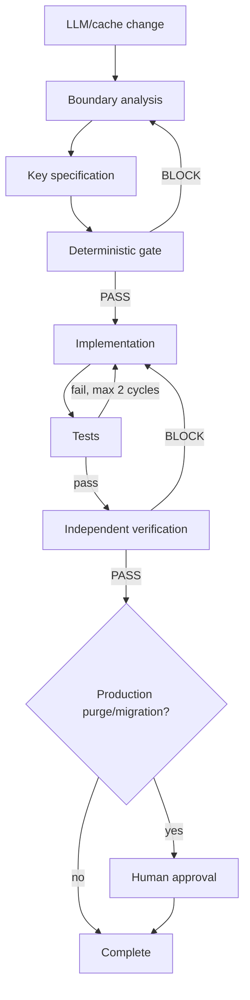

# Agent LLM Cache Key Contamination Gate

## Problem
LLM response caching can accidentally reuse output across different prompts, model settings, tool schemas, tenants, users, authorization scopes, or retrieval datasets when the cache key omits response-affecting context. The result may be incorrect answers, stale behavior, or cross-tenant/cross-user data exposure.

## Purpose
This package provides a reusable, tool-neutral workflow for discovering cache isolation boundaries, designing deterministic privacy-preserving keys, validating requests with executable policy checks, testing separation invariants, and requiring independent verification before rollout.

## When to use
Use when adding or changing response caching, semantic caching, RAG caching, tool-using-agent caching, model gateway caching, or when investigating a suspected cache contamination incident.

## When not to use
Do not use this as a substitute for authorization. A cache hit must still be subject to the same authorization guarantees as a cache miss. Do not use it to mutate or purge production caches without explicit approval.

## Architecture


## Package tree
```text
agent-llm-cache-key-contamination-gate/
├── README.md
├── config/
│   └── cache-policy.yaml
├── schemas/
│   └── cache-request.schema.json
├── scripts/
│   ├── cache_key_gate.py
│   └── verify_package.py
├── tests/
│   └── test_cache_key_gate.py
├── skills/
│   ├── cache-boundary-analysis.md
│   └── cache-key-design.md
├── rules/
│   └── cache-safety.md
├── subagents/
│   ├── cache-boundary-reviewer.md
│   └── cache-verification-agent.md
├── workflows/
│   └── cache-contamination-gate.md
├── hooks/
│   └── lifecycle.md
├── templates/
│   └── cache-review-report.md
└── examples/
    ├── request-safe.json
    └── request-cross-tenant-risk.json
```

## Component responsibilities
- `skills/cache-boundary-analysis.md`: trace prompt, identity, authorization, model, tool, and RAG boundaries.
- `skills/cache-key-design.md`: convert verified boundaries into deterministic key material and TTL policy.
- `rules/cache-safety.md`: enforce isolation, hashing, TTL, secret, and approval rules.
- `subagents/cache-boundary-reviewer.md`: independent read-only boundary discovery.
- `subagents/cache-verification-agent.md`: independent evidence-based verifier.
- `workflows/cache-contamination-gate.md`: bounded end-to-end process with retries, failures, approval points, and Definition of Done.
- `hooks/lifecycle.md`: deterministic pre-task, pre-change, post-edit, and final verification hooks.
- `scripts/cache_key_gate.py`: executable key generator/policy gate.
- `scripts/verify_package.py`: checks that every required package artifact exists and is non-empty.
- `config/cache-policy.yaml`: portable policy defaults.
- `schemas/cache-request.schema.json`: structured input contract.
- `tests/test_cache_key_gate.py`: deterministic isolation regression tests.
- `templates/cache-review-report.md`: evidence/report handoff contract.
- `examples/*.json`: safe comparison inputs demonstrating tenant separation.

## Installation
Requires Python 3.9+.

```bash
python -m pip install pyyaml pytest
```

No external service or secret is required to run the included gate and tests.

## Configuration
Edit `config/cache-policy.yaml` to match your environment. Keep tenant/data-scope isolation enabled unless a reviewed architecture proves the output is globally shareable. Increase the cache namespace/version when key semantics change.

Default key dimensions are model, system prompt hash, user prompt hash, tool schema hash, temperature, response format, tenant ID, and data scope. The executable script hashes prompt/tool material with SHA-256 and never places raw prompt text in the generated key.

## Permissions
Analysis and verification should run with repository read access plus permission to execute local tests. Production cache read/write, cache purge, production configuration changes, secret changes, or authorization changes are outside the default permission boundary and require explicit human approval.

## Usage
Validate the package:

```bash
python scripts/verify_package.py
```

Run a request through the cache-key gate:

```bash
python scripts/cache_key_gate.py --request examples/request-safe.json --policy config/cache-policy.yaml --output cache-gate-result.json
```

Run deterministic tests:

```bash
python -m pytest tests/test_cache_key_gate.py
```

## Example invocation for a coding agent
Use `workflows/cache-contamination-gate.md` as the orchestration entry point. First delegate repository exploration to the Cache Boundary Reviewer, then design/implement the smallest safe cache-key change, and finally delegate verification to the independent Cache Verification Agent. Stop before any production purge or namespace migration until explicit approval is present.

## Workflow guarantees
The workflow requires evidence-backed boundary discovery, missing required isolation context to BLOCK caching rather than fall back, deterministic key generation, bounded TTL, unit/integration evidence, at most two implementation correction cycles for validation failures, independent verification, and explicit approval for destructive or production-impacting cache operations.

## Input/output contract
Input is a structured cache request matching `schemas/cache-request.schema.json`. The gate returns `status`, `cache_key`, `ttl_seconds`, `key_material`, `errors`, and `warnings`. A workflow report should use `templates/cache-review-report.md` and separate confirmed evidence from assumptions and residual risks.

## Safety and approval boundaries
Explicit human approval is required before production cache purge or bulk deletion, production namespace migration that invalidates live entries, production configuration changes, permission or secret changes, weakening authorization/isolation rules, or production deployment when the surrounding repository process requires approval. The workflow must never increase permissions silently to unblock itself.

## Failure handling
- Missing tenant/data-scope or other required key context: BLOCK caching.
- Deterministic test failure: preserve evidence and allow at most two implementation correction cycles.
- Transient local/tool failure: retry the exact command once, then stop with environment/tool evidence.
- Production-only reproducibility: stop before access escalation and request the required approved access/process.
- Independent verifier BLOCK: do not report success.

## Verification
Evidence-based completion requires `python scripts/verify_package.py` to pass; `python -m pytest tests/test_cache_key_gate.py` to pass; same effective requests to produce the same key; configured isolation changes to produce different keys; missing required fields to block caching; TTL to remain within policy; no raw prompt/secret to appear in generated keys; relevant project tests to pass; independent verification to be PASS; and required approval to exist before production-destructive operations.

## Definition of Done
The workflow is complete only when required context was gathered, every relevant response and authorization boundary is evidence-backed, the cache key includes all mandatory dimensions, deterministic tests pass, the diff contains no unintended changes, no secret or raw prompt is exposed in key material/logging, TTL and namespace rules are satisfied, independent verification is PASS, required approvals are recorded, and no blocking failure remains.

## Customization
Extend `key_fields` for locale, feature flags, model reasoning mode, retrieval index version, safety policy version, or user identity when those inputs materially change responses or authorization. Add project-specific tests rather than weakening the core isolation tests. Keep tool/provider-specific adapters outside the core workflow unless materially required.
