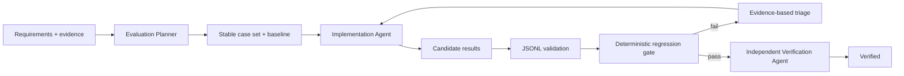

# Agent LLM Evaluation Regression Gate

Reusable gate for preventing prompt/model/context/tool changes from shipping when they silently reduce correctness, safety, format/tool behavior, latency, or cost efficiency.

## Problem
AI behavior can regress without compile failures. A prompt cleanup, model swap, retrieval change, tool schema edit, or memory change may improve a few examples while breaking critical workflows. Ad-hoc spot checks are difficult to reproduce and easy to overfit.

## Purpose
Establish a stable baseline/candidate contract, deterministic validation, bounded regression thresholds, explicit critical cases, independent verification, and approval boundaries around changes that could make the gate easier instead of making the system better.

## When to use
Use before merging or releasing behavior-affecting AI changes. It is especially useful for coding agents, support agents, tool-calling systems, RAG, structured output, routing, memory, and model migrations.

## When not to use
Do not use aggregate evaluation as proof of correctness for destructive production operations. Do not use unsanitized customer data. For purely deterministic non-AI code, ordinary tests may be the better primary gate.

## Package tree
```text
agent-llm-evaluation-regression-gate/
├── README.md
├── config/eval-gate.yaml
├── schemas/eval-result.schema.json
├── scripts/eval_gate.py
├── scripts/validate_eval_jsonl.py
├── skills/build-evaluation-corpus.md
├── skills/triage-regression.md
├── rules/evaluation-safety.md
├── subagents/evaluation-planner.md
├── subagents/implementation-agent.md
├── subagents/verification-agent.md
├── workflows/evaluation-regression-workflow.md
├── hooks/pre-evaluation.md
├── hooks/final-verification.md
├── examples/baseline.jsonl
├── examples/candidate.jsonl
└── tests/test_eval_gate.py
```

## Architecture


## Components
`build-evaluation-corpus.md` defines corpus construction. `triage-regression.md` diagnoses failures. `evaluation-safety.md` prevents gaming the gate. Three subagents separate planning, implementation, and verification. `eval_gate.py` computes release-blocking metrics. `validate_eval_jsonl.py` rejects malformed handoffs. Hooks define lifecycle enforcement.

## Installation
Requires Python 3.9+ and PyYAML. Install PyYAML with your normal dependency mechanism. For package self-tests, install pytest. Copy this directory into a repository and keep paths relative to the package root.

## Configuration
Edit `config/eval-gate.yaml` to reflect approved service SLOs and scoring dimensions. Threshold weakening, baseline replacement, or evaluator changes require explicit human approval. Do not store API keys in this file.

## Input contract
Each JSONL row contains a stable `case_id`, status (`pass|fail|error`), scoring `dimensions` from 0..1, optional latency/cost, `critical`, evidence strings, and optional error. Baseline and candidate must contain the same case IDs. The JSON Schema documents the row contract.

## Usage
Validate artifacts:
```bash
python scripts/validate_eval_jsonl.py examples/baseline.jsonl
python scripts/validate_eval_jsonl.py examples/candidate.jsonl
```

Run the gate:
```bash
python scripts/eval_gate.py --baseline examples/baseline.jsonl --candidate examples/candidate.jsonl --config config/eval-gate.yaml --out eval-gate-report.json
```

Run self-tests:
```bash
pytest -q tests/test_eval_gate.py
```

Exit codes from `eval_gate.py`: `0` verified metric gate pass; `2` regression detected; `3` invalid input/config/tooling failure. A zero exit code proves only the configured evaluation gate passed; repository-specific build/tests and independent verification are still required.

## Workflow
Follow `workflows/evaluation-regression-workflow.md`. Start with repository structure and relevant entry points, then nearby tests and evidence. Expand context only when evidence requires it. Facts, hypotheses, decisions, evidence, and open questions should remain distinct.

Transient infrastructure/tool failures may retry at most twice. Semantic failures are diagnosed rather than resampled until they pass. All failed evidence is preserved.

## Approval boundaries
Stop for human approval before baseline replacement, threshold weakening, evaluator changes, production model/config changes, deployment, destructive operations, secret/permission changes, breaking API/tool contracts, or weakening security controls. Least privilege is mandatory.

## Failure handling
Invalid JSONL blocks evaluation. Case-set mismatch blocks comparison. Critical regression blocks completion regardless of averages. Repeated transient failure stops after two retries with evidence. Ambiguous expected behavior is escalated instead of encoded as guessed ground truth.

## Verification
The Verification Agent independently reruns JSONL validation and the gate, checks relevant repository build/tests, inspects the diff for unexplained scope or gate manipulation, and confirms approvals. Implementation completion and verified completion are intentionally separate states.

## Definition of Done
- Baseline/candidate contain identical stable case IDs.
- Required dimensions exist and result artifacts validate.
- All critical cases pass.
- Configured pass-rate, score, latency, and cost thresholds pass.
- Relevant repository tests/build pass.
- Independent Verification Agent reports `verified`.
- No approval-required change lacks approval.
- Remaining non-blocking risks are documented.

## Customization
Add dimensions only when they map to observable behavior. Prefer deterministic assertions to model judging where possible. Add repository-specific runners that produce this JSONL contract rather than coupling the core gate to a specific AI vendor, allowing use with Codex, Claude Code, Cursor, ChatGPT, Copilot, OpenCode, or custom agents.
