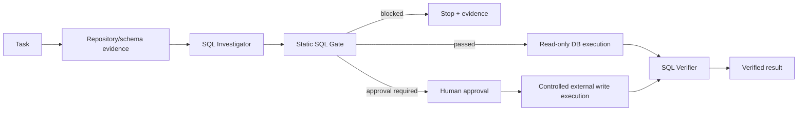

# Agent LLM-Generated SQL Safety Gate

Reusable guardrail for AI coding/operations agents that generate SQL. It separates SQL generation from execution authority, statically blocks dangerous patterns, routes writes to human approval, and requires independent evidence before completion.

## Problem
AI agents can produce syntactically plausible SQL while misunderstanding schema, tenant boundaries, row scope, environment, or destructive consequences. A prompt instruction such as “be careful” is not an execution boundary. This kit adds a deterministic pre-execution gate plus an evidence/approval workflow.

## When to use
Use when agents investigate databases, generate support/remediation SQL, diagnose production data, prepare data corrections, or hand SQL to database tools. It is especially useful where the same agent can otherwise generate and execute queries.

## When not to use
This is not a SQL parser, database firewall, migration framework, authorization system, or replacement for database-native least privilege. Do not use static analysis as proof that arbitrary SQL is semantically safe. Keep DB credentials and actual write execution outside this package.

## Architecture



The Python gate **never connects to a database and never executes SQL**. It emits `passed`, `blocked`, or `approval_required`. Database credentials remain governed by the host agent/platform.

## Package tree

```text
agent-llm-generated-sql-safety-gate/
├── README.md
├── config/policy.yaml
├── examples/safe-select.sql
├── examples/unsafe-update.sql
├── hooks/lifecycle.md
├── rules/sql-safety.md
├── schemas/gate-result.schema.json
├── scripts/sql_safety_gate.py
├── scripts/verify_package.py
├── skills/sql-change-review.md
├── skills/sql-investigation.md
├── subagents/sql-investigator.md
├── subagents/sql-verifier.md
├── templates/sql-request.md
├── tests/test_sql_safety_gate.py
└── workflows/sql-gated-execution.md
```

## Components
- `skills/sql-investigation.md`: evidence-first read-only investigation procedure.
- `skills/sql-change-review.md`: write review and approval-packet procedure.
- `rules/sql-safety.md`: enforceable agent boundaries.
- `subagents/sql-investigator.md`: SQL author/evidence collector without write authority.
- `subagents/sql-verifier.md`: independent reviewer/verifier.
- `workflows/sql-gated-execution.md`: bounded end-to-end workflow.
- `hooks/lifecycle.md`: pre-handoff, post-edit, pre-write, and final verification hooks.
- `scripts/sql_safety_gate.py`: deterministic static gate; no DB connectivity.
- `scripts/verify_package.py`: package integrity check.
- `config/policy.yaml`: portable policy configuration.
- `schemas/gate-result.schema.json`: machine-readable output contract.

## Installation
Requires Python 3.9+ and PyYAML.

```bash
python -m pip install pyyaml
```

Copy this directory into a repository. Keep the core instructions tool-neutral; wire lifecycle hooks into the coding-agent platform you use.

## Configuration
Edit `config/policy.yaml`. Important controls are environment aliases, blocked keywords, write operations requiring approval, maximum statement/query size, blocked/allowed schemas, and `block_production_writes`.

An empty `allowed_schemas` means the static gate does not enforce an allowlist. Populate it when agents should touch only named application schemas. Do not weaken policy automatically to unblock a task.

## Usage
Gate an agent-generated SQL file before any DB tool receives it:

```bash
python scripts/sql_safety_gate.py \
  --sql-file examples/safe-select.sql \
  --policy config/policy.yaml \
  --environment development \
  --output gate-result.json
```

Exit codes: `0` = passed, `2` = blocked, `4` = human approval required, `3` = gate/configuration error. The JSON always includes `executed: false` because the gate never executes SQL.

Try the unsafe example:

```bash
python scripts/sql_safety_gate.py --sql-file examples/unsafe-update.sql --policy config/policy.yaml --environment development
```

It is blocked because UPDATE lacks WHERE. A scoped UPDATE is not automatically safe: it returns `approval_required`. In a configured production environment, writes are blocked when `block_production_writes: true`.

## Agent integration
Give the agent `rules/sql-safety.md`, the relevant Skill, and `workflows/sql-gated-execution.md`. Configure the host so DB execution tools are downstream of the pre-SQL hook. Investigation credentials should be read-only. Do not give the investigator permission to change DB roles or production policy.

For a write request, the agent prepares the SQL and approval packet but stops. A human must approve the exact artifact/environment, and a separate controlled operator/mechanism performs the write. Editing the SQL invalidates approval.

## Input/output contract
Input is a SQL file, policy file, and explicit environment. Output follows `schemas/gate-result.schema.json` with one of three statuses. `findings` are blocking safety findings; `approvals` identify statements requiring human authorization.

Static scanning is intentionally conservative and not a full dialect-aware parser. Database-native permissions remain the final enforcement boundary.

## Approval boundaries
Explicit human approval is required for configured writes. Production writes are blocked by default. DROP/TRUNCATE/ALTER/GRANT/REVOKE and configured dangerous operations are blocked. Schema changes, destructive SQL, permission changes, secret changes, infrastructure changes, and security weakening are never silently authorized.

## Failure and recovery
Gate/config errors block execution. Retry an unchanged transient gate/tool failure once. Retry a transient read-only DB failure once. An investigation hypothesis may be revised at most twice, and every revision must pass through the gate again. Permission failures stop; agents never expand privileges automatically. Verification mismatch stops and escalates rather than triggering automatic compensation.

## Verification
Run:

```bash
python -m unittest tests/test_sql_safety_gate.py
python scripts/verify_package.py
```

For real tasks, package tests are necessary but insufficient. The SQL Verifier must reproduce the gate result, validate schema/scope assumptions, and verify read results or mutation postconditions using separately gated read-only queries.

## Definition of Done
A task is complete only when target environment and context were identified; the exact SQL artifact was gated; blocked SQL was not executed; required approval references the exact artifact/environment; execution authority remained least-privileged; independent verification completed; expected postconditions were proven; and unresolved risk is documented. “SQL generated” and “gate ran” are not completion.

## Customization
Add dialect-specific blocked operations and schema allowlists in `policy.yaml`. For stronger guarantees, replace or supplement the lexical scanner with a dialect-aware AST parser while preserving the same three-state contract. Integrate database-native read-only roles, statement timeouts, row-level security, transaction controls, and audited privileged execution outside this package rather than embedding credentials here.
