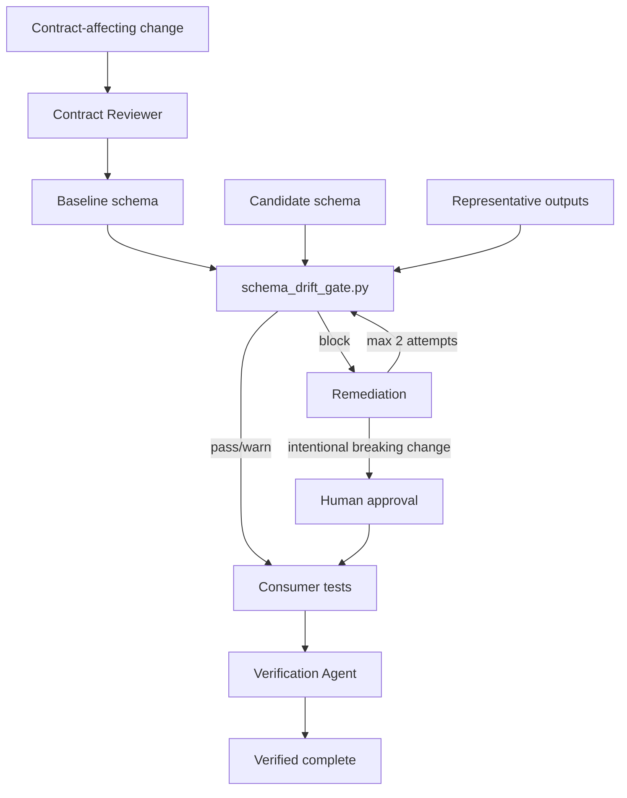

# Agent LLM Output Schema Drift Gate

Reusable implementation kit for detecting and controlling breaking changes in structured output produced by LLMs, coding agents, tool calls, and agent-to-agent handoffs.

## Problem
Structured AI output often behaves like an API contract even when it originates from prompts, response-format schemas, function/tool definitions, or agent instructions. A model, prompt, parser, or schema change can silently remove fields, add newly required fields, change types, narrow enums, or produce outputs that no longer validate. These failures frequently appear only after downstream parsers, workflows, databases, or other agents consume the output.

## Purpose
This package turns structured-output compatibility into a deterministic engineering gate. It combines schema comparison, sample validation, consumer-impact review, bounded remediation, human approval for intentional breaking changes, and independent verification.

## When to use
Use before merging or releasing changes to prompts, models, tool/function schemas, structured response formats, parsers, agent handoff contracts, or dependencies that may change machine-consumed AI output.

## When not to use
Do not use this package as a substitute for semantic-quality evaluation of free-form prose, model safety evaluation, or production deployment approval. It verifies structural compatibility, not factual correctness of arbitrary natural-language responses.

## Architecture



## Package tree

```text
agent-llm-output-schema-drift-gate/
├── README.md
├── config/
│   └── policy.yaml
├── schemas/
│   └── output-contract.schema.json
├── scripts/
│   ├── schema_drift_gate.py
│   └── verify_package.py
├── tests/
│   └── test_schema_drift_gate.py
├── skills/
│   ├── contract-baseline-review.md
│   └── drift-remediation.md
├── rules/
│   └── output-contract-safety.md
├── subagents/
│   ├── contract-reviewer.md
│   └── verification-agent.md
├── workflows/
│   └── schema-drift-gate.md
├── hooks/
│   └── lifecycle.md
├── templates/
│   └── change-approval.md
└── examples/
    ├── baseline.schema.json
    └── candidate-breaking.schema.json
```

## Component responsibilities
- `skills/contract-baseline-review.md` establishes an authoritative baseline from schemas, consumers, tests, and samples.
- `skills/drift-remediation.md` defines bounded repair and escalation behavior.
- `rules/output-contract-safety.md` defines enforceable MUST/MUST NOT/SHOULD constraints.
- `subagents/contract-reviewer.md` owns independent compatibility analysis.
- `subagents/verification-agent.md` independently verifies the final result.
- `workflows/schema-drift-gate.md` defines the complete trigger-to-verification workflow.
- `hooks/lifecycle.md` defines deterministic lifecycle checks.
- `scripts/schema_drift_gate.py` compares JSON Schemas and optionally validates representative outputs.
- `scripts/verify_package.py` confirms the package manifest is complete and non-empty.
- `config/policy.yaml` documents default compatibility and retry policy.
- `templates/change-approval.md` records approval for intentional breaking changes.
- `examples/` provides a reproducible breaking-change example.

## Dependencies
Core schema comparison requires Python 3.9+ and the standard library. Sample validation additionally requires `jsonschema`. Tests require `pytest`.

Install optional validation/test dependencies:

```bash
python -m pip install jsonschema pytest
```

## Configuration
`config/policy.yaml` defines the intended default policy: two remediation attempts, strict required-field/type compatibility, blocking field removal/type changes/enum narrowing/new required fields, and mandatory human approval for intentional breaking changes. The current Python gate implements these compatibility categories directly; if you adapt policy behavior, change the script and tests together.

## Permissions
The core gate only needs read access to schemas, samples, consumer code, and tests, plus write access to its local result file. Production logs should be read-only and must be redacted before storing fixtures. No production deployment, secret modification, destructive database operation, or permission escalation is authorized by this kit.

## Usage
Compare two schemas:

```bash
python scripts/schema_drift_gate.py \
  --baseline path/to/baseline.schema.json \
  --candidate path/to/candidate.schema.json \
  --out schema-drift-result.json
```

Validate representative outputs as well:

```bash
python scripts/schema_drift_gate.py \
  --baseline path/to/baseline.schema.json \
  --candidate path/to/candidate.schema.json \
  --samples path/to/samples.jsonl \
  --out schema-drift-result.json
```

Exit codes:
- `0`: pass or warn; no blocking incompatibility detected.
- `2`: blocking drift, invalid sample, or validator/tool error.
- `3`: malformed input or filesystem/JSON processing failure.

Run the package example:

```bash
python scripts/schema_drift_gate.py \
  --baseline examples/baseline.schema.json \
  --candidate examples/candidate-breaking.schema.json \
  --out schema-drift-result.json
```

The example should block because it removes `summary`, adds required `details`, narrows `status`, and changes `confidence` from number to string.

Run unit tests:

```bash
python -m pytest tests/test_schema_drift_gate.py
```

Verify the package manifest:

```bash
python scripts/verify_package.py
```

## Workflow
1. Identify the change trigger and affected structured-output contract.
2. Execute `skills/contract-baseline-review.md`.
3. Compare baseline and candidate schemas with `scripts/schema_drift_gate.py`.
4. Validate representative outputs when available.
5. Map every finding to affected consumers.
6. If blocked, execute `skills/drift-remediation.md`; maximum two attempts.
7. For intentional breaking changes, complete `templates/change-approval.md` and stop until explicit human approval exists.
8. Run parser, contract, integration, and relevant end-to-end tests.
9. Have the Verification Agent independently rerun the gate and inspect evidence.
10. Complete only when the Definition of Done is satisfied.

## Approval boundaries
Explicit human approval is required before intentionally removing contract fields, adding required fields, changing field types, narrowing enums, weakening validation, breaking public/cross-agent contracts, or coordinating irreversible consumer/data migrations. Approval in this package does not authorize production deployment, destructive SQL, secret changes, infrastructure changes, force pushes, or weakened security controls.

## Failure and recovery
- Deterministic compatibility or test failures return to remediation; maximum two remediation attempts.
- Clearly transient tool/environment failures may be retried once.
- Permission, approval, and business-rule failures are not automatically retryable.
- Every failed attempt should preserve schemas, gate output, and relevant test evidence.
- After two failed remediations, stop and escalate with evidence rather than looping autonomously.

## Verification
A task is not verified merely because a model returned valid JSON or because code was generated. Successful verification requires a non-blocking gate result, representative sample validation when supplied, passing affected consumer/parser tests, independent verification, required approvals, and no unintended contract changes.

## Definition of Done
- Authoritative baseline and candidate schemas are identified.
- Affected consumers are identified.
- Schema gate is non-blocking.
- Representative outputs validate when supplied.
- Relevant parser/contract/integration tests pass.
- Independent Verification Agent review is complete.
- Explicit approval exists for any intentional breaking change.
- Remaining risks are recorded.
- No blocking failure remains.

## Portability
The workflow is tool-neutral. It can be used with OpenAI Codex, Claude Code, Cursor, ChatGPT, GitHub Copilot, OpenCode, custom agents, or standard CI systems because the contract comparison and verification logic is implemented as repository assets rather than relying on a specific agent runtime.

## Customization
Adapt the baseline/candidate schema locations, repository-specific test commands, and allowed compatibility rules for your system. Keep breaking-change approval, bounded retries, independent verification, and evidence preservation intact unless an equally strict control replaces them.
