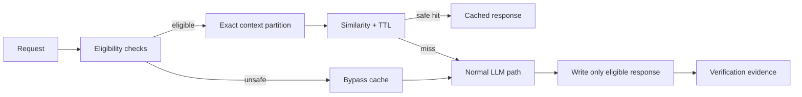

# Agent LLM Semantic Cache Safety Gate

A reusable implementation kit for preventing unsafe or stale semantic-cache hits in LLM applications. It addresses a common optimization failure: prompts that are textually similar are not necessarily interchangeable when tenant, authorization, system instructions, model, tools, schema, locale, sensitivity, side effects, or freshness differ.

## Problem
Semantic caching can reduce latency and token cost, but a similarity-only lookup can leak data across users/tenants, replay an answer created under different privileges or instructions, return stale behavior after prompt/tool/schema changes, or bypass required tool execution. This kit makes cache eligibility and reuse an explicit safety gate rather than an embedding-score shortcut.

## Purpose
Use deterministic policy checks before similarity lookup, exact partitioning for behavior-affecting context, bounded TTL, sensitive/mutation bypasses, adversarial tests, and independent verification.

## When to use
Use when introducing semantic caching for LLM responses, changing cache keys/TTL/thresholds, changing model/system prompt/tools/output schema, adding multi-tenant or authorization-aware behavior, or investigating suspicious cached answers.

## When not to use
Do not use semantic response caching for state-changing actions, approval decisions, deployments, purchases, data deletion, secret-bearing requests, or workflows whose correct result depends on live tool execution unless a separately reviewed design proves safe semantics.

## Architecture


## Package tree
```text
agent-llm-semantic-cache-safety-gate/
├── README.md
├── config/policy.json
├── schemas/cache-request.schema.json
├── scripts/semantic_cache_gate.py
├── scripts/verify_package.py
├── skills/cache-eligibility-investigation.md
├── skills/cache-hit-verification.md
├── rules/semantic-cache-safety.md
├── subagents/cache-explorer.md
├── subagents/cache-implementer.md
├── subagents/cache-verifier.md
├── workflows/semantic-cache-safety-workflow.md
├── hooks/pre-cache-decision.md
├── hooks/final-verification.md
├── examples/request.json
├── examples/entries.json
└── tests/run_tests.py
```

## Dependencies
Python 3.9+ and the Python standard library. The deterministic reference gate intentionally avoids external packages. Integrating it into a production embedding/vector store is application-specific; keep the same eligibility and partition rules around that adapter.

## Installation
Copy this directory into the target repository. Review `config/policy.json` against the application's actual authorization, tenancy, model, prompt, tool, schema and freshness behavior. Do not weaken defaults merely to increase hit rate.

## Configuration
`similarity_threshold` controls the reference token-set similarity gate. `max_entry_age_seconds` is the TTL ceiling. Exact-match flags define isolation dimensions. `allowed_purposes` limits caching to reviewed read-only classes. Sensitive-data, tool-call and mutation checks cause bypass before candidate reuse.

For a real embedding cache, replace only the similarity function/lookup adapter; retain exact context filtering, TTL, bypass checks, decision evidence and adversarial verification.

## Permissions
The kit requires read access to repository/configuration and permission to run local tests. It requires no production write access. Explicit human approval is required before weakening tenant/auth isolation, enabling cache reuse for side-effect/tool-executing requests, changing production security controls, or materially broadening sensitive-data eligibility.

## Usage
From the package root:

```bash
python scripts/semantic_cache_gate.py \
  --request examples/request.json \
  --entries examples/entries.json \
  --policy config/policy.json \
  --out semantic-cache-decision.json
```

The decision is one of `hit`, `miss`, or `bypass`. A bypass means the normal uncached path may continue if independently safe; it must never be converted into a cache hit.

Run verification:

```bash
python tests/run_tests.py
python scripts/verify_package.py
```

## Workflow
Follow `workflows/semantic-cache-safety-workflow.md`: Explorer gathers evidence, Implementer makes the smallest safe change, and Verifier independently challenges cache boundaries. Retry loops are bounded: transient tool failures get at most two retries; deterministic test failures get one remediation cycle followed by the full verification set.

## Input/output contract
The request contract requires purpose, tenant, authorization scope, model, system-prompt hash, toolset hash, schema version and prompt; locale and tool expectation are also supported. A decision includes a status and reason, and safe hits additionally include entry ID, similarity, response and request hash. Raw sensitive prompts should not be copied into telemetry.

## Safety boundaries
A request bypasses caching when required context is missing, purpose is not allowlisted, tools are expected, secret-like or personal data is detected, or mutation intent is detected. Candidate entries must satisfy TTL and every configured exact-match dimension before similarity can qualify them.

The built-in regexes are conservative guardrails, not a complete DLP system. Production systems handling regulated data should place their approved classifier/DLP control before this gate and treat uncertainty as bypass.

## Failure handling
Malformed policy/request/entry files block cache reuse. Missing context fails closed. Unsafe hits or cross-boundary matches are validation failures and are not retried. Transient command/tool failures may be retried twice. Repeated failures preserve evidence and stop verification rather than silently relaxing policy.

## Verification
`tests/run_tests.py` proves a normal same-context hit plus cross-tenant miss and bypasses for secrets, mutation intent and tool-capable requests. `scripts/verify_package.py` verifies required artifacts, policy validity and forbidden omission markers. Host repositories must additionally run their relevant build, unit/integration tests, formatting/static analysis and final diff inspection.

## Definition of Done
The task is verified only when repository context and answer-affecting dimensions are evidenced; cacheable purposes are read-only and allowlisted; tenant/auth/model/system/tool/schema/locale isolation matches policy; sensitive, mutation and tool-capable requests bypass; TTL and threshold checks are deterministic; adversarial and host tests pass; independent verification reports `verified`; required approvals exist; and no blocking risk remains.

## Customization
Adapt purpose allowlists, TTL, sensitivity classifiers and exact dimensions to the application. For vector similarity, use the production embedding store only after exact partition filtering. Add domain-specific adversarial fixtures whenever a new authorization scope, tool, retrieval source, response schema, feature flag, model or system prompt can alter the correct answer.
