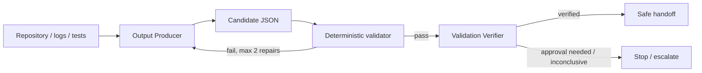

# Agent LLM Structured Output Validation Gate

A reusable gate for AI workflows where JSON produced by an LLM is consumed by code, another agent, CI, or an action runner. It prevents a common failure mode: output is syntactically JSON but violates the expected contract, contains unsupported claims, or reports `verified` despite failed semantic checks.

## Problem and trigger
Use this package when agent output crosses a machine boundary. Do not use it as a substitute for domain tests or when free-form prose is intentionally the final artifact.

## Architecture


## Package tree
```text
agent-llm-structured-output-validation-gate/
├── README.md
├── config/gate.json
├── schemas/agent-output.schema.json
├── skills/produce-validated-output.md
├── skills/repair-invalid-output.md
├── rules/output-safety.md
├── subagents/output-producer.md
├── subagents/validation-verifier.md
├── workflows/validated-output-loop.md
├── hooks/pre-handoff.md
├── scripts/validate_output.py
├── scripts/run_gate.py
├── examples/valid-output.json
└── tests/test_validator.py
```

## Installation
Requires Python 3.9+ and `jsonschema`:

```bash
python -m pip install jsonschema
```

Copy the package into a repository. Run commands from this package root, or update `config/gate.json` paths to match your integration.

## Configuration
`config/gate.json` selects the schema, fixes repair attempts at 2, rejects unknown fields, requires evidence for claims, and lists changes requiring human approval. Adapt the schema to your domain through review; never modify it merely to make a failing output pass.

## Usage
Validate the included example:

```bash
python scripts/run_gate.py examples/valid-output.json
```

Validate your agent result:

```bash
python scripts/run_gate.py path/to/agent-output.json
```

Run package tests:

```bash
python tests/test_validator.py
```

## Component responsibilities
The Output Producer gathers evidence and emits the candidate. The Validation Verifier independently runs the deterministic gate and checks evidence/status consistency. `validate_output.py` performs JSON Schema validation plus evidence linkage and verified-status semantic checks. `run_gate.py` loads configuration and invokes the validator. The pre-handoff hook blocks machine consumption on any gate failure.

## Workflow and recovery
Follow `workflows/validated-output-loop.md`. Syntax, schema and correctable evidence-link failures may enter `skills/repair-invalid-output.md`; maximum two repair attempts are allowed. Preserve validator stderr. Missing evidence becomes inconclusive unless evidence can actually be gathered. Tool/environment failure blocks handoff rather than being treated as a valid result.

## Approval boundaries
Explicit human approval is required before schema changes, validation weakening, production configuration changes, destructive operations, secret changes, breaking API contracts, irreversible migrations, infrastructure changes, or production deployment. The package never grants itself additional permissions.

## Verification
A task is executed when an output file has been produced. It is verified successfully only when the unchanged deterministic gate exits 0, every finding has evidence, and `verified` has both verification flags true. Domain-specific acceptance tests should be added before setting `semanticChecksPassed`.

## Definition of Done
- Required task evidence was gathered.
- Candidate JSON exists and matches the schema.
- Every finding ID has evidence.
- Deterministic gate exits 0.
- Domain semantic checks passed before status is `verified`.
- Required human approval exists for any approval-gated action.
- No blocking tool, permission, validation, or evidence failure remains.
- Remaining risks are represented by `failed`, `inconclusive`, or `needs_approval` rather than hidden.

## Portability
Core behavior is tool-neutral and can be used with Codex, Claude Code, Cursor, ChatGPT, GitHub Copilot, OpenCode, CI jobs, or custom agent runners. Integrations only need to write the candidate JSON and execute the gate before handoff.

## Customization
Add domain fields to the JSON Schema, then add deterministic semantic checks to `validate_output.py` or invoke project-native tests before setting `semanticChecksPassed`. Keep producer and verifier ownership separate for high-risk workflows.
