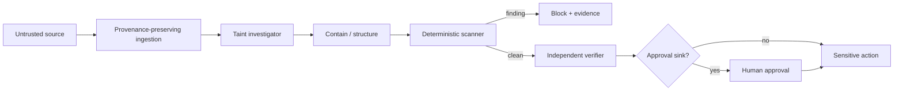

# Agent LLM Tool Output Taint Gate

Reusable security kit for preventing indirect prompt injection and untrusted tool output from becoming control instructions for coding agents.

## Problem
Coding agents routinely ingest web pages, issues, email, MCP results, logs, documents, and other tool output. That content may contain attacker-controlled instructions. If free-form content is copied into prompts or converted directly into shell, filesystem, Git, database, HTTP, secret, or deployment actions, data crosses into control authority without a trustworthy boundary.

## Purpose
Trace untrusted-data flow, preserve provenance, detect instruction/secret-like content deterministically, contain unsafe paths, and require independent evidence before sensitive actions.

## When to use
Use when adding or reviewing browsing/retrieval, MCP servers, issue/email automation, log/document analysis, autonomous tool selection, command generation, or any agent workflow where external content can precede a write/execute action.

## When not to use
It is not a general malware scanner, DLP product, or proof that arbitrary content is safe. Regex findings are a deterministic gate and evidence source; repository-specific typed validation and authorization remain required.

## Architecture


## Package tree
```text
agent-llm-tool-output-taint-gate/
├── README.md
├── config/policy.json
├── schemas/evidence.schema.json
├── scripts/scan-taint.py
├── scripts/verify-package.py
├── tests/test-scan-taint.py
├── examples/untrusted-tool-output.txt
├── skills/trace-untrusted-data.md
├── skills/contain-and-sanitize.md
├── rules/taint-safety.md
├── subagents/taint-investigator.md
├── subagents/independent-verifier.md
├── hooks/pre-sensitive-action.md
└── workflows/tool-output-taint-gate.md
```

## Dependencies
Python 3.9+ only; scripts use the standard library. The adopting repository may add its own build/test tools.

## Installation
Copy this directory into the repository. Review `config/policy.json` and align source/sink names with actual tool adapters. Keep the rules and workflow in the coding-agent instruction scope.

## Configuration
`untrusted_sources` defines externally controlled origins. `sensitive_sinks` defines actions requiring a taint boundary. `approval_sinks` always stop for explicit human approval. `max_retries` is fixed at 2 for transient tooling failures. Do not add allowlist entries merely to silence a finding.

## Permissions
The investigator and verifier require repository read/search and safe test execution. Implementation requires normal development write access only. The kit never requires production, secret, infrastructure, or force-push permission.

## Usage
Scan captured external content:

```bash
python3 scripts/scan-taint.py examples/untrusted-tool-output.txt --source web --json-out taint-evidence.json
```

Run scanner regression tests:

```bash
python3 -m unittest tests/test-scan-taint.py
```

Verify package structure/configuration:

```bash
python3 scripts/verify-package.py
```

For a real repository change, execute `workflows/tool-output-taint-gate.md`: investigator traces source-to-sink paths; implementation separates trusted control from untrusted data; the pre-sensitive-action hook blocks unsafe content; an independent verifier proves the boundary.

## Output contract
Verification status is one of `pass`, `blocked`, `needs-approval`, `failed`. Findings record source, sink, risk, evidence, and recommended action. `schemas/evidence.schema.json` provides the portable evidence shape.

## Approval boundaries
Explicit human approval is mandatory before deployment, secret reads, production/database writes, force push/history rewriting, production configuration changes, security weakening, destructive operations, breaking contracts, or irreversible migrations. Passing the scanner never grants that approval.

## Failure and recovery
Instruction/secret finding: block without blind retry. Transient scanner/test infrastructure failure: preserve evidence and retry at most twice. Permission failure: stop; never broaden permission automatically. Unknown source-to-sink path: remain blocked until evidence resolves it. Retry exhaustion produces `failed`.

## Verification
Success requires malicious fixtures to be blocked, benign fixtures to pass, affected repository tests/build to pass, sink arguments to originate from trusted task/configuration fields, provenance to survive handoffs, no unintended permission expansion, and independent verifier status `pass`.

## Definition of Done
Relevant sources and sinks are mapped; high/critical paths have evidence; containment exists before sensitive sinks; scanner and affected tests pass; package verification passes; independent verification passes; required human approvals exist; residual risks are documented; no blocking failure remains.

## Customization
Extend patterns conservatively in `scripts/scan-taint.py` or replace the scanner with a stronger deterministic engine while preserving exit semantics: `0` pass, `1` finding/block, `2` scanner/input failure. Extend policy source/sink labels to match local adapters. Keep tool-specific integration outside the core skills/rules so the workflow remains portable across coding agents.
