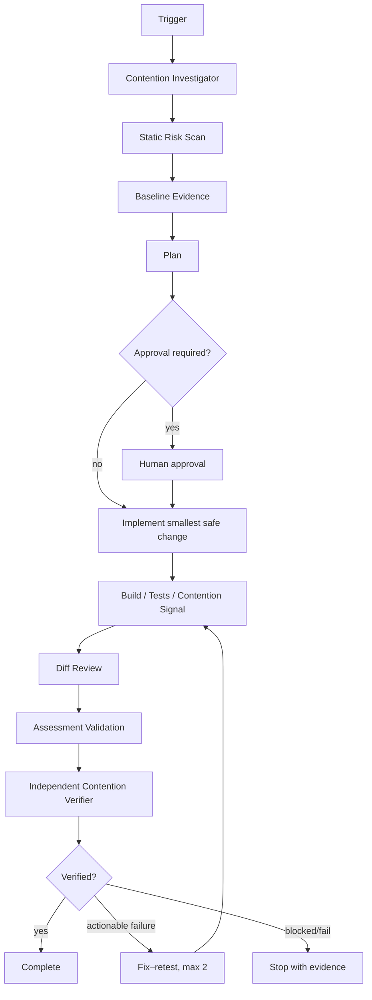

# Agent Lock Contention Regression Gate

Reusable AI engineering package for reviewing code changes that may introduce or worsen lock contention, deadlocks, starvation, blocking waits, or excessive synchronization scope.

## Problem

Concurrency changes often look locally correct while increasing time spent waiting on locks or holding synchronization across slow work. Typical regressions include:

- Lock scopes that expand over database, network, file, logging, or callback work.
- Blocking waits inside async execution paths.
- Multiple locks acquired in inconsistent order.
- Broad process-wide synchronization protecting state that could be partitioned.
- Semaphore or mutex use that serializes otherwise independent work.
- Performance fixes that remove synchronization but silently introduce races.

This kit adds a repeatable review gate that separates heuristic detection, evidence collection, implementation, and independent verification.

## Purpose

Use this package to determine whether a code change preserves concurrency correctness while avoiding measurable contention regressions. It combines deterministic scripts with structured agent procedures rather than relying on an ad-hoc prompt.

## When to use

Use when a task adds or modifies `lock`, `Monitor`, `SemaphoreSlim`, `Mutex`, `ReaderWriterLockSlim`, shared mutable state, async coordination, transaction-held work, worker serialization, queue consumers, or when production/local evidence suggests lock waiting or deadlock risk.

## When not to use

Do not use this package as a substitute for a full distributed-systems consistency review, database lock investigation, or production incident response when the dominant contention source is outside application-process synchronization. Those can still provide input evidence to this gate.

## Architecture



## Package tree

```text
agent-lock-contention-regression-gate/
├── README.md
├── config/
│   └── lock-contention.yaml
├── schemas/
│   └── assessment.schema.json
├── scripts/
│   ├── scan-lock-risk.py
│   └── validate-assessment.py
├── skills/
│   └── lock-contention-review.md
├── rules/
│   └── lock-safety.md
├── subagents/
│   ├── contention-investigator.md
│   └── contention-verifier.md
├── workflows/
│   └── lock-contention-gate.md
├── hooks/
│   └── lifecycle-hooks.md
├── examples/
│   └── sample-assessment.json
└── tests/
    └── self-test.py
```

## Component responsibilities

`config/lock-contention.yaml` defines retry limits, risk thresholds, approval boundaries, scan tokens, and mandatory verification properties.

`schemas/assessment.schema.json` defines the structured handoff contract used for findings, before/after evidence, status, and verification state.

`scripts/scan-lock-risk.py` performs a language-light heuristic scan for synchronization primitives, blocking waits, nearby I/O, and suspected nested locking. It returns exit code `1` when high-risk patterns are detected, `2` for invalid input/tool errors, and `0` otherwise.

`scripts/validate-assessment.py` enforces the assessment contract, including the rule that `pass` requires before/after evidence, all verification flags, and no unresolved high/critical finding.

`skills/lock-contention-review.md` is the reusable procedure for context gathering, evidence collection, remediation, testing, and handoff.

`rules/lock-safety.md` defines testable MUST, MUST NOT, and SHOULD behaviors.

`subagents/contention-investigator.md` owns exploration and hypothesis/evidence collection. `subagents/contention-verifier.md` independently verifies the final candidate and cannot rely on implementation claims alone.

`workflows/lock-contention-gate.md` defines the complete bounded workflow, failure paths, approval checkpoints, retry rules, and Definition of Done.

`hooks/lifecycle-hooks.md` defines automatic pre-task, post-edit, test, assessment-validation, and final-verification hooks.

`examples/sample-assessment.json` is a valid reference assessment. `tests/self-test.py` exercises the validator and verifies that the scanner flags a known blocking-wait fixture.

## Installation

Copy the package into your repository or agent instruction directory. Python 3.9+ is sufficient for the provided scripts; they use only the Python standard library.

No secrets, services, or network connectivity are required for the deterministic checks.

## Configuration

Edit `config/lock-contention.yaml` only when repository-specific policy differs. Keep `max_fix_retries` bounded. Extend scan tokens carefully because the scanner is intentionally heuristic and false positives should become investigation evidence rather than automatic code changes.

## Permissions

The default workflow requires read access to the repository and permission to run local build/tests. Write permission is needed only for approved implementation work.

Explicit human approval is required before:

- Production configuration changes.
- Database schema changes or destructive SQL.
- Weakening concurrency safety guarantees.
- Replacing synchronization with an unsafe lock-free design.
- Any other destructive or irreversible action introduced by the surrounding task.

The workflow must never silently increase permissions.

## Usage

From the package root, scan the target files or directories:

```bash
python scripts/scan-lock-risk.py ../../src --json
```

Create an assessment JSON using `schemas/assessment.schema.json` and the example as guidance, then validate it:

```bash
python scripts/validate-assessment.py examples/sample-assessment.json
```

Run the package self-test:

```bash
python tests/self-test.py
```

For an AI coding agent, provide the task scope and instruct it to follow `skills/lock-contention-review.md`, enforce `rules/lock-safety.md`, and execute `workflows/lock-contention-gate.md` with the roles defined under `subagents/`.

## Example invocation

```text
Review the current change for lock-contention regression risk.
Follow skills/lock-contention-review.md and workflows/lock-contention-gate.md.
Use rules/lock-safety.md as mandatory policy.
Run scripts/scan-lock-risk.py on the changed concurrency paths.
Produce an assessment matching schemas/assessment.schema.json.
Do not mark pass until subagents/contention-verifier.md can independently verify the evidence.
```

## Workflow summary

The investigator first maps the shared state and synchronization boundaries, then runs the static scanner and gathers a baseline contention signal. The implementation phase is permitted only after correctness invariants are understood. After the smallest safe change, the workflow reruns build/tests and a comparable contention signal, reviews the diff, validates the assessment, and hands the candidate to the independent verifier.

Fix–retest is bounded to two attempts. A transient tool error may be retried once. Missing reproducible evidence results in `blocked`, not an unsupported `pass`.

## Evidence expectations

Prefer deterministic or observable signals such as:

- Concurrency regression tests.
- Benchmark elapsed time under a fixed worker count.
- Lock wait duration or contention profiler output.
- Request throughput/latency under a comparable local load.
- Timeout/deadlock/starvation reproduction.
- Trace evidence showing time spent inside a critical section.

Before/after measurements must use materially comparable conditions. Scanner findings alone do not prove a contention problem.

## Failure and recovery

Tool or environment failures preserve the command output and stop after bounded retries. Build/test failures return to implementation only while the two-attempt budget remains. If contention cannot be reproduced and no credible equivalent signal is available, the workflow stops with `blocked`. Approval-required remediation stops with `needs-approval` before the dangerous action.

## Verification

A task can be marked `pass` only when all of the following are true:

- The assessment validates with `scripts/validate-assessment.py`.
- Relevant build and tests pass.
- A contention test or equivalent before/after signal exists.
- The candidate signal is non-regressed or improved under comparable conditions.
- Diff review finds no new race, deadlock, starvation, ordering, transaction, or public-contract problem.
- No unresolved high or critical finding remains.
- `subagents/contention-verifier.md` independently confirms the result.

Task execution without these checks is not verified success.

## Definition of Done

The package-specific Definition of Done is satisfied when required context has been gathered, scanner evidence is preserved, correctness invariants are documented, a candidate change (if required) exists, relevant build/tests pass, before/after evidence is available, the assessment validates, approval boundaries were respected, independent verification passed, and all remaining risks are documented with no blocking high/critical issue.

## Customization

Repositories can add language-specific scanners, profiler adapters, benchmark commands, or CI wrappers while keeping the core contract stable. Tool-specific integration should remain outside the core skill/rules/workflow unless it materially changes the verification model.

When adding custom hooks, keep the same principles: deterministic checks for deterministic facts, bounded retries, preserved evidence, least privilege, and explicit approval before dangerous actions.
