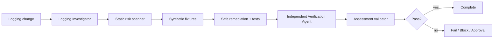

# Agent Log Redaction Integrity Gate

A reusable evidence-based package for preventing secrets and sensitive personal data from leaking through application logs while preserving the correlation context needed for debugging and incident response.

## Problem
Logging changes frequently introduce accidental leakage through request/response bodies, authorization headers, cookies, exception context, connection/configuration objects, telemetry enrichers, or structured properties. Simply deleting fields can also damage observability by removing trace, request, and correlation identifiers.

## Purpose
This gate combines deterministic scanning, synthetic fixture redaction, explicit agent responsibilities, bounded workflow retries, approval boundaries, and a machine-checkable assessment contract.

## When to use
Use for logging middleware, exception handlers, HTTP/message payload logging, audit/telemetry enrichers, structured logging changes, formatter changes, redaction changes, or investigation of a suspected logging leak.

## When not to use
Do not use this package to inspect or copy real production secrets/PII into tests or prompts. It does not replace provider-specific compliance review, retention policy, or secure log-access controls.

## Architecture


## Package tree
```text
agent-log-redaction-integrity-gate/
├── README.md
├── config/redaction-policy.json
├── schemas/assessment.schema.json
├── scripts/scan-logging-risks.py
├── scripts/redact-json.py
├── scripts/validate-assessment.py
├── skills/log-redaction-assessment.md
├── rules/log-redaction-safety.md
├── subagents/logging-investigator.md
├── subagents/verification-agent.md
├── workflows/log-redaction-gate.md
├── hooks/lifecycle-hooks.md
├── examples/assessment.json
└── tests/self-test.py
```

## Component responsibilities
`skills/log-redaction-assessment.md` defines the reusable assessment procedure. `rules/log-redaction-safety.md` provides enforceable MUST/MUST NOT/SHOULD rules. `subagents/logging-investigator.md` owns evidence collection; `subagents/verification-agent.md` independently verifies the result. `workflows/log-redaction-gate.md` defines the bounded end-to-end process. `scripts/scan-logging-risks.py` identifies suspicious logging patterns as hypotheses. `scripts/redact-json.py` provides deterministic structured-fixture redaction for testing/reference. `scripts/validate-assessment.py` validates completion requirements. `tests/self-test.py` verifies scanner, redaction, correlation preservation, and assessment validation.

## Dependencies
Python 3.9+ for bundled scripts. No third-party Python packages are required. Repository-specific build/test tooling remains unchanged.

## Installation
Copy this directory into a repository or agent-instruction location and preserve relative paths. Adjust `config/redaction-policy.json` only to make policy stricter or to add project-specific sensitive-field names and approved correlation fields.

## Configuration
`config/redaction-policy.json` defines secret/PII field-name patterns, `[REDACTED]` replacement text, approved correlation identifiers, maximum transient retry count (`2`), and approval-required actions.

The included redactor operates on JSON object keys. Application production redaction may be implemented differently; verification must exercise the actual application path where feasible. The bundled redactor is a deterministic fixture/reference tool, not proof that application middleware is safe.

## Permissions
Default operation is repository read/search plus local non-destructive scripts, tests, and builds. Production logging configuration, log sink changes, secret rotation/change, security-control changes, deployment, or data deletion require explicit human approval.

## Usage
Run the static scanner:

```bash
python3 scripts/scan-logging-risks.py /path/to/repository --output scan.json
```

Exit `0` means no heuristic hits, `1` means findings require contextual review, and `2` means invalid input/invocation.

For a synthetic JSON fixture, run:

```bash
python3 scripts/redact-json.py fixture.json --policy config/redaction-policy.json --output redacted.json
```

Then follow `skills/log-redaction-assessment.md` and `workflows/log-redaction-gate.md`, generate an assessment, and validate it:

```bash
python3 scripts/validate-assessment.py assessment.json
```

Run package self-test:

```bash
python3 tests/self-test.py
```

## Verification model
Verification uses synthetic sentinel values rather than real sensitive data. For each changed logging path, prove that secret and PII sentinel values are absent from emitted/sanitized output, while required correlation identifiers remain unchanged. Include success paths, nested objects/arrays, casing variations when relevant, and exception/error paths that may serialize more context.

A scanner finding is not proof of leakage. Conversely, a clean scanner is not proof of safety. `pass` requires all four assessment flags: `secret_fixture_tested`, `pii_fixture_tested`, `correlation_preserved`, and `raw_payload_logging_checked`.

## Approval boundaries
Stop before production configuration changes, logging sink/routing changes, secret changes, deployment, data deletion, security-control weakening, or any other organization-specific dangerous operation. Never increase permissions silently.

## Failure and recovery
Transient tool or test-environment failures may be retried at most twice. Preserve sanitized command output and fixture identifiers. Deterministic failures require diagnosis or a code/config change before rerun. If the real sink transformation cannot be safely reproduced and materially affects the proof, report `blocked` rather than assuming correctness.

## Definition of Done
The changed logging paths are mapped; sensitive and correlation fields are classified; scanner findings are reviewed; synthetic secret and PII fixtures are tested; raw payload/header and exception paths are checked; correlation identifiers remain usable; independent verification is complete; the assessment validates; required approvals are obtained; remaining risks are recorded; and no blocking failure remains for a `pass` verdict.

## Customization
Add field-name patterns specific to the repository, but avoid broad patterns that redact harmless operational context without evidence. Prefer centralized structured-property redaction and allowlists for high-risk payloads. Keep correlation IDs explicit so observability remains useful after security hardening.
