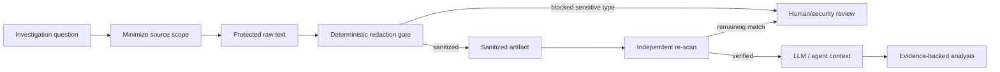

# Agent Log Redaction PII & Secrets Gate

Reusable safety gate for AI-assisted debugging, incident response, log analysis, and tool-output workflows. It minimizes evidence, deterministically redacts common secrets and personal data, blocks high-risk findings from automatic handoff, and verifies sanitized artifacts before they enter LLM context.

## Problem
Production logs and developer tool output often contain authorization headers, API keys, connection strings, email addresses, IP addresses, identifiers, or payload fragments. Copying that evidence directly into an AI agent, issue, PR, or chat creates an avoidable data-exposure path. Prompt instructions such as “do not reveal secrets” do not protect data that has already entered model context.

## Purpose
Put a deterministic boundary before AI context. The package never sends data externally. It reads a local text artifact, writes a separate sanitized artifact, emits a value-free report, and returns a blocking status when configured high-risk detector types are present.

## When to use
Use before AI-assisted production debugging, incident analysis, CI/log diagnosis, HTTP trace review, terminal-output analysis, support investigations, or any workflow that exports operational evidence from a more trusted system into a less trusted/shared context.

## When not to use
This is not a compliance certification tool, DLP platform, secret manager, binary dump parser, or guarantee of irreversible anonymization. Regex-based detection can miss novel formats and can generate false positives. Keep database/log-system access controls, source-side masking, retention policy, encryption, and least privilege as primary controls.

## Architecture



## Package tree

```text
agent-log-redaction-pii-secrets-gate/
├── README.md
├── config/redaction.yaml
├── examples/sample-unsafe.log
├── hooks/lifecycle.md
├── rules/sensitive-log-safety.md
├── schemas/redaction-report.schema.json
├── scripts/redact_logs.py
├── scripts/verify_package.py
├── skills/log-evidence-sanitization.md
├── skills/redaction-policy-tuning.md
├── subagents/evidence-collector.md
├── subagents/redaction-verifier.md
├── templates/evidence-request.md
├── tests/test_redact_logs.py
└── workflows/sanitize-before-llm.md
```

## Component responsibilities
- `scripts/redact_logs.py` performs deterministic text scanning/redaction and never connects to external services.
- `config/redaction.yaml` defines enabled detectors, blocking types, custom patterns, allowlists, replacement text, and input limits.
- `skills/log-evidence-sanitization.md` defines the evidence-minimization and safe-handoff procedure.
- `skills/redaction-policy-tuning.md` defines how to handle detector misses/noise using synthetic regression cases.
- `rules/sensitive-log-safety.md` defines enforceable MUST/MUST NOT/SHOULD boundaries.
- `subagents/evidence-collector.md` scopes and sanitizes evidence without changing source systems.
- `subagents/redaction-verifier.md` independently verifies the sanitized artifact before downstream use.
- `workflows/sanitize-before-llm.md` provides the bounded end-to-end process and retry policy.
- `hooks/lifecycle.md` defines deterministic pre-context, verification, policy-change, and final-evidence hooks.
- `schemas/redaction-report.schema.json` defines the safe report contract; reports intentionally exclude matched values.

## Installation
Requires Python 3.9+ and PyYAML.

```bash
python -m pip install pyyaml
```

Copy the package into a repository. No external service or credential is required by the redaction script.

## Configuration
Edit `config/redaction.yaml`.

Important settings:
- `scan_types`: built-in detector types to run.
- `block_on_types`: detections that prevent automatic downstream handoff even after replacement.
- `max_input_bytes`: upper bound forcing evidence minimization/chunking.
- `replacement`: replacement format. Keep it value-free.
- `custom_patterns`: repository-specific detectors expressed as `{name, pattern}` mappings.
- `allowlist_patterns`: exact/controlled exceptions. Broad allowlists are high risk and require review.
- `report_sample_limit`: maximum number of location-only finding records included in the report.

Built-in detectors cover email, IPv4, JWT-like tokens, bearer tokens, common API-key assignments, connection-string patterns, Luhn-valid card-number candidates, and PEM/OpenSSH private keys. These patterns are intentionally conservative and should be supplemented for organization-specific formats.

## Permissions
The redaction script requires only local read access to the source text and local write access to the output/report paths. The evidence collector should use read-only permissions against production log systems. Neither subagent is authorized to expand source permissions, change retention, modify production configuration, or delete evidence.

## Basic usage

```bash
python scripts/redact_logs.py \
  --input examples/sample-unsafe.log \
  --output sanitized.log \
  --policy config/redaction.yaml \
  --report redaction-report.json
```

Exit codes:
- `0`: sanitized; no configured blocking type was found.
- `2`: sensitive input was sanitized, but one or more configured high-risk types were found; do not forward automatically.
- `3`: configuration/input/runtime error; fail closed and do not forward.

The report contains type/count/location metadata only. It never intentionally records the matched sensitive value.

## Example invocation in an agent workflow
Before attaching logs to an agent prompt, save the minimal evidence slice to a protected temporary file and invoke the pre-context hook command. If the command exits `0`, independently scan the sanitized output again. Only the verified sanitized artifact may be attached to LLM context.

If the command exits `2`, keep the artifact out of LLM context and route the value-free report to a human/security owner. A high-risk finding is not automatically approved merely because the script replaced the detected value.

## Workflow
The canonical workflow is `workflows/sanitize-before-llm.md`:

1. Define the investigation question.
2. Minimize source, fields, IDs, and time range.
3. Export a protected raw text slice.
4. Run the deterministic redaction gate.
5. Stop or escalate on blocked/tool failure.
6. Independently re-scan sanitized output.
7. Hand only verified sanitized evidence to the downstream analysis agent.
8. Keep facts, hypotheses, and source metadata distinct.
9. Complete only when evidence supports the finding and residual risk is documented.

Retries are bounded: one unchanged retry for transient tool failure, at most two evidence-scope reductions for oversized input, and one fresh re-redaction after verification failure. Permission failures are never retried by expanding permissions.

## Approval boundaries
Explicit human/security/data-owner approval is required before:
- removing a configured blocked detector type;
- materially broadening an allowlist;
- exporting an artifact that remains blocked-sensitive across a trust boundary;
- changing raw evidence deletion/retention behavior;
- increasing log-system permissions;
- weakening production masking/security controls.

Agents must stop before these actions.

## Failure handling
**Validation/config failure:** exit non-zero; do not forward evidence.  
**Oversized input:** narrow scope or split into bounded chunks; never raise the limit automatically.  
**Permission failure:** stop and escalate; never increase privileges automatically.  
**Blocked-sensitive input:** preserve only value-free report metadata and request human/security review.  
**Re-scan failure:** regenerate from the original protected source once; if findings remain, stop.  
**Binary/non-UTF-8 evidence:** use an approved deterministic extractor outside the package, then restart the workflow with text output.

## Verification
Run unit tests and package verification:

```bash
python -m unittest tests/test_redact_logs.py
python scripts/verify_package.py
```

For real operational evidence, also perform the independent second scan described by `subagents/redaction-verifier.md`. Verification proves the downstream artifact was scanned under the configured policy; it does not prove that no unknown sensitive format exists.

## Input/output contract
Input: a UTF-8 text file, a YAML policy, and separate output/report paths. The script never overwrites the input by default because input and output are explicit arguments.

Output JSON status fields are compatible with `schemas/redaction-report.schema.json`: `status`, `findings_count`, `counts`, `output`, `raw_persisted`, and optional location-only `samples`. `raw_persisted` is always `false` in the report because the redactor does not create or persist an additional raw copy; source-system retention remains outside its scope.

## Definition of Done
An evidence-sharing task is complete only when the question and minimal evidence scope are recorded; the raw artifact stayed outside LLM context; the deterministic gate completed successfully; any blocking category received required review; the exact downstream sanitized artifact passed independent verification; reports contain no matched values; analysis distinguishes facts from hypotheses; and unresolved security/privacy risk is documented.

“Logs collected,” “values replaced,” or “agent analysis completed” alone are not proof of safe completion.

## Customization
Add organization-specific credential formats through `custom_patterns` and synthetic regression tests. Prefer source-side structured logging and masking when possible. If stronger guarantees are required, integrate an enterprise DLP/secrets-scanning engine behind the same workflow contract while keeping the tool-neutral skills, rules, approval boundaries, and independent verification stage unchanged.
