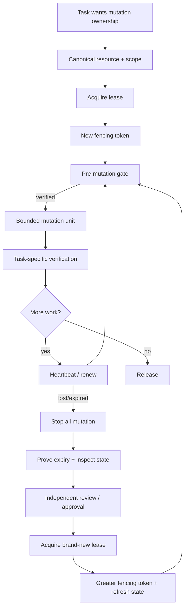

# Agent Long-Running Lock Lease Guard

A reusable, tool-neutral guardrail for AI agents and workers that run long enough to crash, reconnect, retry, resume, overlap with schedulers, or compete for the same mutable resource.

## Problem
Long-running agent workflows commonly rely on weak ownership signals: “this process started first”, “this browser tab is still open”, “the task has a checkpoint”, or “the previous worker stopped heartbeating”. Those signals do not prevent a stale worker from continuing to write after another worker has taken over. Duplicate concurrent mutation can corrupt branches, deployments, migrations, generated artifacts, tickets, external APIs, or shared state.

## Purpose
This kit introduces a lease lifecycle with canonical resource scope, expiration, heartbeat, strictly increasing fencing tokens, deterministic mutation gates, bounded stale-lease recovery, independent takeover review, and explicit human approval for dangerous lock breaking.

The core invariant is: **a worker may mutate a protected resource only while its exact lease is active and its fencing token is still current.**

## When to use
Use for resumable coding agents, scheduled automation, long migrations/backfills, branch writers, release agents, CI repair agents, external integration workers, or any workflow where two executions might overlap on the same mutable resource.

## When not to use
Do not use this as a replacement for database transactions, provider-native optimistic concurrency, distributed lock services, branch protection, IAM, or task-specific verification. For a tiny read-only task, a lease is unnecessary.

## Architecture


## Package tree
```text
agent-long-running-lock-lease-guard/
├── README.md
├── config/
│   └── lease-policy.json
├── examples/
│   ├── lease-store.example.json
│   └── takeover-review.example.json
├── hooks/
│   └── lease-lifecycle-hooks.md
├── rules/
│   └── lease-governance.md
├── schemas/
│   ├── lease-record.schema.json
│   └── mutation-intent.schema.json
├── scripts/
│   ├── evaluate-mutation-gate.py
│   ├── evaluate-takeover.py
│   ├── lease_store.py
│   └── validate-lease-state.py
├── skills/
│   ├── acquire-and-maintain-lease.md
│   └── recover-stale-lease.md
├── subagents/
│   ├── lease-coordinator.md
│   └── lease-recovery-reviewer.md
├── templates/
│   └── mutation-intent.example.json
├── tests/
│   └── smoke-test.py
└── workflows/
    └── long-running-lease-workflow.md
```

## Dependencies
- Python 3.9+
- Python standard library only for included scripts
- A trustworthy UTC clock
- For real concurrent production usage: a durable shared store with atomic compare-and-set/transaction semantics

The included JSON store is suitable for local development, agent integration examples, CI checks, and single-host coordination. For multi-host production use, keep the contracts/gates but adapt `lease_store.py` to Redis, PostgreSQL, Cosmos DB, DynamoDB, etcd, Consul, or another transactional lease store.

## Installation
Copy this directory into the repository. Keep relative paths or update workflow/hook commands consistently.

Run the self-contained smoke test:
```bash
python tests/smoke-test.py
```

## Configuration
Edit `config/lease-policy.json`:
- lease and heartbeat durations;
- clock-skew tolerance;
- bounded retry counts;
- takeover review requirements;
- human-approval-required actions.

Do not increase lease duration simply to hide heartbeat reliability problems.

## Usage
### Acquire
```bash
python scripts/lease_store.py acquire \
  --store .agent/lease-store.json \
  --resource repo:owner/service:main \
  --owner implementation-agent-7 \
  --scope-json .agent/lease-scope.json \
  --lease-seconds 120
```
Capture `lease_id`, `fencing_token`, `scope_fingerprint`, and expiry.

### Gate a mutation
Create an intent using `templates/mutation-intent.example.json`, then:
```bash
python scripts/evaluate-mutation-gate.py \
  --store .agent/lease-store.json \
  --intent .agent/mutation-intent.json \
  --policy config/lease-policy.json
```
Only `verified` permits the protected write.

### Heartbeat
```bash
python scripts/lease_store.py heartbeat \
  --store .agent/lease-store.json \
  --resource repo:owner/service:main \
  --owner implementation-agent-7 \
  --lease-id <lease-id> \
  --fencing-token <token> \
  --lease-seconds 120
```

### Recover/take over
First evaluate the old lease without changing it:
```bash
python scripts/evaluate-takeover.py \
  --store .agent/lease-store.json \
  --resource repo:owner/service:main \
  --policy config/lease-policy.json \
  --review .agent/takeover-review.json
```
High/critical production recovery may also require an explicit approval reference. After `safe-to-acquire`, call normal acquire; never revive the old lease.

### Release
```bash
python scripts/lease_store.py release \
  --store .agent/lease-store.json \
  --resource repo:owner/service:main \
  --owner implementation-agent-7 \
  --lease-id <lease-id> \
  --fencing-token <token>
```

## Fencing token semantics
Expiry prevents a well-behaved worker from continuing. A fencing token protects against a stale worker that is still alive but unaware it lost ownership. Each new lease receives a strictly greater token. Downstream mutation adapters should reject a write whose token is lower than the latest token observed for that resource.

For systems that support version checks, map the fencing token to a conditional write/version column. For systems that do not, put the mutation behind a wrapper that runs `evaluate-mutation-gate.py` immediately before the tool call and avoids caching an earlier decision.

## Delegation
- **Lease Coordinator** owns normal acquire/heartbeat/release and mutation-intent binding.
- **Lease Recovery Reviewer** independently decides whether stale/high-risk takeover evidence is sufficient.
- The implementation/execution agent is never the sole verifier for high-risk takeover.

## Safety and approval
This package never grants production authority merely by obtaining a lease. Explicit human approval is still required for production deployment, destructive SQL, schema/data deletion, force push/history rewrite, infrastructure/secret/config changes, breaking APIs, security weakening, irreversible migrations, large dependency upgrades, and policy-defined forced lock breaking.

No workflow may increase permissions to acquire or break a lease.

## Failure and recovery
- Lease store transient error: one retry maximum.
- Active lease conflict: no acquisition loop; stop and observe current owner/expiry.
- Heartbeat failure twice: immediately stop new protected mutations.
- Expired ownership: never renew the old lease. Use takeover procedure and acquire a new token.
- Unknown/ambiguous ownership: fail closed.
- Clock outside trusted skew: takeover is blocked.
- Resource changed while owner was absent: refresh context and replan before mutation.
- Required review/approval missing: block.

## Verification
Success requires more than the agent executing its steps:
1. `validate-lease-state.py` passes.
2. Every protected mutation has evidence of a current mutation gate.
3. Fencing token was current at the mutation boundary.
4. Takeover, if any, was bound to the exact previous token/resource and had required review/approval.
5. Resource state was refreshed after takeover.
6. Task-specific build/test/API/database verification separately passed.
7. Final lease was explicitly released or safely expired with no contradictory owner.

## Definition of Done
- Protected resource and scope are explicit.
- Lease lifecycle is valid.
- No two active owners are accepted for one resource.
- Tokens are unique and monotonically increasing.
- Stale workers cannot pass the mutation gate.
- Retry/takeover loops are bounded.
- Dangerous lock breaking/actions have explicit approval.
- High-risk takeover has independent review.
- Verification is evidence-based and distinct from execution.
- Package smoke test passes.

## Portability
The Markdown contracts and deterministic scripts are tool-neutral and can be integrated with OpenAI Codex, Claude Code, Cursor, ChatGPT, GitHub Copilot, OpenCode, MCP tools, CI workers, schedulers, or custom orchestration. Tool-specific adapters should translate lease context into the tool call, not weaken lease semantics.

## Customization
Prefer adapting only the storage backend and resource-key conventions. Keep these invariants stable: atomic acquisition, finite expiry, current-owner heartbeat, new token per acquisition, fencing before mutation, fail-closed ambiguity, bounded takeover, independent review for high risk, and explicit approval for dangerous actions.
