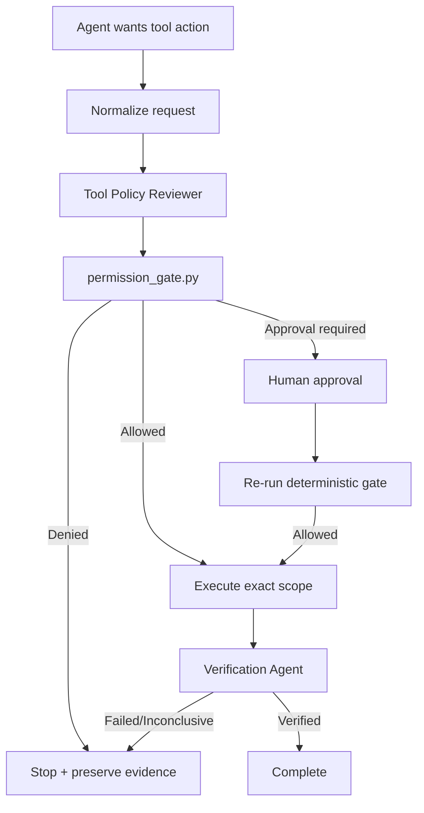

# Agent MCP Tool Permission Escalation Gate

A reusable safety and verification kit for AI coding agents that invoke MCP servers or other external tools. It prevents an agent from silently broadening tool permissions, resource scope, or operational authority simply because a task becomes difficult.

## Problem
AI agents often begin with read-only or narrowly scoped permissions and later encounter a task that appears to require more access: repository writes, production mutation, secret retrieval, permission changes, deletion, or deployment. Ad-hoc prompting is unreliable because the same agent that wants more authority is also tempted to justify it. This package turns permission elevation into a deterministic, evidence-based gate with independent review and explicit human approval for dangerous actions.

## Purpose
- Default-deny incomplete or broad tool requests.
- Enforce least privilege and exact resource scope.
- Separate request, policy review, approval, execution, and verification.
- Bind approval to a specific tool/action/resources/duration.
- Prevent unchanged retries after permission denial.
- Produce auditable evidence without logging secret values.

## When to use
Use before AI agents invoke MCP servers, GitHub/issue trackers, cloud APIs, databases, CI/CD systems, file systems, secret stores, production tooling, or any integration where tool permissions can exceed the agent's initial authority.

## When not to use
Do not use this as a replacement for the target platform's authentication/authorization. It is an agent-side policy and workflow layer. Platform-native IAM, sandboxing, secret management, audit logs, and production controls remain mandatory.

## Architecture



## Package tree

```text
agent-mcp-tool-permission-escalation-gate/
├── README.md
├── config/
│   └── policy.yaml
├── schemas/
│   └── tool-request.schema.json
├── scripts/
│   ├── permission_gate.py
│   └── verify_package.py
├── skills/
│   ├── evaluate-tool-request.md
│   └── review-permission-escalation.md
├── rules/
│   └── mcp-permission-safety.md
├── subagents/
│   ├── tool-policy-reviewer.md
│   └── verification-agent.md
├── workflows/
│   └── mcp-permission-gate.md
├── hooks/
│   └── lifecycle.md
├── templates/
│   └── approval-request.md
├── examples/
│   ├── read-request.json
│   └── external-write-request.json
└── tests/
    └── test_permission_gate.py
```

## Component responsibilities
- `config/policy.yaml` defines default-deny behavior, approval-required actions, maximum elevation duration, least-privilege constraints, and logging requirements.
- `schemas/tool-request.schema.json` defines the handoff contract for agent tool requests.
- `scripts/permission_gate.py` performs deterministic policy checks before tool invocation.
- `scripts/verify_package.py` verifies required kit files exist and rejects placeholder content.
- `skills/evaluate-tool-request.md` provides the normal pre-tool procedure.
- `skills/review-permission-escalation.md` handles requests that expand authority.
- `rules/mcp-permission-safety.md` defines enforceable MUST/MUST NOT/SHOULD behavior.
- `subagents/tool-policy-reviewer.md` owns independent pre-execution policy review.
- `subagents/verification-agent.md` independently checks post-execution scope and outcome.
- `workflows/mcp-permission-gate.md` defines the bounded end-to-end lifecycle.
- `hooks/lifecycle.md` defines blocking pre/post lifecycle hooks.
- `templates/approval-request.md` standardizes human approval evidence.
- `examples/*.json` show read-only and high-risk requests.
- `tests/test_permission_gate.py` verifies deterministic gate behavior.

## Installation
Copy this directory into a repository or agent configuration repository. Python 3.9+ is sufficient for the deterministic scripts and tests. No third-party Python package is required.

## Configuration
Edit `config/policy.yaml` to match your environment. Keep `default_decision: deny`. Add or remove approval-required actions only through an explicit security review. Avoid wildcard resource scopes. If you change maximum elevation duration, update both policy documentation and the CLI invocation used by your adapter.

Core actions used by the package are:
- `read`
- `local_write`
- `write_external`
- `delete`
- `deploy`
- `secret_access`
- `permission_change`
- `production_mutation`

## Permissions
The gate itself needs only local read access to the request/policy plus permission to execute Python. The policy reviewer should be read-only. The execution agent should receive only the target tool permission needed after a successful gate decision. The verification agent should remain read-only whenever possible.

## Usage
Validate the package:

```bash
python scripts/verify_package.py
python -m unittest tests/test_permission_gate.py
```

Evaluate a read-only request:

```bash
python scripts/permission_gate.py examples/read-request.json
```

The read request should return `status: allowed`.

Evaluate an external write request without approval:

```bash
python scripts/permission_gate.py examples/external-write-request.json
```

It should exit with code `3` and deny execution because explicit approval is missing.

After an independent human approval has been recorded:

```bash
python scripts/permission_gate.py examples/external-write-request.json --approved --approval-id APR-123
```

The approval identifier is evidence only; adapters must ensure it corresponds to a real approval event and that the approved fields exactly match the request.

## Example agent invocation
1. Agent identifies a GitHub file update as necessary.
2. Agent creates a structured request with `action: write_external`, one exact repository/file resource, reason, risk, and requested duration.
3. Tool Policy Reviewer checks whether a read-only/local alternative exists.
4. `permission_gate.py` blocks execution pending approval.
5. Human approves the exact tool/action/resource/duration.
6. Gate is rerun with the approval ID.
7. Agent executes only that exact update.
8. Verification Agent confirms no other files, permissions, credentials, or resources were changed.
9. Task can be marked verified.

## Approval boundaries
Explicit human approval is mandatory for external writes, deletion, deployment, secret access, permission changes, production mutation, security weakening, irreversible operations, and other actions designated by local policy. Approval is invalid when the tool, action, resources, duration, or material task context changes.

An agent must stop before the dangerous action. It must never grant itself extra MCP scopes, install a more powerful integration, switch credentials, or broaden resource access merely to bypass a denial.

## Failure and recovery
- **Validation failure:** correct the structured request; maximum two attempts for accidental formatting/input errors.
- **Transient tool failure:** retry at most twice while preserving prior evidence.
- **Permission failure:** do not retry unchanged. Narrow scope, supply new evidence, or obtain explicit approval.
- **Environment/tool unavailable:** preserve request and failure evidence, then stop.
- **Execution mismatch:** verification fails immediately. Do not claim completion; propose rollback only when safe and separately authorized.
- **Approval mismatch/expiry:** obtain a new approval; never reinterpret an old approval.

No workflow uses an unbounded retry loop.

## Verification
A task is not complete merely because the tool call succeeded. Verification must prove:
- The executed tool equals the gated tool.
- The executed action equals the approved action.
- Every touched resource is inside the approved resource set.
- No new credentials, scopes, MCP servers, or persistent permissions were silently added.
- Acceptance criteria were satisfied.
- Required approvals exist and match the request.
- Security controls remain intact.
- Remaining risks are recorded.

## Definition of Done
The workflow is complete only when all of the following are true:
1. Required context was gathered.
2. A valid structured request exists.
3. Tool Policy Reviewer completed its review.
4. Deterministic gate returned `allowed`.
5. Required human approval exists and exactly matches the request.
6. Execution stayed within approved scope.
7. Verification Agent returned `verified` with evidence.
8. No unauthorized persistent permission remains.
9. No blocking failure remains.
10. Package tests and package verification pass when the kit itself was changed.

## Portability
The workflow is tool-neutral. Integrate it with Codex, Claude Code, Cursor, ChatGPT, GitHub Copilot, OpenCode, custom agents, or MCP hosts by adapting only the step that converts a native tool call into the structured request contract and enforces the resulting decision. Do not add a compatibility layer unless the target agent can actually honor a pre-tool blocking gate.

## Customization
Extend the action taxonomy or resource syntax in `schemas/tool-request.schema.json`, then update policy, examples, tests, workflow documentation, and any adapter together. Keep deterministic authorization checks outside the LLM wherever possible. If your environment supports short-lived credentials, issue them only after an allow decision and expire/revoke them immediately after the approved action.
