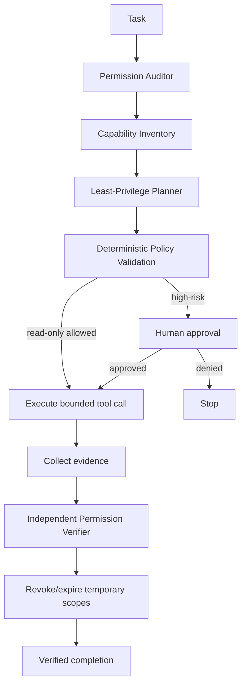

# Agent MCP Tool Permission Least-Privilege Gate

A reusable implementation kit for preventing AI agents and MCP integrations from running with permissions broader than the task requires.

## Problem

Coding agents increasingly expose repository, filesystem, database, deployment, secret, issue, browser, and external-service tools through MCP or similar tool layers. A tool being available does not mean the agent should be authorized to use every capability it exposes. Broad persistent credentials, wildcard scopes, hidden downstream privileges, and automatic permission escalation can turn a normal coding task into a production, data-loss, or secret-exposure incident.

This kit adds a deterministic gate between task planning and tool execution. It inventories capabilities, narrows them per task stage, requires human approval for high-risk operations, validates permission requests before invocation, and independently verifies effective permissions after execution.

## Purpose

Use this package to make tool authorization explicit, evidence-based, bounded, and reviewable instead of relying on ad-hoc prompting such as “only use safe tools.”

## When to use

Use when adding or enabling an MCP server, connecting a new coding-agent tool, changing agent permissions, allowing repository/database/deployment access, investigating unexpected tool access, or introducing autonomous workflows that can mutate external state.

## When not to use

This package is not an authentication provider, secret manager, IAM product, sandbox, or replacement for the underlying platform's authorization controls. It does not make an inherently unsafe tool safe. It coordinates and verifies how available permissions should be used.

## Architecture



## Package tree

```text
agent-mcp-tool-permission-least-privilege-gate/
├── README.md
├── config/
│   └── policy.json
├── schemas/
│   └── permission-request.schema.json
├── skills/
│   ├── permission-inventory.md
│   └── least-privilege-plan.md
├── rules/
│   └── permission-rules.md
├── subagents/
│   ├── permission-auditor.md
│   ├── least-privilege-planner.md
│   └── permission-verifier.md
├── workflows/
│   └── least-privilege-gate.md
├── hooks/
│   ├── pre-tool-invocation.md
│   └── post-task-verification.md
├── scripts/
│   ├── check-permissions.py
│   └── verify-evidence.py
├── examples/
│   ├── read-only-request.json
│   └── verified-evidence.json
└── tests/
    └── test-policy.py
```

## Component responsibilities

- `skills/permission-inventory.md` discovers configured and effective capabilities without exercising dangerous tools.
- `skills/least-privilege-plan.md` maps task stages to the smallest practical scopes and argument boundaries.
- `rules/permission-rules.md` provides enforceable MUST/MUST NOT/SHOULD constraints.
- `subagents/permission-auditor.md` owns read-only capability discovery.
- `subagents/least-privilege-planner.md` owns permission minimization and approval placement.
- `subagents/permission-verifier.md` independently checks effective permissions after execution.
- `workflows/least-privilege-gate.md` defines the end-to-end bounded workflow and retry rules.
- `hooks/pre-tool-invocation.md` blocks unauthorized calls before they execute.
- `hooks/post-task-verification.md` blocks successful completion until evidence is verified.
- `scripts/check-permissions.py` performs deterministic pre-call policy validation.
- `scripts/verify-evidence.py` validates final authorization evidence.
- `config/policy.json` contains default-deny policy and risk classifications.
- `schemas/permission-request.schema.json` defines the normalized handoff contract.

## Dependencies

Core scripts require Python 3.9+ and use only the standard library. Tests use `pytest`.

## Installation

Copy this directory into the target repository. Keep the package paths intact or update hook commands consistently if relocated.

Install the optional test dependency:

```bash
python -m pip install pytest
```

## Configuration

Edit `config/policy.json` to match your platform's normalized scopes. Keep `default_effect` as `deny`. Add known read scopes explicitly. Put any capability that can mutate state, access secrets, deploy, modify permissions, or publish externally behind approval.

Do not place credentials or real secrets in policy files, examples, prompts, or evidence.

## Permission model

A permission request contains the task, agent, tool, normalized scope, concrete action, risk class, bounded resource, justification, expiry behavior, and optional approval ID. `schemas/permission-request.schema.json` provides the contract.

High-risk categories in the default policy are:

- write
- destructive
- production
- secret
- permission-change
- external-publish

Unknown tools and wildcard scopes are denied by default.

## Usage

Start with the inventory skill and produce normalized permission requests. A read-only example is in `examples/read-only-request.json`.

Validate requests before invocation:

```bash
python scripts/check-permissions.py \
  --policy config/policy.json \
  --requests examples/read-only-request.json
```

Expected result:

```text
ALLOW: validated 1 permission request(s)
```

A write request without an approval ID must fail. A wildcard scope must fail. Unknown read scopes must fail while `deny_unknown_tools` is enabled.

After execution, produce an evidence object and validate it:

```bash
python scripts/verify-evidence.py \
  --policy config/policy.json \
  --evidence examples/verified-evidence.json
```

Then apply the independent verification procedure in `subagents/permission-verifier.md`.

## Example agent invocation

Use a tool-neutral instruction such as:

```text
Run the MCP Tool Permission Least-Privilege Gate for this task.
Inventory every enabled task-relevant tool, normalize required scopes, deny unknown or wildcard capabilities, and plan the smallest stage-specific permission set. Validate each permission request before tool invocation. Stop for explicit approval before any write, destructive, production, secret, permission-change, deployment, infrastructure, force-push, or external-publication action. After execution, independently verify effective permissions and evidence before declaring success.
```

## Approval boundaries

Explicit human approval is required before:

- granting or broadening permissions
- repository/filesystem/database writes or deletion
- database schema changes
- secret reads or changes
- production operations or configuration changes
- deployment or infrastructure changes
- force push/history rewriting
- weakening security controls
- external publication
- irreversible actions

The implementing agent must not approve its own elevated capability.

## Failure and recovery

The workflow allows at most two retries and only for transient read-only metadata, audit-log, or tool-introspection failures. Preserve previous failure evidence.

Do not retry these as transient failures:

- permission denied
- missing approval
- policy validation failure
- invalid request contract
- unknown tool/scope
- argument outside approved boundary

For a permission denial, identify the exact narrow missing capability and escalate it. Never silently substitute a broader credential.

## Verification

Successful execution and verified completion are different states. Completion requires all of the following:

- every enabled task-relevant tool was inventoried
- unknown and wildcard capabilities are absent or blocked
- planned permissions are minimal for each stage
- deterministic policy validation passed
- every high-risk invocation has approval evidence
- invocation arguments remained inside approved resource boundaries
- effective permissions are no broader than the plan
- temporary scopes were revoked or expired where supported
- the independent verifier returned `verified`

Run package tests with:

```bash
pytest -q tests/test-policy.py
```

## Definition of Done

The package gate is complete for a task only when the required context has been gathered, permission requests are valid, high-risk actions were approved, execution evidence is complete, effective permissions match or are narrower than the approved plan, temporary permissions are closed where supported, and no blocking unknown/excess capability remains.

## Customization

Map platform-specific capabilities into stable normalized scopes in `config/policy.json`. Keep tool-specific adapters outside the core workflow when possible. For platforms that support ephemeral tokens, sessions, role assumption, or per-resource grants, bind them to the task and revoke them after verification. For platforms that cannot expose effective permissions, mark those capabilities unknown rather than assuming static configuration equals runtime authorization.
