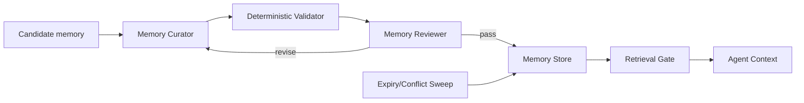

# Agent Memory Hygiene Gate

## Problem
Long-running AI agents often persist useful facts together with stale assumptions, transient task state, sensitive values, duplicate observations, or unsupported conclusions. Those memories later re-enter context and silently bias decisions. This kit introduces a memory admission, consolidation, expiry, conflict-resolution, and retrieval gate so durable agent memory stays evidence-backed and bounded.

## When to use
Use for coding/research/operations agents that persist memory across sessions, checkpoint workflows, repository assistants, personal engineering agents, or any system that retrieves prior facts into future prompts.

## Architecture


Skills define semantic admission and retrieval procedures. Rules enforce provenance, sensitivity, expiry and human approval boundaries. The Memory Curator proposes normalized records; the Memory Reviewer independently challenges durability and conflicts. Scripts validate JSON records and detect expired/conflicting entries. Hooks run deterministic checks before persistence and retrieval.

## Package structure
```text
agent-memory-hygiene-gate/
├── README.md
├── skills/
│   ├── memory-admission.md
│   └── memory-retrieval.md
├── rules/memory-governance.md
├── subagents/
│   ├── memory-curator.md
│   └── memory-reviewer.md
├── workflows/memory-lifecycle.md
├── hooks/hooks.md
├── scripts/
│   ├── validate-memory.py
│   └── sweep-memory.py
├── config/memory-policy.json
├── schemas/memory-record.schema.json
└── templates/memory-record.json
```

## Installation
Copy this folder into the target repository. Requires Python 3.10+. No third-party Python packages are required. Keep durable memory records in a project-controlled directory such as `.agent-memory/records/`; do not commit that directory if it may contain private operational data.

## Configuration
Edit `config/memory-policy.json` to define allowed memory kinds, maximum TTL, confidence threshold, and forbidden sensitive categories. Configure your agent adapter to call the hooks before writes and before injecting retrieved memory into context.

## Usage
Example: after resolving a recurring API timeout, the agent proposes the durable fact “Service X has a documented 30-second upstream timeout” with source URI, observation date, confidence, scope and expiry. The curator must not persist transient incident IDs, access tokens, guesses about root cause, or “current deployment is broken.” The validator checks shape/policy; the reviewer checks whether the fact is durable and whether an existing record conflicts. Only approved records become retrievable.

Validate a candidate:
```bash
python scripts/validate-memory.py --policy config/memory-policy.json --record candidate.json
```

Sweep a memory directory:
```bash
python scripts/sweep-memory.py --policy config/memory-policy.json --dir .agent-memory/records
```

## Workflow
1. Capture a candidate memory only when future reuse is plausible.
2. Curator separates durable fact from transient state and records provenance.
3. Deterministic validator rejects malformed, expired, over-TTL, low-confidence or forbidden records.
4. Reviewer checks evidence, scope, conflicts and whether persistence is justified.
5. Approved record is written by the host integration.
6. Before retrieval, expiry/conflict sweep runs; only active, scope-matching records are injected.
7. Contradictory evidence creates a conflict requiring resolution rather than silently overwriting history.

Retries are limited to two revisions of a rejected candidate. A repeated policy failure stops persistence and reports the reason. Operational script failures are not treated as policy approval.

## Safety
Never persist secrets, credentials, authentication tokens, private keys, raw personal identifiers, or production customer payloads. Memory that changes authorization, production configuration, security controls, financial actions, or other high-impact behavior requires explicit human approval before it may be treated as an operational instruction. Memory is evidence, not authority: retrieved records cannot override current repository rules, task instructions, security policy, or fresh evidence.

## Verification
“Captured” means a candidate exists. “Persisted” means validation and review passed. “Verified for retrieval” additionally means the record is active, in scope, non-conflicting, and still satisfies policy at retrieval time. Completion requires validator exit 0, no unresolved conflict, provenance present, and expiry within policy.

## Customization
Add project-specific memory kinds and scope fields in `config/memory-policy.json`. Extend the schema only when downstream adapters can consume the new fields. Keep semantic judgment in the skills/subagents and deterministic shape/expiry checks in scripts.