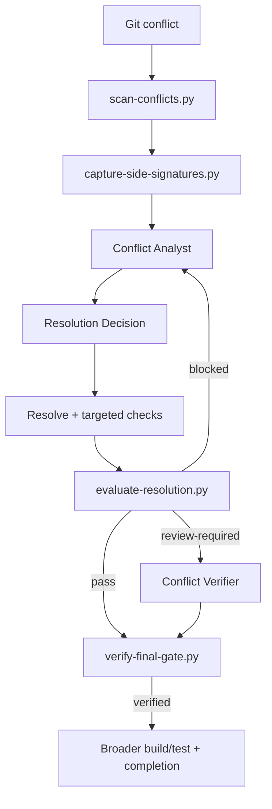

# Agent Merge Conflict Semantic Resolution Gate

A reusable AI-engineering package for resolving Git conflicts without treating “all markers removed” as proof that the merged behavior is correct.

## Problem
AI agents can make a conflicted file syntactically clean while silently dropping behavior, contracts, security checks, migration intent, configuration, tests, or assumptions from one side. Blanket `ours`/`theirs` choices are especially dangerous when both branches introduced valid but different behavior.

## Purpose
This kit turns conflict resolution into an evidence-bound workflow:

1. Inventory each conflict before editing.
2. Capture lightweight signatures from both sides.
3. Investigate semantic intent using repository evidence.
4. Record one explicit resolution decision per conflict.
5. Resolve the file and run conflict-specific targeted checks.
6. Deterministically detect markers, missing decisions, stale revisions, and declared-preservation/signature inconsistencies.
7. Require independent review for high/critical conflict risk.
8. Bind final verification to exact inventory and policy fingerprints.

## When to use
- Merge or rebase conflicts with non-trivial behavior.
- Cherry-pick/revert conflicts.
- Long-lived branch integration.
- Conflicts touching APIs, auth/security, migrations, infrastructure, configuration, SQL, or shared contracts.
- AI-assisted conflict resolution where you need evidence beyond Git status.

## When not to use
- Purely generated files that are safely regenerated from one authoritative source.
- Binary conflicts that require a domain-specific merge tool.
- Trivial lockfile conflicts when the lockfile can be deterministically regenerated and verified by the package manager; use the regeneration workflow instead.

## Architecture



## Package tree

```text
agent-merge-conflict-semantic-resolution-gate/
├── README.md
├── config/
│   └── conflict-policy.json
├── schemas/
│   ├── conflict-inventory.schema.json
│   ├── conflict-review.schema.json
│   ├── resolution-decision.schema.json
│   └── resolution-report.schema.json
├── scripts/
│   ├── scan-conflicts.py
│   ├── capture-side-signatures.py
│   ├── evaluate-resolution.py
│   └── verify-final-gate.py
├── skills/
│   ├── inspect-conflict-semantics.md
│   └── resolve-conflict-with-evidence.md
├── rules/
│   └── merge-conflict-governance.md
├── subagents/
│   ├── conflict-analyst.md
│   └── conflict-verifier.md
├── workflows/
│   └── merge-conflict-resolution-workflow.md
├── hooks/
│   └── merge-conflict-hooks.md
├── templates/
│   ├── conflict-inventory.example.json
│   └── resolution-decision.example.json
├── examples/
│   └── conflict-review.example.json
└── tests/
    └── smoke-test.py
```

## Dependencies
- Python 3.9+.
- Git for automatic conflicted-file discovery and revision capture.
- Repository-specific build/test tools for targeted and broad verification.
- No third-party Python packages are required by the deterministic scripts or smoke test.

## Installation
Copy this directory into the target repository. The package is tool-neutral: agents may be Codex, Claude Code, Cursor, ChatGPT, GitHub Copilot, OpenCode, or another coding agent capable of reading files and invoking local commands.

## Configuration
Edit `config/conflict-policy.json` only when repository policy differs.

Important settings:
- High-risk paths/extensions.
- Independent-review requirements.
- Self-review policy.
- Bounded retry counts.
- Human approval actions.

Changes to policy invalidate old resolution reports because the final gate recomputes the policy fingerprint.

## Permissions
Use least privilege. Reading Git history and editing conflicted files are ordinary permissions. Do not broaden permissions to unblock tests or integrations.

Explicit human approval is required before:
- production deployment,
- destructive SQL,
- database schema changes,
- data/file deletion,
- force push or Git history rewrite,
- infrastructure changes,
- secret changes,
- production configuration changes,
- breaking API changes,
- weakening security controls,
- irreversible migrations,
- large dependency upgrades.

## Usage

### 1. Create the conflict inventory

```bash
python scripts/scan-conflicts.py --output .ai/conflicts.json
```

Optionally provide specific files:

```bash
python scripts/scan-conflicts.py --files src/a.py src/b.py --output .ai/conflicts.json
```

### 2. Capture side signatures

```bash
python scripts/capture-side-signatures.py \
  --inventory .ai/conflicts.json \
  --output .ai/conflicts.signed.json
```

The signatures are lightweight line-level evidence. They are not a proof of semantic equivalence; they help catch a declared preserved side that disappeared completely.

### 3. Investigate semantic intent
Follow `skills/inspect-conflict-semantics.md`. For each conflict, inspect nearby code/tests and, when useful, the commits/PRs introducing each side. Produce `.ai/resolution.json` matching `schemas/resolution-decision.schema.json`.

### 4. Resolve conflicts
Follow `skills/resolve-conflict-with-evidence.md`. Run every `targeted_checks` command declared for each conflict and retain the output for the exact resolved state.

### 5. Evaluate resolution deterministically

```bash
python scripts/evaluate-resolution.py \
  --inventory .ai/conflicts.signed.json \
  --resolution .ai/resolution.json \
  --policy config/conflict-policy.json \
  --root . \
  --output .ai/resolution-report.json
```

Exit codes:
- `0`: `pass`
- `2`: `blocked`
- `3`: `review-required`
- `1`: tool/validation error

Typical blockers include:
- stale resolution revision,
- missing resolution decision,
- resolved file missing,
- conflict markers still present,
- missing rationale or targeted checks,
- declared preserved side with no surviving side signature.

### 6. Independent review when required
High/critical conflicts require `conflict-verifier`. The review must match `schemas/conflict-review.schema.json` and use the exact `report_fingerprint` from the current report.

### 7. Final gate

Without review when policy/risk allows:

```bash
python scripts/verify-final-gate.py \
  --report .ai/resolution-report.json \
  --inventory .ai/conflicts.signed.json \
  --policy config/conflict-policy.json \
  --actor agent-a
```

With required review:

```bash
python scripts/verify-final-gate.py \
  --report .ai/resolution-report.json \
  --inventory .ai/conflicts.signed.json \
  --policy config/conflict-policy.json \
  --review .ai/conflict-review.json \
  --actor agent-a
```

The final gate blocks stale inventory/policy evidence, deterministic blockers, missing review, review fingerprint mismatch, non-approved review, and self-review when forbidden.

## Execution vs verification
A task is **executed** when conflict files are resolved and checks have been attempted.

A task is **verified** only when:
- deterministic evaluation is not blocked,
- required independent review is current and approved,
- final gate returns `verified`,
- targeted checks and the repository's broader appropriate build/tests have run for the resolved state,
- required human approvals are satisfied before dangerous actions.

## Failure and recovery
- Transient read/tool failure: retry at most once and retain the first error.
- Deterministic blocker: do not retry until the underlying state changes.
- Test/build/review failure: one resolution-remediation cycle maximum.
- Permission/environment failure: stop and escalate; never silently broaden privileges.
- Conflict set changes after a rebase/base movement: regenerate inventory/signatures and invalidate old decisions/reports/reviews.
- Unknown business intent: stop and ask the relevant owner/domain authority rather than inventing behavior.

## Hooks
`hooks/merge-conflict-hooks.md` defines lifecycle actions for pre-resolution inventory, post-edit marker checks, targeted verification, deterministic evaluation, final verification, broad repository verification, and approval boundaries.

## Verification of this package
Run:

```bash
python tests/smoke-test.py
```

The stdlib smoke test exercises:
- a clean two-side preservation case,
- residual conflict markers,
- a declared preserved side whose signature disappears,
- high-risk independent review,
- forbidden self-review.

The presence of the smoke test in the package is not itself proof that it has been executed in a given repository; execution evidence must be captured by the repository/CI using this kit.

## Definition of Done
- All conflicts are inventoried before resolution.
- Side signatures exist for conflict evidence.
- Every conflict has exactly one evidence-backed decision.
- No conflict markers remain.
- Declared side preservation is consistent with deterministic signature checks.
- Every conflict has targeted verification evidence.
- Deterministic report has no blocker.
- Required independent review is approved and fingerprint-current.
- Final gate returns `verified`.
- Broader relevant build/tests/static analysis have run separately.
- Required human approval exists before dangerous actions.
- No unrelated changes are hidden inside conflict resolution.
- Remaining risks/open questions are documented.

## Customization
- Adjust path risk classification in `config/conflict-policy.json`.
- Add repository-specific semantic checks to the targeted-check commands in resolution decisions.
- Extend deterministic evaluators for AST/symbol-level signatures when your language/toolchain supports them.
- Keep tool-specific adapters outside the core contracts so the same workflow can be reused across coding agents.
