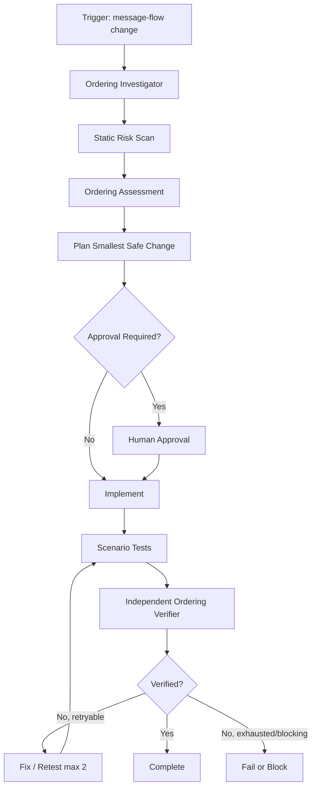

# Agent Message Ordering Consistency Gate

A reusable AI engineering kit for reviewing and verifying message-driven code where out-of-order delivery, retries, duplicate delivery, replay, or concurrent consumers can corrupt state.

## Problem
Message brokers often provide ordering guarantees only within a partition, session, or key. Application code can still break ordering through unstable partition keys, timestamp-based ordering, parallel processing, retry/replay behavior, stale events, or duplicate side effects. Coding agents can also accidentally weaken these protections while refactoring consumers or scaling concurrency.

## Purpose
This kit gives an AI coding workflow a repeatable gate for mapping ordering semantics, detecting risky patterns, implementing the smallest safe correction, and proving behavior with explicit scenarios.

## When to use
Use it when changing event publishers, consumers, queue/topic handlers, background workers, partition/session keys, retry policies, dead-letter recovery, replay/backfill tooling, concurrency settings, aggregate versions, offsets, sequence numbers, inbox/deduplication logic, or message-driven persistence.

## When not to use
Do not use it as a generic performance review for code with no asynchronous message delivery. It also does not replace broker-specific operational documentation or production incident procedures.

## Architecture


## Package tree
```text
agent-message-ordering-consistency-gate/
├── README.md
├── config/
│   └── message-ordering.yaml
├── examples/
│   └── sample-assessment.json
├── hooks/
│   └── message-ordering-hooks.md
├── rules/
│   └── message-ordering-safety.md
├── schemas/
│   └── ordering-assessment.schema.json
├── scripts/
│   ├── scan-ordering-risk.py
│   └── validate-assessment.py
├── skills/
│   └── message-ordering-review.md
├── subagents/
│   ├── ordering-investigator.md
│   └── ordering-verifier.md
├── tests/
│   └── self-test.py
└── workflows/
    └── message-ordering-gate.md
```

## Component responsibilities
`skills/message-ordering-review.md` defines the executable review procedure. `rules/message-ordering-safety.md` defines enforceable MUST/MUST NOT/SHOULD constraints. `subagents/ordering-investigator.md` owns evidence gathering; `subagents/ordering-verifier.md` independently verifies the result. `workflows/message-ordering-gate.md` coordinates the bounded end-to-end process. `hooks/message-ordering-hooks.md` defines deterministic lifecycle checks. `scripts/scan-ordering-risk.py` finds suspicious message-ordering patterns, while `scripts/validate-assessment.py` enforces the handoff contract. The JSON schema and sample assessment standardize outputs. `tests/self-test.py` proves the package scripts behave as expected.

## Installation
Copy this directory into a repository, preserving relative paths. Python 3.9+ is sufficient for the supplied scripts; they use only the standard library.

Make executable where useful:

```bash
chmod +x scripts/*.py tests/self-test.py
```

## Configuration
Edit `config/message-ordering.yaml` only when project policy differs. Keep the retry budget synchronized with the workflow. The defaults require a stable ordering key, monotonic sequence/version semantics, duplicate detection, idempotent consumption, replay behavior, and four verification scenarios.

## Dependencies
- Python 3.9+
- Repository-native build/test tooling
- Optional broker/config/log access using least privilege

No Python packages are required.

## Permissions
Read-only repository/config/log access is sufficient for investigation. Editing code requires normal repository write access. The package never requires production broker administration to run its core gate.

Explicit human approval is required before production broker reconfiguration, partition-count changes, retention-policy changes, destructive message purges, breaking event contracts, disabling duplicate detection, or weakening ordering guarantees.

## Usage
Run a baseline risk scan against the relevant module:

```bash
python3 scripts/scan-ordering-risk.py src/
```

Exit codes: `0` means no heuristic findings, `1` means findings below the configured blocking score, and `2` means at least one high-risk finding. Scanner results are triage evidence, not final proof.

Create an assessment based on `examples/sample-assessment.json`, then validate it:

```bash
python3 scripts/validate-assessment.py path/to/ordering-assessment.json
```

Run package self-tests:

```bash
python3 tests/self-test.py
```

## Example agent invocation
> Review the changed message publisher/consumer flow using `skills/message-ordering-review.md` and `rules/message-ordering-safety.md`. Use `workflows/message-ordering-gate.md`. Produce an assessment matching `schemas/ordering-assessment.schema.json`. Stop at approval boundaries. Do not claim success until the independent verifier has evidence for all required scenarios.

## Workflow
The investigator first maps the publisher, transport, ordering/partition key, consumer, persistence boundary, downstream side effects, and retry/dead-letter/replay paths. The scanner then flags deterministic static risks. The agent defines an ordering assessment and plans the smallest safe change. After implementation, tests must demonstrate out-of-order delivery, duplicate replay, stale-event rejection, and parallel-consumer safety. The independent verifier reruns the relevant evidence and validates the final assessment.

## Ordering model
The package expects teams to answer four concrete questions:

1. **What is ordered?** Define the ordering domain such as one aggregate, entity, tenant, or workflow.
2. **How are related messages routed?** Define a stable ordering/partition/session key.
3. **How is newer distinguished from older?** Prefer a monotonic aggregate version, sequence, broker offset where semantically valid, or equivalent causal marker; timestamp-only ordering is disallowed by default.
4. **What happens on duplicate/replay?** Side effects must remain idempotent and stale messages must not overwrite current state.

## Verification scenarios
A final `pass` assessment requires evidence for all four scenarios:

- **Out of order:** deliver version N+1 before N and prove N cannot regress state.
- **Duplicate replay:** deliver the same message more than once and prove external/business side effects are not duplicated.
- **Stale event:** deliver a message with an older sequence/version after current state advances and prove it is ignored or handled safely.
- **Parallel consumer:** exercise multiple consumer instances/tasks against the same ordering domain and prove serialization or version conflict handling preserves correctness.

Use deterministic integration tests where possible. Unit tests alone are insufficient when broker partitioning, database concurrency, or idempotency persistence is essential to the guarantee.

## Failure handling
Tool or environment failures may be retried at most twice while preserving error evidence. Implementation/test failures enter a fix-retest loop capped at two attempts. Validation failures return to the assessment stage; agents must not flip verification flags without supporting evidence. Permission failures and approval-required actions stop immediately without increasing privileges.

## Recovery
After a failed attempt, preserve scanner output, failed test logs, ordering assessment, and the diff. Replan from the observed failure. If the retry budget is exhausted, report `fail` or `blocked`, the remaining risk, and the evidence needed to proceed.

## Approval boundaries
Agents must stop before:

- production broker or queue/topic configuration changes;
- partition-count changes that can alter key-to-partition mapping;
- retention changes;
- destructive purge/deletion of messages;
- breaking event/schema contracts;
- disabling duplicate detection or idempotency protections;
- weakening an existing ordering guarantee.

## Definition of Done
The package considers a task complete only when the ordering domain/key and sequence semantics are documented in the assessment; duplicate and replay behavior is defined; all four verification scenarios pass; relevant project build/tests pass; the assessment validator exits successfully; scanner findings are resolved or explicitly accounted for; no approval boundary was bypassed; the diff contains no unintended contract/broker changes; and remaining risks are documented.

## Portability
Core instructions are tool-neutral and can be used with Codex, Claude Code, Cursor, ChatGPT, GitHub Copilot, OpenCode, or another coding agent. Broker-specific details should be supplied as repository/project context rather than embedded into the core workflow.

## Customization
Adjust risk thresholds and approval boundaries in `config/message-ordering.yaml`. Extend `scripts/scan-ordering-risk.py` with repository-specific consumer, broker, or concurrency APIs. Keep validation fields and workflow completion criteria synchronized when adding required scenarios.
