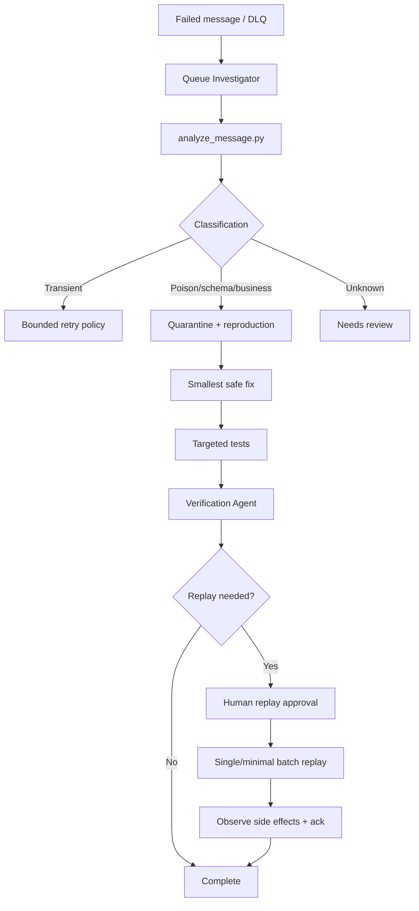

# Agent Message Queue Poison Message DLQ Gate

## Problem
Message consumers often retry the wrong failures: transient dependency errors need bounded retry, while schema/business-rule defects can create retry storms, duplicate side effects, hidden backlog, and unsafe bulk DLQ replays. This kit gives coding agents and operators a reusable evidence-first workflow for classification, quarantine, root-cause repair, independent verification, and approval-gated replay.

## Purpose
Use this package to turn repeated queue failures into a controlled lifecycle: capture evidence, classify failure, reproduce it, fix the smallest responsible component, verify retry/acknowledgement/idempotency behavior, and only then consider a tightly bounded production replay.

## When to use
Use when a message repeatedly fails, enters a DLQ, causes consumer crashes, exceeds delivery-attempt warnings, or an operator wants to replay quarantined messages after a fix.

## When not to use
Do not use this package as a generic queue provisioning tool, bulk queue migration mechanism, or justification for automatic production replay. It intentionally avoids provider-specific broker mutation commands.

## Architecture


## Package tree
```text
agent-message-queue-poison-message-dlq-gate/
├── README.md
├── config/
│   └── policy.yaml
├── hooks/
│   └── lifecycle.md
├── rules/
│   └── queue-safety.md
├── schemas/
│   └── analysis-result.schema.json
├── scripts/
│   ├── analyze_message.py
│   └── verify_package.py
├── skills/
│   ├── dlq-replay-review.md
│   └── poison-message-triage.md
├── subagents/
│   ├── queue-investigator.md
│   └── verification-agent.md
├── templates/
│   └── replay-approval.md
├── tests/
│   └── test_analyze_message.py
└── workflows/
    └── poison-message-workflow.md
```

## Component responsibilities
- `skills/poison-message-triage.md`: repeatable investigation and classification procedure.
- `skills/dlq-replay-review.md`: replay-readiness procedure with duplicate-side-effect checks.
- `rules/queue-safety.md`: enforceable production, retry, payload, and approval boundaries.
- `subagents/queue-investigator.md`: owns evidence gathering and root-cause classification.
- `subagents/verification-agent.md`: independently proves the fix and replay readiness.
- `workflows/poison-message-workflow.md`: end-to-end bounded lifecycle and failure paths.
- `hooks/lifecycle.md`: deterministic pre/post gates for triage, fixes, replay, and package validation.
- `scripts/analyze_message.py`: provider-neutral local classifier for a sanitized envelope.
- `scripts/verify_package.py`: checks required package artifacts and omission markers.
- `config/policy.yaml`: retry, age, DLQ, replay, and redaction defaults.
- `schemas/analysis-result.schema.json`: handoff contract for investigation results.
- `templates/replay-approval.md`: explicit production replay approval record.
- `tests/test_analyze_message.py`: executable regression tests for classifier behavior.

## Dependencies
Core classifier and package verification require Python 3.9+ and the standard library only. Tests use `pytest`. YAML is configuration for agents/operators and is not parsed by the included classifier.

## Installation
Copy the entire directory into the target repository. Keep all relative paths unchanged or update references consistently. Install test dependency with `python -m pip install pytest` if it is not already available.

## Configuration
Edit `config/policy.yaml` to match your broker and service policy. Defaults are five delivery attempts, staged retry delays, 24-hour age limit, no automatic replay, replay batch <=100, and explicit human approval for replay. Align header/metadata names in your message-capture adapter without weakening required identifiers.

## Permissions
Investigation should run with repository/log read permissions and local test execution. Production queue mutation permissions are not required for triage and must not be requested automatically. Replay/delete/purge/reroute actions require an authorized human and provider-specific least-privilege tooling outside this neutral core kit.

## Input envelope
`scripts/analyze_message.py` accepts JSON containing at least `message_id`, `correlation_id`, `schema_version`, and `payload`. It also understands `attempt_count`, `created_at_epoch`, and `last_error`.

Example local command:
```bash
python scripts/analyze_message.py message.json --out analysis.json
```
Exit code `0` means the deterministic gate considers the message eligible for bounded retry/review flow; exit code `1` means quarantine, blocked, or needs-review; exit code `2` means invalid input/tool failure. A `pass` result is not equivalent to successful message processing.

## Usage with an AI coding agent
Give the agent the failing message envelope after sanitization, consumer logs, repository path, relevant schema, and this package. Instruct it to follow `workflows/poison-message-workflow.md`, apply `rules/queue-safety.md`, delegate investigation to `subagents/queue-investigator.md`, and require `subagents/verification-agent.md` before declaring a fix verified.

## Workflow guarantees
The package separates facts from hypotheses, requires evidence for classification, caps automated fix/test cycles at two, blocks blind retry of deterministic defects, and stops at a human approval gate before production replay. The first replay batch defaults to one message so a fix is observed before wider replay.

## Approval boundaries
Explicit human approval is mandatory before production replay, delete/purge, message mutation, queue/routing configuration change, deployment, destructive data remediation, schema-breaking change, security weakening, or permission escalation. `templates/replay-approval.md` records replay-specific approval and batch limits.

## Failure handling
Transient tool/test failures may be retried at most twice. Missing evidence yields `needs-review`; missing permission yields `blocked`. Deterministic validation/schema/business failures are quarantined instead of blindly retried. Any duplicate side effect or repeated deterministic failure during replay stops further replay immediately.

## Verification
A fix is verified only when the original failure is reproduced or preserved with reliable evidence, the root cause is addressed, targeted tests pass, retry remains bounded, acknowledgement behavior is correct, duplicate delivery is safe, schema compatibility is checked, and the independent Verification Agent records `passed`. Replay success additionally requires observed consumption and correct downstream state.

Run package integrity validation with:
```bash
python scripts/verify_package.py
```
Run classifier tests with:
```bash
python -m pytest tests/test_analyze_message.py -q
```

## Definition of Done
- Failure classification is supported by logs, tests, schema validation, or deterministic comparison.
- Root cause is fixed or explicitly documented as unresolved.
- Targeted regression tests pass.
- Bounded retry and acknowledgement semantics remain intact.
- Duplicate-delivery/idempotency safety is verified.
- Independent verification passes.
- Any production replay has explicit approval, respects the approved batch limit, and is observed successfully.
- No blocking failure or unexplained production side effect remains.

## Customization
Broker-specific adapters may be added to collect envelopes or execute approved replay, but keep them separate from the provider-neutral investigation workflow. Never make provider adapters automatically replay DLQs by default. For RabbitMQ, Azure Service Bus, AWS SQS, Kafka retry topics, or other brokers, map broker metadata to the common envelope and preserve the package's bounded retry, quarantine, evidence, and approval semantics.
