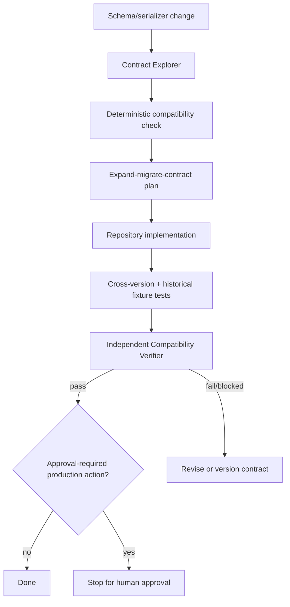

# Agent Message Schema Evolution Gate

Reusable AI engineering kit for safely evolving asynchronous message/event contracts across producers, consumers, retained messages, and replay workflows.

## Problem
Message contracts often change in code without a complete view of downstream consumers or historical payloads. A DTO can compile while older consumers fail on a required field, enum value, type change, field removal, serializer option change, or message-key semantic change. Retained broker messages, DLQs, outboxes, inboxes, and event stores make compatibility a time dimension as well as a service-to-service dimension.

## Purpose
Provide a repeatable investigate → classify → plan → implement → cross-version test → independently verify workflow. Deterministic JSON Schema comparison catches common structural regressions; agent procedures cover consumer behavior, semantics, rollout order, replay safety, and approval boundaries that static checking cannot prove.

## When to use
Use before changing Kafka/RabbitMQ/Azure Service Bus/SNS/SQS/domain-event/webhook payloads, serializer settings, envelopes, enum values, message keys, or versioning behavior.

## When not to use
Do not use this package as proof that arbitrary Avro/Protobuf/schema-registry compatibility is correct without adapting the deterministic checker to the actual format. Do not use it to directly mutate production brokers, schema registries, subscriptions, stored messages, or replay jobs.

## Architecture



## Package tree

```text
agent-message-schema-evolution-gate/
├── README.md
├── config/
│   └── schema-policy.json
├── schemas/
│   └── compatibility-report.schema.json
├── skills/
│   ├── investigate-message-contract.md
│   └── plan-schema-evolution.md
├── rules/
│   └── message-schema-safety.md
├── subagents/
│   ├── contract-explorer.md
│   └── compatibility-verifier.md
├── workflows/
│   └── schema-evolution-workflow.md
├── hooks/
│   └── pre-merge-compatibility.md
├── scripts/
│   ├── check-message-schema.py
│   └── verify-package.py
├── examples/
│   ├── order-created-v1.schema.json
│   └── order-created-v2.schema.json
└── tests/
    └── test-check-message-schema.py
```

## Component responsibilities
- `skills/investigate-message-contract.md`: finds serialization boundaries, consumers, reader behavior, retention, replay paths, and evidence.
- `skills/plan-schema-evolution.md`: converts evidence into a bounded rollout/rollback and compatibility plan.
- `rules/message-schema-safety.md`: enforceable safety, compatibility, evidence, retry, and approval rules.
- `subagents/contract-explorer.md`: read-only repository investigator.
- `subagents/compatibility-verifier.md`: independent verifier that must not rely solely on implementation-agent claims.
- `workflows/schema-evolution-workflow.md`: end-to-end workflow with checkpoints, failure paths, bounded retries, and Definition of Done.
- `hooks/pre-merge-compatibility.md`: deterministic pre-merge gate instructions.
- `scripts/check-message-schema.py`: Python standard-library checker for common backward-compatibility risks in JSON Schema.
- `scripts/verify-package.py`: verifies required package artifacts and invariants.
- `schemas/compatibility-report.schema.json`: handoff/report contract.
- `examples/*`: additive evolution fixture with optional field plus new enum value.
- `tests/test-check-message-schema.py`: executable positive and breaking regression tests.

## Installation
Copy this directory into a repository. Python 3.9+ is sufficient for the included scripts; no third-party Python dependency is required.

If your contracts are Avro, Protobuf, AsyncAPI, or registry-managed schemas, retain the workflow/rules/subagents but replace or extend the deterministic adapter with the official format/registry compatibility command. Do not claim the provided JSON Schema checker validates another format.

## Configuration
Edit `config/schema-policy.json` only when repository policy materially differs. Defaults:
- compatibility objective: backward;
- maximum transient retries: 2;
- breaking categories include removal/rename, type narrowing, optional→required, semantic enum changes, field-meaning changes, and message-key semantic changes;
- dangerous production operations require human approval.

## Permissions
The default workflow needs repository read/search and normal local build/test execution. Implementation needs ordinary repository edit permission. Production broker, registry, replay, secret, deployment, data, subscription/topic, and cutover permissions are intentionally not required for normal analysis and verification.

Never expand permissions merely to unblock the workflow.

## Usage

### 1. Investigate
Give the AI agent the target message, proposed change, producer, known consumers, and acceptance criteria. Apply `skills/investigate-message-contract.md` and `rules/message-schema-safety.md`.

### 2. Run deterministic compatibility checking

```bash
python scripts/check-message-schema.py \
  --old contracts/order-created-v1.schema.json \
  --new contracts/order-created-v2.schema.json \
  --message OrderCreated \
  --producer orders-api \
  --consumer billing-worker \
  --consumer notifications-worker \
  --output compatibility-report.json
```

Exit codes:
- `0`: no structurally breaking condition detected;
- `1`: at least one breaking condition detected;
- `2`: invalid input/tool error.

A zero exit code is **not** proof of behavioral compatibility. New enum values are intentionally warnings because consumer code may still be exhaustive/strict.

### 3. Test the package checker

```bash
python tests/test-check-message-schema.py
python scripts/verify-package.py
```

### 4. Plan and implement
Use `skills/plan-schema-evolution.md` and `workflows/schema-evolution-workflow.md`. Prefer expand-migrate-contract for rename/removal/type or semantic replacement.

### 5. Independently verify
The Compatibility Verifier reproduces deterministic results, inspects actual deserializers, runs required cross-version/historical fixture tests, checks the diff for hidden serializer/key/semantic changes, and verifies rollback feasibility.

## Example invocation

```text
Apply agent-message-schema-evolution-gate to OrderCreated.
Producer: Orders.Api.
Consumers: Billing.Worker and Notifications.Worker.
Proposed change: replace customerId with customer.id and add status=cancelled.
Find all actual consumers and serializer settings, assess retained-message replay exposure, produce the safest rollout, make only repository changes that do not require production approval, run compatibility and cross-version tests, then hand off to the independent Compatibility Verifier.
```

## Workflow

```text
Trigger
  ↓
Contract discovery
  ↓
Compatibility baseline
  ↓
Rollout + rollback plan
  ↓
Repository implementation
  ↓
Build / serialization / cross-version / replay-fixture tests
  ↓
Independent review
  ↓
Evidence-based verification
  ↓
Approval checkpoint for production-risk actions
  ↓
Complete
```

## Approval boundaries
Explicit human approval is required before:
- breaking schema retirement/cutover;
- production topic/subscription/schema-registry mutations;
- schema-registry compatibility-mode changes;
- production replay or DLQ reprocessing;
- destructive data operations;
- secret or production configuration changes;
- deployments or irreversible migrations associated with the change.

Agents must stop before these actions.

## Failure handling
- **Transient tool/network/test-infrastructure failure:** preserve evidence and retry at most 2 times.
- **Structural incompatibility:** do not retry; change design, use expand-migrate-contract, or version the message.
- **Behavioral/cross-version test failure:** block completion and preserve fixtures/output.
- **Unknown material consumer:** status is blocked until evidence resolves it.
- **Permission failure:** stop; do not request broader privileges automatically.
- **Historical replay incompatibility:** block retirement/cutover until compatibility adapter/versioning or an approved migration plan exists.

## Verification
Success requires evidence beyond generated code:
- producer serialization behavior identified;
- all discoverable material consumers identified;
- deterministic compatibility check run when applicable;
- relevant consumer strictness/tolerance verified;
- required old/new producer-consumer combinations tested;
- historical/replay exposure assessed;
- build/tests pass;
- diff contains no unintended serializer/key/semantic changes;
- rollback remains valid after new-format messages may exist;
- independent verifier passes;
- required approvals exist before dangerous actions.

## Definition of Done
The task is complete only when the output contract is satisfied, no blocking compatibility gap remains, required cross-version and replay-related tests pass, rollout and rollback are explicit, independent verification passes, remaining non-blocking risks are documented, and all approval-required production actions remain stopped until approved.

## Customization
Extend `check-message-schema.py` with repository-specific rules only when they are deterministic and testable. For schema-registry systems, isolate provider-specific commands in a new adapter/script while keeping core skills, rules, contracts, workflow, bounded retries, and approval boundaries tool-neutral.
