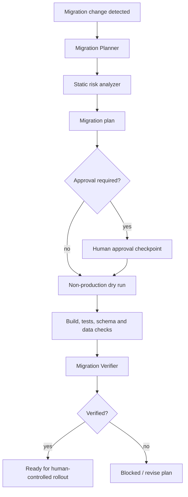

# Agent Migration Dry-Run Gate

A reusable safety and verification kit for AI-assisted database migrations. It prevents an agent from treating migration generation as completion, requires explicit risk classification and rollback planning, blocks unsafe production automation, and uses a non-production dry run plus independent verification before declaring a migration ready for human-controlled rollout.

## Problem
AI coding agents can generate migrations quickly but may miss destructive operations, deployment compatibility, lock/data risks, rollback gaps, or the difference between a migration that compiles and one that is operationally safe. This package turns migration work into a bounded, evidence-based gate.

## When to use
Use for SQL migrations, ORM migrations such as EF Core migrations, data backfills coupled to schema changes, index changes, constraint changes, renames, nullability changes, and other persistent-state changes.

Do not use it as a substitute for database-specific operational expertise on exceptionally large or mission-critical migrations. It also does not authorize unattended production execution.

## Architecture



## Package tree

```text
agent-migration-dry-run-gate/
├── README.md
├── config/
│   └── gate.yaml
├── hooks/
│   ├── post-migration.md
│   └── pre-migration.md
├── rules/
│   └── migration-safety.md
├── scripts/
│   ├── analyze-migration.py
│   ├── verify-package.py
│   └── verify-plan.py
├── skills/
│   ├── plan-migration.md
│   └── verify-migration.md
├── subagents/
│   ├── migration-planner.md
│   └── migration-verifier.md
├── templates/
│   └── migration-plan.yaml
└── workflows/
    └── migration-dry-run-gate.md
```

## Component responsibilities
- `rules/migration-safety.md`: enforceable safety, evidence, approval, and retry boundaries.
- `skills/plan-migration.md`: procedure for repository discovery, risk analysis, migration planning, and handoff.
- `skills/verify-migration.md`: independent evidence-based verification procedure.
- `subagents/migration-planner.md`: owns analysis and planning but cannot execute production changes.
- `subagents/migration-verifier.md`: independently validates the dry run and completion evidence.
- `workflows/migration-dry-run-gate.md`: bounded end-to-end execution lifecycle and failure paths.
- `hooks/pre-migration.md`: blocking checks before migration execution.
- `hooks/post-migration.md`: blocking verification after a non-production dry run.
- `scripts/analyze-migration.py`: dependency-free static scanner for risky SQL and common ORM migration constructs.
- `scripts/verify-plan.py`: dependency-free safety validation for a populated migration plan.
- `scripts/verify-package.py`: checks package completeness and README references.
- `templates/migration-plan.yaml`: structured handoff contract for planning, approvals, evidence, rollback, and verification.
- `config/gate.yaml`: shared risk, approval, retry, and status configuration.

## Installation
Copy this directory into the target repository, preferably under an agent/tooling directory such as `.ai/agent-migration-dry-run-gate/`. Python 3.9+ is sufficient for the included scripts; no third-party Python package is required.

The actual database dry-run command is project-specific. Use the repository's normal migration tool, for example EF Core, Flyway, Liquibase, DbUp, Alembic, Prisma, or a database-native client, but point automated runs only at a disposable or explicitly non-production database.

## Configuration
Edit `config/gate.yaml` only when repository policy requires different risk patterns or retry limits. Keep production execution, destructive SQL, irreversible migrations, security changes, and schema changes behind explicit human approval.

Create a working plan by copying `templates/migration-plan.yaml` and filling every applicable field. The plan must state the database engine, target environment, migration files, affected objects, risk, prechecks, dry-run command, rollback/roll-forward path, verification steps, approvals, evidence locations, and unresolved risks.

## Permissions
Use least privilege. Automated agents need repository read access and permission to run local build/test commands. Database credentials, if used, must target a non-production environment and should have only the permissions needed for the dry run. Do not grant broader credentials after a permission failure merely to unblock execution.

## Usage

### 1. Analyze the proposed migration

```bash
python scripts/analyze-migration.py path/to/001.sql path/to/002.sql --output .artifacts/migration-risk.json
```

Exit codes:
- `0`: scan completed with no statically blocked operation.
- `2`: an input file is missing.
- `3`: a blocked/destructive pattern was detected.

The scanner is intentionally conservative and does not replace database-engine-specific analysis.

### 2. Build the migration plan
Follow `skills/plan-migration.md` and populate a copy of `templates/migration-plan.yaml`.

### 3. Validate the plan

```bash
python scripts/verify-plan.py path/to/migration-plan.yaml
```

The validator blocks empty recovery/dry-run planning, unsupported status, and automated production targets. If approval is marked as required, an approval identity must be recorded before the gate can pass.

### 4. Execute the pre-migration hook
Follow `hooks/pre-migration.md`. Do not proceed if the static analyzer, plan validator, environment identity, or approval check fails.

### 5. Run the project-native migration against non-production
Record the exact command, target identity, stdout/stderr, exit code, and migration set executed. Never infer the target from a connection-string name alone; validate the actual environment/database identity with repository-specific tooling.

### 6. Execute post-migration verification
Follow `hooks/post-migration.md` and `skills/verify-migration.md`. Build/tests, expected schema changes, required data invariants, recovery readiness, and unrelated-diff checks must be evidenced.

## Example invocation for an AI coding agent

```text
Use agent-migration-dry-run-gate for the migration in this change.
Follow rules/migration-safety.md and workflows/migration-dry-run-gate.md.
First run scripts/analyze-migration.py on the changed migration files, then produce a populated migration plan from templates/migration-plan.yaml.
Do not run any production migration. Stop at every approval-required action.
After a non-production dry run, hand the recorded evidence to the Migration Verifier and report readiness only if verification returns verified.
```

## Approval boundaries
Explicit human approval is required before production deployment/execution, destructive SQL, schema changes, irreversible data transformations, secret changes, production configuration changes, breaking API changes caused by data-contract changes, security weakening, or other high-risk actions. Approval is scoped to the exact next action; it is not blanket permission for autonomous production changes.

## Failure and recovery
- Transient tool/environment failure: preserve evidence and retry at most twice.
- Build, test, SQL, constraint, or data-integrity failure: do not blindly retry; correct the plan or implementation first.
- Permission failure: stop; do not increase privileges automatically.
- Unknown or ambiguous target environment: stop immediately.
- Missing rollback/roll-forward path: block readiness.
- Analyzer-detected destructive operation: block automated execution and escalate.

## Verification
A task is only verified when the reviewed migration set matches the executed set, the target is known to be non-production, the dry run succeeds, expected schema changes are present, required data invariants hold, application checks pass, recovery remains viable, approvals are present when required, and the independent verifier returns `verified`.

Package self-check:

```bash
python scripts/verify-package.py
```

## Definition of Done
- Required migration context was gathered.
- All migration files and affected objects are identified.
- Static analyzer evidence exists.
- A complete migration plan exists.
- Required human approvals are recorded.
- A dry run completed on a verified non-production target.
- Build/tests and migration-specific schema/data checks passed.
- Rollback or roll-forward recovery is credible and documented.
- Independent verification completed with status `verified`.
- Remaining non-blocking risks are documented.
- No blocking failure remains.

## Customization
Extend `config/gate.yaml` with repository-specific risk patterns and adapt the plan's verification commands to the database engine. Keep the core separation of planner, executor/operator, verifier, and human approval boundaries intact. For tool-specific agents, map these files into that tool's skill/rule/subagent mechanism without changing the safety contract.
