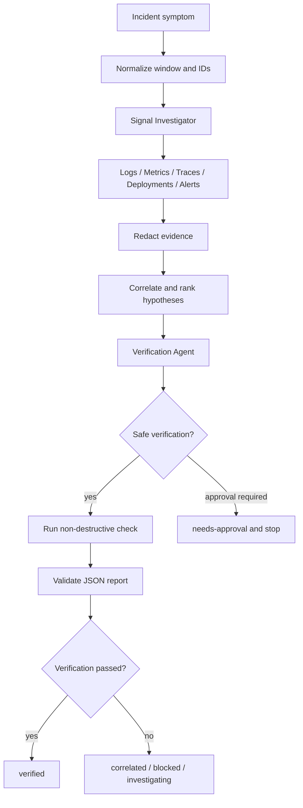

# Agent Observability Signal Correlation Triage

Reusable AI engineering kit for turning production symptoms into an evidence-backed incident triage report by correlating logs, metrics, traces, deployments, and alerts without allowing the agent to jump from temporal coincidence to an unverified root cause.

## Problem
Production investigations often begin from a single alert or log line. An AI agent can overfit to that first signal, ignore contradictory telemetry, leak sensitive evidence into handoffs, or propose risky production changes before causality is established. This package provides a bounded workflow that collects independent signals, preserves evidence, redacts sensitive data, ranks hypotheses, requires independent verification, and stops at explicit approval boundaries.

## When to use
Use for production error-rate spikes, latency regressions, failed requests, dependency failures, alert triage, suspected post-deployment regressions, or incidents where several observability systems must be correlated.

Do not use it as a substitute for a deployment pipeline, destructive remediation tool, security-forensics chain of custody, or unrestricted production automation.

## Package tree

```text
agent-observability-signal-correlation-triage/
├── README.md
├── config/
│   └── triage.yaml
├── schemas/
│   └── triage-report.schema.json
├── skills/
│   └── correlate-signals.md
├── rules/
│   └── safety-and-evidence.md
├── subagents/
│   ├── signal-investigator.md
│   └── verification-agent.md
├── workflows/
│   └── triage-workflow.md
├── hooks/
│   └── lifecycle-hooks.md
├── scripts/
│   ├── redact-evidence.py
│   └── validate-report.py
├── examples/
│   └── sample-report.json
└── tests/
    └── run-self-test.sh
```

## Architecture



## Components
`skills/correlate-signals.md` is the reusable investigation procedure. `rules/safety-and-evidence.md` defines enforceable evidence, security, retry, and approval boundaries. `subagents/signal-investigator.md` owns collection/correlation while `subagents/verification-agent.md` independently challenges the conclusion. `workflows/triage-workflow.md` is the end-to-end bounded state flow. `hooks/lifecycle-hooks.md` maps predictable lifecycle events to deterministic actions. `config/triage.yaml` contains thresholds and approval categories. `schemas/triage-report.schema.json` defines the handoff contract. The scripts perform redaction and report validation without third-party Python packages.

## Installation
Copy this directory into a repository. Python 3.9+ is required for the scripts; Bash is only required for the included self-test. No Python package installation is required.

Make scripts executable when the host environment honors executable bits:

```bash
chmod +x scripts/redact-evidence.py scripts/validate-report.py tests/run-self-test.sh
```

## Configuration
Edit `config/triage.yaml` to match the repository's risk model. The default investigation window is 30 minutes, telemetry/tool retries are capped at 2, two independent sources are required for correlation, and the default confidence threshold is 0.70. Keep approval-required actions conservative; removing an action from the list should be a deliberate human policy change, not an agent decision.

## Inputs
A run should provide the symptom, affected component, approximate time, timezone, available telemetry locations, known correlation IDs, and relevant repository/deployment context. Optional inputs include a known-good baseline, feature-flag history, dependency ownership, and safe staging/replay environment details.

## Permissions
Grant read-only telemetry access by default. Repository read access is sufficient for investigation. Do not grant deployment, secret-management, production-write, database-write, traffic-management, or infrastructure permissions merely to make this workflow complete.

## Usage
Start with `workflows/triage-workflow.md` and assign collection to the Signal Investigator. Keep raw telemetry outside prompts/commits when it may contain sensitive data. Before agent-to-agent handoff, create a redacted copy:

```bash
python3 scripts/redact-evidence.py evidence/raw.log evidence/redacted.log
```

Produce a report matching `schemas/triage-report.schema.json`, then validate it:

```bash
python3 scripts/validate-report.py triage-report.json
```

Run the package self-test after copying or modifying the scripts:

```bash
bash tests/run-self-test.sh
```

## Example invocation

```text
Investigate API checkout latency from 13:00-13:30 UTC+7. Start with request IDs from the alert, correlate API logs with dependency latency metrics and traces, check deployments in the same window, preserve contradictory evidence, and follow agent-observability-signal-correlation-triage/workflows/triage-workflow.md. Do not perform production mutations. Output a report matching schemas/triage-report.schema.json.
```

`examples/sample-report.json` demonstrates the contract without claiming a verified root cause.

## Workflow and retries
The workflow is Normalize → Collect → Redact → Correlate → Verify → Validate → Complete. Transient telemetry/tool failures may be retried at most twice per operation. Verification can return to correlation once, for no more than two hypothesis cycles. Permission errors are not retryable through privilege escalation. Contradictory evidence is preserved instead of discarded.

## Approval boundaries
Explicit human approval is required before production changes, restarts, rollbacks, traffic shifts, destructive queries, secret changes, or equivalent dangerous actions. The agent must set `needs-approval`, state the exact proposed action and evidence, and stop before executing it.

## Failure handling
If a telemetry source remains unavailable after bounded retries, preserve the failed query/error and use `blocked` when the missing evidence prevents a conclusion. If available signals disagree, widen context once and report the contradiction if unresolved. If no hypothesis reaches the configured confidence threshold after two cycles, stop without manufacturing a root cause. If report validation fails, correct distinct structural errors for at most two validation cycles.

## Verification
Task execution means signals were collected and a report was generated. Successful verification additionally requires reproducible checks, evidence attribution, redaction, a valid report, and `verification.result: passed` before `status: verified` is allowed. The validator enforces this status invariant.

## Definition of Done
The investigation window/timezone is explicit; required telemetry was inspected; evidence includes source and observation time; sensitive evidence was redacted before handoff; hypotheses include supporting and contradicting evidence; verification result and unresolved risks are recorded; report validation exits 0; no approval-required action was executed without approval; and no blocking failure remains hidden.

## Customization
Add organization-specific telemetry adapters outside this core package while keeping the report contract stable. Extend redaction patterns when your systems emit additional secret formats. Add signal types only when both the schema and workflow are updated together. Tool-specific instructions for OpenAI Codex, Claude Code, Cursor, ChatGPT, GitHub Copilot, OpenCode, or another agent should be isolated in repository-level configuration rather than changing the core safety rules.
