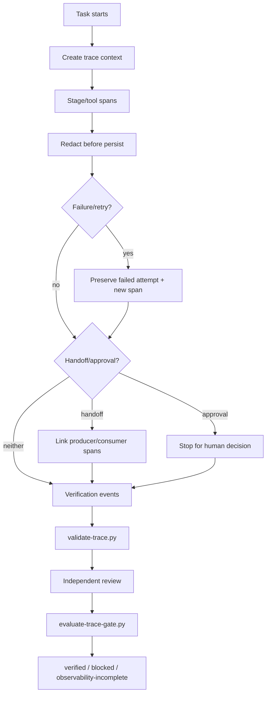

# Agent Observability Trace Contract

A reusable, tool-neutral observability package for AI-agent workflows. It defines how to trace stages, tool calls, retries, handoffs, approvals, failures, and verification so operators can reconstruct what happened without logging raw secrets or confusing execution with verification.

## Problem
Long-running or multi-agent workflows often fail in ways that are hard to reproduce: a tool times out after a possible side effect, a retry hides the first failure, a handoff loses context, an approval is unclear, or a workflow says “done” because a command returned successfully even though no independent verification ran. Free-form logs are difficult to correlate and frequently leak too much data.

## Purpose
This kit provides a deterministic event contract, redaction rules, lifecycle hooks, validator, independent review model, final gate, fixtures, and smoke tests that can be copied into a repository with minimal changes.

## When to use
Use for coding agents, QA agents, CI repair agents, research pipelines, MCP/tool workflows, incident agents, multi-agent systems, resumable jobs, or any workflow with retries, approvals, side effects, and evidence-based completion.

## When not to use
A tiny one-shot local prompt with no tools, side effects, delegation, retry, or verification requirement usually does not need this package.

## Architecture



## Component responsibilities
- `skills/trace-instrumentation.md` — procedure for instrumenting workflow stages, tools, retries, handoffs, approvals, and verification.
- `skills/trace-verification.md` — independent trace integrity/completeness review procedure.
- `rules/trace-governance.md` — enforceable MUST/MUST NOT/SHOULD rules.
- `subagents/trace-instrumentation-agent.md` — owns instrumentation and trace production.
- `subagents/observability-reviewer.md` — independently reviews high-risk trace evidence.
- `workflows/agent-trace-workflow.md` — end-to-end workflow with checkpoints, bounded retries, approvals, failure paths, and DoD.
- `hooks/trace-lifecycle-hooks.md` — pre-task, tool, retry, approval, and final verification hooks.
- `config/trace-policy.json` — redaction, retry, risk, approval, and final-status policy.
- `schemas/trace-event.schema.json` — portable event contract.
- `scripts/emit-trace-event.py` — safe JSONL event emitter with deterministic redaction.
- `scripts/validate-trace.py` — trace structure, lifecycle, verification, and sensitive-key validation.
- `scripts/evaluate-trace-gate.py` — deterministic final verification gate.
- `templates/review-record.example.json` — independent reviewer record template.
- `examples/verified-run.jsonl` — complete example trace.
- `tests/smoke-test.py` — executable end-to-end checks.

## Package tree

```text
agent-observability-trace-contract/
├── README.md
├── config/
│   └── trace-policy.json
├── examples/
│   └── verified-run.jsonl
├── hooks/
│   └── trace-lifecycle-hooks.md
├── rules/
│   └── trace-governance.md
├── schemas/
│   └── trace-event.schema.json
├── scripts/
│   ├── emit-trace-event.py
│   ├── evaluate-trace-gate.py
│   └── validate-trace.py
├── skills/
│   ├── trace-instrumentation.md
│   └── trace-verification.md
├── subagents/
│   ├── observability-reviewer.md
│   └── trace-instrumentation-agent.md
├── templates/
│   └── review-record.example.json
├── tests/
│   └── smoke-test.py
└── workflows/
    └── agent-trace-workflow.md
```

## Dependencies
- Python 3.9+
- Python standard library only
- Writable local trace/artifact directory
- Optional external telemetry/exporter is allowed but not required

The core contract is vendor-neutral and can be used with OpenAI Codex, Claude Code, Cursor, ChatGPT, GitHub Copilot, OpenCode, custom agents, MCP servers, or CI orchestration.

## Installation
Copy this directory into the target repository. Keep paths unchanged or update hook commands consistently. No package installation is required.

## Configuration
Edit `config/trace-policy.json` to set:
- which workflows require traces
- which risk levels require independent review
- approval-required side-effect classes
- sensitive-key patterns
- max attribute length
- telemetry retry budget

Do not remove secret redaction merely to simplify debugging.

## Permissions
The trace layer should use least privilege. It only needs permission to read workflow metadata and write local trace artifacts. It must not request broader production/tool permissions just to improve observability.

## Usage

Emit a task event:

```bash
python scripts/emit-trace-event.py \
  --trace traces/run.jsonl \
  --event task.started \
  --trace-id trace-12345678 \
  --span-id root-001 \
  --actor implementation-agent \
  --status started \
  --risk medium
```

Validate the final trace:

```bash
python scripts/validate-trace.py \
  --trace traces/run.jsonl \
  --policy config/trace-policy.json \
  --output artifacts/trace-validation.json
```

After independent review, evaluate the gate:

```bash
python scripts/evaluate-trace-gate.py \
  --trace traces/run.jsonl \
  --policy config/trace-policy.json \
  --review artifacts/review.json \
  --output artifacts/trace-gate.json
```

Run package verification:

```bash
python tests/smoke-test.py
```

## Event design
Every event carries:
- `trace_id`: one logical task run
- `span_id`: one stage/tool/verification unit
- `parent_span_id`: delegation or nested-operation lineage
- event name and status
- actor
- optional attempt number
- risk and side-effect class
- evidence references
- bounded, redacted attributes

Tool inputs and outputs should normally be represented by fingerprints, counts, status codes, artifact references, and bounded metadata rather than complete payloads.

## Retry semantics
Retries do not overwrite prior attempts. A failed or unknown attempt remains in the trace and a retry receives a new span/attempt. Telemetry/export failures may be retried at most once when local evidence remains intact. Validation, security, approval, permission, business-rule, or verification failures are not blindly retried.

## Approval boundaries
Explicit human approval is required before dangerous actions including production deployment, destructive SQL, schema changes, data/file deletion, force push, infrastructure/secret/production-config changes, breaking contracts, security weakening, irreversible migrations, or large dependency upgrades. The trace records approval request/decision evidence but does not replace the approval system itself.

## Failure handling
- Exporter unavailable: retain local JSONL and retry export once.
- Malformed trace: block verification and repair instrumentation.
- Sensitive data detected: stop export/persistence of affected material and remediate the leak; never waive the finding automatically.
- Crash/open spans: on recovery mark unresolved spans `unknown` or `abandoned`; never invent success.
- Missing verification: report executed-but-unverified.
- Missing approval: stop the dangerous action.

## Verification
A successful command is only execution evidence. Final `verified` requires:
- complete trace lifecycle
- no blocking sensitive-data findings
- required approval evidence
- explicit verification events with evidence references
- independent reviewer identity for high/critical risk
- deterministic gate success

## Definition of Done
The package is correctly integrated when:
1. required workflow stages/tool calls emit correlated events;
2. retries preserve first-failure evidence;
3. handoffs/approvals/verification are linked to the same trace;
4. raw secrets are not persisted;
5. validator passes;
6. high-risk work has independent review;
7. final gate returns `verified`;
8. `python tests/smoke-test.py` passes.

## Customization
Add event attributes only when they improve diagnosis or auditability. Prefer stable, low-cardinality metadata and fingerprints. Exporter-specific metadata belongs under an isolated attribute namespace and must not change the core event semantics.
