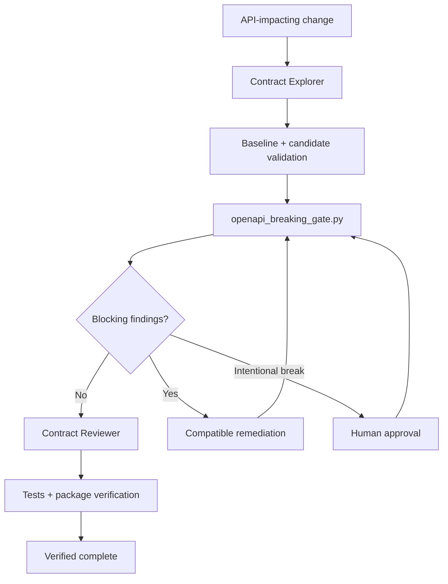

# Agent OpenAPI Breaking Change Gate

A reusable AI-engineering implementation kit for preventing accidental backward-incompatible API contract changes during agent-assisted development, refactoring, code review, and release preparation.

## Problem
AI coding agents can compile and test a codebase while still changing a public HTTP contract in ways existing consumers cannot tolerate. Typical regressions include removed routes, removed response codes, parameters becoming required, request/response type changes, and removed enum values. Compilation is not contract verification.

## Purpose
This package adds a deterministic compatibility gate plus agent procedures, independent verification, bounded recovery, and explicit human approval for intentional breaking changes.

## When to use
Use whenever controllers/routes, request or response DTOs, serializers, API versioning, OpenAPI generation, or public endpoint behavior may change. It is suitable for PR validation and pre-release checks.

## When not to use
Do not treat it as a replacement for integration tests, consumer-driven contract tests, authorization testing, runtime behavior testing, or business-level API review. The included comparator intentionally focuses on high-value structural OpenAPI compatibility checks rather than every rule in the OpenAPI specification.

## Architecture



## Package tree

```text
agent-openapi-breaking-change-gate/
├── README.md
├── config/policy.yaml
├── rules/api-contract-safety.md
├── skills/contract-diff-analysis.md
├── skills/breaking-change-review.md
├── subagents/contract-explorer.md
├── subagents/contract-reviewer.md
├── workflows/openapi-contract-gate.md
├── hooks/lifecycle.md
├── schemas/gate-result.schema.json
├── templates/breaking-change-approval.md
├── scripts/openapi_breaking_gate.py
├── scripts/verify_package.py
├── examples/baseline.json
├── examples/candidate-breaking.json
└── tests/test_openapi_breaking_gate.py
```

## Component responsibilities
- `config/policy.yaml` defines blocking categories and retry/approval defaults.
- `rules/api-contract-safety.md` defines enforceable MUST, MUST NOT, and SHOULD boundaries.
- `skills/contract-diff-analysis.md` defines the comparison procedure.
- `skills/breaking-change-review.md` defines remediation and approval handling.
- `subagents/contract-explorer.md` owns repository contract discovery without edits.
- `subagents/contract-reviewer.md` independently verifies deterministic findings and final status.
- `workflows/openapi-contract-gate.md` defines lifecycle, retries, failure paths, approval checkpoint, and Definition of Done.
- `hooks/lifecycle.md` defines pre-task, post-edit, and final deterministic hooks.
- `schemas/gate-result.schema.json` defines the result contract.
- `templates/breaking-change-approval.md` records human approval for unavoidable breaks.
- `scripts/openapi_breaking_gate.py` detects configured structural breaking changes with meaningful exit codes.
- `scripts/verify_package.py` verifies required package artifacts exist and are referenced here.
- `examples/baseline.json` and `examples/candidate-breaking.json` provide a reproducible example.
- `tests/test_openapi_breaking_gate.py` proves pass, block, and validation-error behavior.

## Installation
Requires Python 3.9+ for JSON specs. YAML inputs require `PyYAML`.

```bash
python -m pip install pyyaml
```

## Configuration
Edit `config/policy.yaml` only through normal repository review. Do not change policy solely to suppress a finding. The default policy blocks removed paths/operations/status codes, removed parameters, parameters becoming required, newly required request properties, request/response type changes, and removed enum values.

## Usage

```bash
python scripts/openapi_breaking_gate.py \
  --baseline examples/baseline.json \
  --candidate examples/candidate-breaking.json \
  --policy config/policy.yaml \
  --output gate-result.json
```

Exit codes: `0` pass, `2` breaking changes blocked, `3` validation/configuration/input failure.

For repository integration, point `--baseline` to the contract consumers currently depend on and `--candidate` to the newly generated contract. Keep generation stable across local and CI runs.

## Example agent invocation
Follow `skills/contract-diff-analysis.md`, obey `rules/api-contract-safety.md`, use context from `subagents/contract-explorer.md`, execute `scripts/openapi_breaking_gate.py`, and hand findings to `subagents/contract-reviewer.md`. If a breaking change remains necessary, stop until an authorized human completes `templates/breaking-change-approval.md`.

## Workflow
The canonical workflow is `workflows/openapi-contract-gate.md`. It permits one retry after a changed candidate/remediation in a validation cycle. Missing context or invalid specs never become success.

## Approval boundaries
Explicit human approval is required for an intentional breaking public API contract. Production deployment, destructive database work, infrastructure or secret changes, force pushes, irreversible migrations, and security weakening require separate authorization. The implementing agent cannot be the sole verifier.

## Failure handling
- Missing baseline: block; never generate a baseline from the candidate.
- Invalid OpenAPI/config: return validation error.
- Transient file/tool failure: retry at most once and preserve the first error.
- Breaking finding: remediate compatibly or obtain explicit approval.
- Unknown consumer impact: remain blocked.

## Verification

```bash
python -m unittest tests/test_openapi_breaking_gate.py
python scripts/verify_package.py .
```

For repository use, also regenerate the candidate contract using the project's normal command, execute the gate, optionally validate output against `schemas/gate-result.schema.json`, and inspect the source diff. Task execution is not verified success.

## Definition of Done
- Authoritative baseline and candidate identified and parsed.
- Deterministic gate completed.
- No unapproved blocking findings remain.
- Every blocking finding has reproducible evidence.
- Contract Reviewer independently verified final status.
- `tests/test_openapi_breaking_gate.py` passes.
- `scripts/verify_package.py` passes.
- Intentional breaking changes have explicit approval plus migration/versioning plans.
- Remaining risks are documented and no blocking failure remains.

## Customization
Extend `scripts/openapi_breaking_gate.py` for security-scheme changes, media-type removals, schema removals, format/constraint narrowing, discriminator changes, or operation-level authorization requirements. Add each category to `config/policy.yaml`, update tests, and keep deterministic decisions separate from agent reasoning.
