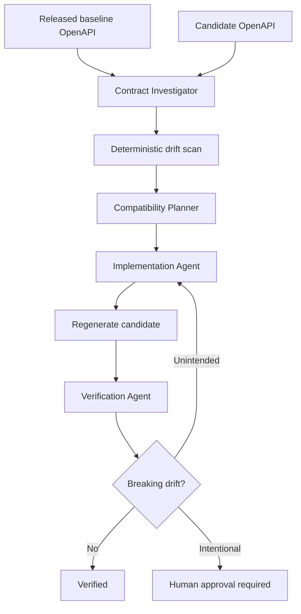

# Agent OpenAPI Contract Drift Gate

Reusable AI-engineering kit for detecting and preventing accidental breaking drift between a released OpenAPI contract and a candidate contract before merge or release.

## Problem
API changes often compile and pass service-side tests while silently breaking consumers: paths or operations disappear, required response fields vanish, request requirements become stricter, enums narrow, schema types change, status semantics move, or authentication requirements become stronger. The failure is frequently discovered only after client generation, integration testing, or production rollout.

## Purpose
This package combines deterministic OpenAPI comparison with structured agent responsibilities, explicit approval boundaries, bounded recovery, and independent verification. It is tool-neutral and can be used with Codex, Claude Code, Cursor, ChatGPT, GitHub Copilot, OpenCode, or another repository-capable coding agent.

## When to use
Use before merging endpoint/DTO/auth changes, regenerating API clients, publishing a new OpenAPI document, changing API versions, or investigating consumer failures caused by contract drift.

## When not to use
Do not treat this lightweight comparator as a complete semantic OpenAPI compatibility engine. Vendor-specific behavior, advanced composition (`oneOf`/`allOf`), serialization rules, runtime behavior, and consumer-specific assumptions may require additional contract tests or dedicated tooling.

## Architecture


## Package tree
```text
agent-openapi-contract-drift-gate/
├── README.md
├── config/
│   └── contract-policy.json
├── examples/
│   ├── baseline.openapi.json
│   └── breaking.openapi.json
├── hooks/
│   └── pre-merge-contract-check.md
├── rules/
│   └── api-contract-safety.md
├── schemas/
│   └── drift-report.schema.json
├── scripts/
│   ├── openapi_drift.py
│   └── validate_report.py
├── skills/
│   └── investigate-contract-drift.md
├── subagents/
│   ├── compatibility-planner.md
│   ├── contract-investigator.md
│   ├── implementation-agent.md
│   └── verification-agent.md
├── templates/
│   └── client-impact-note.md
├── tests/
│   └── test_openapi_drift.py
└── workflows/
    └── contract-drift-gate.md
```

## Dependencies
Python 3.9+ is sufficient for the deterministic scripts. No third-party Python package is required. Your repository may additionally require its normal build/test toolchain and client generator.

## Installation
Copy this directory into the target repository. Keep the relative paths unchanged or update hook/workflow references consistently. Replace the example baseline/candidate with your real contract sources or point the commands at your existing files.

## Configuration
Edit `config/contract-policy.json` only when project policy differs. `ignore_paths` is intended for non-consumer operational endpoints. `max_retries` is fixed at two by the workflow. Breaking classifications must not be weakened merely to pass CI.

## Permissions
The investigation and verification stages need read access plus permission to execute local scripts/tests. The implementation stage needs repository write access. Production deployment, secret/config changes, infrastructure changes, irreversible migrations, and intentional breaking contracts require explicit human approval.

## Usage
Run from the package root or adapt paths from the repository root:

```bash
python scripts/openapi_drift.py examples/baseline.openapi.json examples/breaking.openapi.json --policy config/contract-policy.json --output openapi-drift-report.json
python scripts/validate_report.py openapi-drift-report.json
```

The drift command exits `0` when no detected breaking drift exists and `2` when breaking drift exists. Input/load failures terminate with a non-zero error. The validator uses non-zero exit codes for invalid report structure or inconsistent status/counts.

Run the self-test:

```bash
python tests/test_openapi_drift.py
```

## Example invocation for an AI coding agent
Ask the agent to follow `workflows/contract-drift-gate.md`, enforce `rules/api-contract-safety.md`, use `skills/investigate-contract-drift.md`, compare your released and candidate specs, and stop before any approval-required action.

## Workflow
1. Establish trustworthy baseline and candidate provenance.
2. Investigator maps contract drift to implementation/tests and runs the initial deterministic scan.
3. Planner classifies drift and proposes the smallest compatibility-preserving remediation.
4. Implementation Agent makes scoped changes and regenerates the candidate spec.
5. Verification Agent independently reruns scan/report validation, relevant build/tests/client generation, and diff inspection.
6. Complete only with `verified` status and no unapproved breaking drift.

## Approval boundaries
Explicit human approval is mandatory before intentional breaking API contracts, production deployment, secret/config changes, infrastructure changes, or irreversible migrations. Agents must not interpret task assignment as implicit approval.

## Failure handling
Transient tool/process failures may be retried at most twice while preserving command output and inputs. Validation, build, client, or contract-test failures are not retried unchanged; they require diagnosis. Missing baseline provenance, permission failure, or unapproved breaking drift blocks completion. Permissions must never be silently elevated.

## Verification
Evidence-based verification requires:
- deterministic drift report generated from the intended baseline/candidate;
- `scripts/validate_report.py` succeeds;
- relevant build, server tests, contract tests, and client generation/build pass when available;
- Git diff contains no unexplained contract changes;
- intentional breaking changes have explicit approval and migration guidance;
- remaining risks are documented.

## Definition of Done
The baseline and candidate are identified; findings are evidence-backed; unintended drift is removed; the candidate is regenerated; deterministic checks pass; relevant tests/client builds pass; independent verification returns `verified`; required approvals exist; no blocking failure remains.

## Customization
Extend `openapi_drift.py` for project-specific rules such as `oneOf`/`allOf`, media-type compatibility, discriminator changes, nullable semantics, header contracts, operation IDs, or custom extensions. Keep deterministic policy in scripts/config and keep agent reasoning focused on repository evidence, remediation, and risk.
