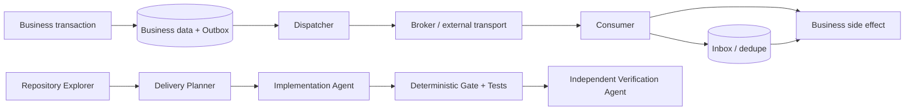

# Agent Outbox/Inbox Delivery Safety Gate

Reusable AI-engineering kit for preventing lost events and duplicate business effects in asynchronous integrations that use a transactional outbox plus consumer inbox/idempotency handling.

## Problem
Distributed workflows commonly fail in crash windows: business state commits but an event is never published, a publisher retries after an unknown acknowledgement, a consumer receives the same event multiple times, or an external side effect is executed twice. The transport may be at-least-once; the engineering goal is durable delivery with an exactly-once business effect where the domain requires it.

## Purpose
This kit gives coding agents and developers an evidence-driven workflow to map delivery semantics, plan minimal changes, implement bounded recovery/idempotency, run deterministic checks, and independently verify correctness.

## When to use
Use for new or changed message publishing, queue/topic consumers, integration events, webhooks routed through a durable inbox, background dispatchers, delivery incidents, duplicate effects, or refactors of retry/transaction logic.

## When not to use
Do not use this kit as proof that a broker provides globally exactly-once delivery. It also does not replace domain ordering/version-conflict rules, broker-specific disaster recovery, or provider-specific idempotency documentation.

## Architecture



## Package tree

```text
agent-outbox-inbox-delivery-safety-gate/
├── README.md
├── config/
│   └── policy.yaml
├── examples/
│   └── delivery-snapshot.json
├── hooks/
│   └── lifecycle.md
├── rules/
│   └── delivery-safety.md
├── schemas/
│   └── delivery-result.schema.json
├── scripts/
│   ├── outbox_inbox_gate.py
│   └── verify_package.py
├── skills/
│   ├── inbox-idempotency-review.md
│   └── outbox-safety-review.md
├── subagents/
│   ├── delivery-planner.md
│   ├── implementation-agent.md
│   ├── repository-explorer.md
│   └── verification-agent.md
├── templates/
│   └── delivery-review.md
├── tests/
│   └── test_outbox_inbox_gate.py
└── workflows/
    └── delivery-safety-gate.md
```

## Component responsibilities
- `skills/outbox-safety-review.md`: procedure for producer transaction, dispatch, retry, acknowledgement, and crash-recovery analysis.
- `skills/inbox-idempotency-review.md`: procedure for consumer dedupe, transaction, acknowledgement, and side-effect analysis.
- `rules/delivery-safety.md`: enforceable MUST/MUST NOT/SHOULD safety rules.
- `subagents/repository-explorer.md`: read-only evidence gathering.
- `subagents/delivery-planner.md`: minimal evidence-backed change planning.
- `subagents/implementation-agent.md`: scoped implementation and tests without crossing approval boundaries.
- `subagents/verification-agent.md`: independent post-change verification.
- `workflows/delivery-safety-gate.md`: bounded end-to-end workflow and Definition of Done.
- `hooks/lifecycle.md`: deterministic lifecycle checks and blocking behavior.
- `scripts/outbox_inbox_gate.py`: deterministic validation of repository/test evidence against policy.
- `scripts/verify_package.py`: package completeness/reference check.
- `config/policy.yaml`: retry and approval defaults.
- `schemas/delivery-result.schema.json`: output contract for gate results.
- `templates/delivery-review.md`: reusable evidence/verification report.
- `examples/delivery-snapshot.json`: passing evidence snapshot example.
- `tests/test_outbox_inbox_gate.py`: executable unit tests for pass, block, approval, and retry-budget cases.

## Dependencies
Core scripts require Python 3.9+. `scripts/outbox_inbox_gate.py` uses only the standard library for JSON input. Reading `config/policy.yaml` requires PyYAML:

```bash
python -m pip install pyyaml
```

The package verification script uses only the standard library.

## Installation
Copy this directory into the target repository. Keep the internal relative paths unchanged unless you also update workflow/hook references. Customize `config/policy.yaml` to match retry/redelivery constraints before using the gate as a CI blocker.

## Configuration
`config/policy.yaml` defines producer retry budget, dedupe retention, verification expectations, and actions that require approval. Do not reduce safety controls simply to obtain a passing result. `dedupe_ttl_hours` should be greater than the maximum realistic transport redelivery window.

## Permissions
Normal analysis needs read access to repository files and non-production logs. Implementation needs write access only to scoped repository files plus local/test resources. Production replay, schema/data mutation, destructive repair, production configuration, infrastructure changes, breaking contracts, permission escalation, or weakened security controls require explicit human approval.

## Usage
First run the package self-check:

```bash
python scripts/verify_package.py
python -m unittest tests/test_outbox_inbox_gate.py
```

Then create a repository-specific evidence snapshot using `examples/delivery-snapshot.json` as the structural example. Values must come from code, tests, logs, transaction behavior, and observed failure-mode tests rather than guesses.

Run the deterministic gate:

```bash
python scripts/outbox_inbox_gate.py \
  --input examples/delivery-snapshot.json \
  --policy config/policy.yaml \
  --output delivery-result.json
```

Exit code `0` means the supplied evidence passed the deterministic checks. Exit code `1` means blocked or approval-required. Exit code `2` means input, dependency, or I/O failure. A passing sample file is not proof that a target repository is safe; replace the evidence with target-repository observations.

## Example agent invocation

```text
Use the Agent Outbox/Inbox Delivery Safety Gate on the current repository.
Follow rules/delivery-safety.md and workflows/delivery-safety-gate.md.
Start with the Repository Explorer, preserve facts separately from hypotheses,
and do not edit until the Delivery Planner has produced a scoped plan.
Implement only safe non-approval changes. Build a delivery evidence snapshot,
run scripts/outbox_inbox_gate.py, run relevant failure-mode tests, and hand
all evidence to the Independent Verification Agent. Do not report verified
completion unless the deterministic gate, tests, and independent review pass.
```

## Workflow
1. Inspect repository structure and locate producer/consumer entry points.
2. Establish transaction boundaries and message identity from evidence.
3. Plan the smallest changes for transactional enqueue, bounded dispatch recovery, atomic inbox dedupe, and idempotent/reconciled external effects.
4. Stop before approval-required changes.
5. Implement approved safe changes and targeted failure-mode tests.
6. Generate an evidence snapshot and run `scripts/outbox_inbox_gate.py`.
7. Run repository-native build/tests, including rollback, duplicate, concurrency, retry, and crash-window cases relevant to the codebase.
8. Have `subagents/verification-agent.md` independently inspect the diff and evidence.
9. Report `verified` only when all Definition of Done checks pass.

Detailed stage ownership, retries, checkpoints, failure paths, and stop conditions are in `workflows/delivery-safety-gate.md`.

## Approval boundaries
Explicit approval is mandatory before production message replay, destructive SQL or data repair, inbox/outbox deletion, schema changes, production config or infrastructure changes, force push/history rewriting, secret changes, breaking message contracts, large dependency upgrades, or weakening security/uniqueness controls. Agents must stop rather than silently increase privileges.

## Failure handling
Transient tool/network/test-infrastructure failures may be retried at most twice while preserving original evidence. Deterministic validation failures and business-rule failures are not blindly retried. Permission failures stop without privilege escalation. If an external provider cannot guarantee idempotent side effects, the workflow requires a proven reconciliation/compensation design or remains blocked.

## Verification
A task being executed is not the same as being verified. Verification requires evidence for transactional enqueue, stable identity, bounded retries, acknowledgement ordering, crash recovery, atomic durable dedupe, a single committed business effect after duplicate delivery, and idempotency/reconciliation for external side effects. Repository-native build/tests and independent diff review remain required even when `scripts/outbox_inbox_gate.py` passes.

The deterministic result structure is defined by `schemas/delivery-result.schema.json`.

## Definition of Done
- Relevant producer/consumer context and transaction boundaries are gathered.
- Outbox enqueue is atomic with business state when required.
- Dispatcher retries are bounded and crash recovery is proven.
- Stable event/idempotency identity exists before first delivery attempt.
- Consumer dedupe is atomic and durable.
- Acknowledgement occurs only after durable completion.
- Duplicate/concurrent delivery tests demonstrate one business effect.
- Non-transactional external effects are idempotent or have verified reconciliation.
- Deterministic gate passes against real repository evidence.
- Relevant build/unit/integration tests pass.
- Independent verification passes and no unintended diff remains.
- Required approvals are present for any risky action; otherwise the workflow stops.
- Remaining non-blocking risks are documented in `templates/delivery-review.md` format.

## Customization
Adapt retry values and dedupe retention in `config/policy.yaml`. Extend the evidence snapshot only when a repository has materially different delivery invariants; keep the core concepts tool-neutral. Broker/framework-specific commands belong in the target repository, while the safety rules, skills, contracts, and verification sequence stay reusable across .NET, Java, Node.js, Python, Go, and other stacks.
