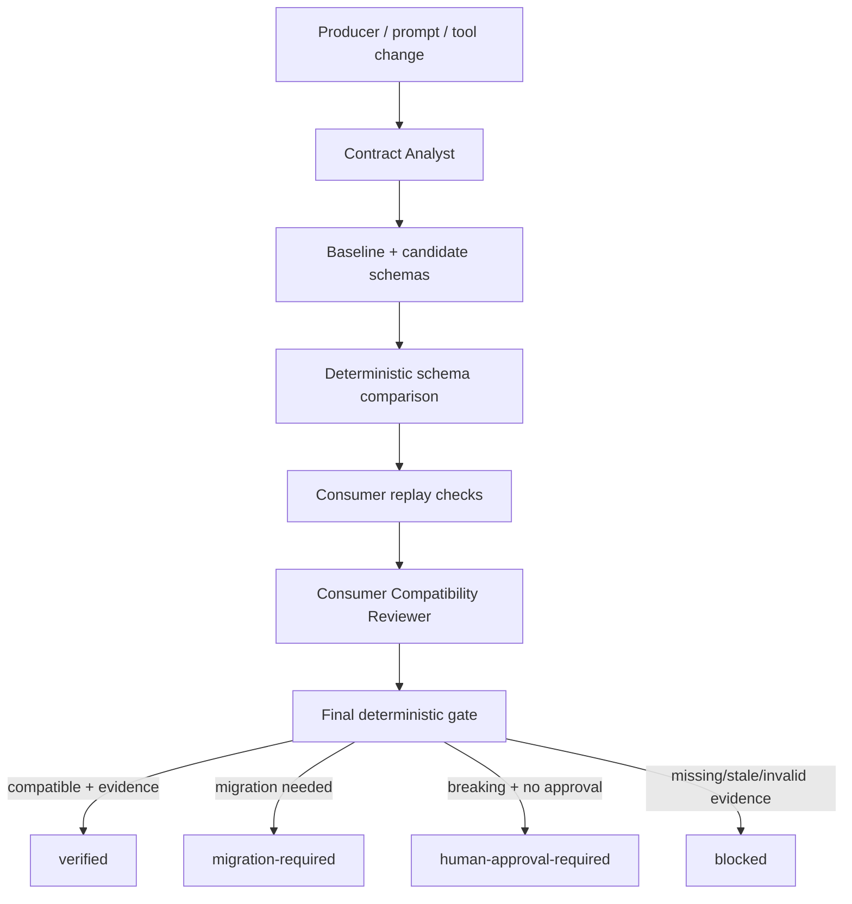

# Agent Output Schema Contract Gate

Reusable guardrail for AI-agent pipelines where one agent/tool produces structured output that another agent, script, service, CI job, or workflow stage consumes.

## Problem

Structured agent output often looks stable until a prompt, model, serializer, tool schema, enum, or field meaning changes. JSON may still parse while downstream behavior silently breaks: a required field disappears, an enum narrows, null becomes forbidden, a status changes meaning, or a consumer expects a field that the producer no longer emits.

This package turns structured AI output into an explicit versioned contract and gates incompatible evolution with deterministic validation, schema comparison, consumer replay evidence, independent review, and approval boundaries.

## When to use

Use it for:
- Multi-agent handoffs.
- Structured LLM outputs consumed by code.
- Tool/function result envelopes.
- Agent-to-agent JSON/YAML contracts.
- CI/CD agent artifacts.
- Research/review/planning agents whose results feed deterministic automation.
- Any workflow where schema drift can cause silent downstream failure.

Do not use it for purely human-readable prose with no machine consumer, or as a replacement for business-domain acceptance testing.

## Architecture



## Package tree

```text
agent-output-schema-contract-gate/
├── README.md
├── config/
│   └── contract-policy.json
├── examples/
│   ├── baseline.schema.json
│   ├── candidate-breaking.schema.json
│   ├── candidate-compatible.schema.json
│   └── candidate-instance.json
├── hooks/
│   └── output-contract-hooks.md
├── rules/
│   └── output-contract-governance.md
├── schemas/
│   └── contract-record.schema.json
├── scripts/
│   ├── compare-contract-schemas.py
│   ├── evaluate-contract-gate.py
│   └── validate-contract-instance.py
├── skills/
│   ├── compatibility-review.md
│   └── output-contract-design.md
├── subagents/
│   ├── consumer-compatibility-reviewer.md
│   └── contract-analyst.md
├── templates/
│   └── contract-record.json
├── tests/
│   └── smoke-test.py
└── workflows/
    └── output-schema-contract-workflow.md
```

## Component responsibilities

- `skills/output-contract-design.md`: discovers producer/consumer assumptions and formalizes a stable contract.
- `skills/compatibility-review.md`: classifies candidate changes with structural + semantic evidence.
- `rules/output-contract-governance.md`: enforceable MUST/MUST NOT/SHOULD rules.
- `subagents/contract-analyst.md`: owns inventory/schema preparation but cannot self-approve breaking drift.
- `subagents/consumer-compatibility-reviewer.md`: independently verifies downstream compatibility.
- `workflows/output-schema-contract-workflow.md`: end-to-end bounded workflow and Definition of Done.
- `hooks/output-contract-hooks.md`: predictable pre-change, post-generation, post-schema, and pre-release gates.
- `scripts/validate-contract-instance.py`: dependency-free JSON-instance validator for the common schema subset used by this kit.
- `scripts/compare-contract-schemas.py`: deterministic compatibility diff for property/type/enum/nullability/format/additional-properties changes.
- `scripts/evaluate-contract-gate.py`: binds hashes, replay evidence, reviewer independence, migration readiness, and approvals into the final gate.
- `config/contract-policy.json`: project-specific compatibility policy.
- `schemas/contract-record.schema.json`: contract-record structure.
- `templates/contract-record.json`: reusable integration template.
- `examples/*`: baseline, compatible, breaking, and instance examples.
- `tests/smoke-test.py`: executable end-to-end self-test.

## Dependencies

Python 3.9+ standard library only for included scripts. No third-party package is required.

## Installation

Copy this directory into your repository, then customize `config/contract-policy.json` and `templates/contract-record.json` for your producer/consumer names, risk levels, schema paths, replay checks, and approval process.

## Configuration

Important policy fields:
- `breaking_changes_require_human_approval`
- `migration_required_changes_block_release`
- `independent_review_for`
- `mandatory_replay_for_risk`
- `breaking_rules`
- `migration_rules`
- `max_transient_retries`
- `fail_closed_on_missing_evidence`

Core statuses are:
- `compatible`
- `migration-required`
- `breaking`
- `verified`
- `human-approval-required`
- `blocked`

## Usage

Validate a representative candidate instance:

```bash
python scripts/validate-contract-instance.py \
  --schema examples/candidate-compatible.schema.json \
  --instance examples/candidate-instance.json
```

Compare baseline and candidate schemas:

```bash
python scripts/compare-contract-schemas.py \
  --baseline examples/baseline.schema.json \
  --candidate examples/candidate-compatible.schema.json \
  --policy config/contract-policy.json \
  --out compatibility-report.json
```

Evaluate the final gate after filling a real contract record and review record:

```bash
python scripts/evaluate-contract-gate.py \
  --record contract-record.json \
  --compatibility compatibility-report.json \
  --review review.json \
  --policy config/contract-policy.json
```

## Workflow

1. Inventory producer and all direct consumers.
2. Capture the approved baseline schema and hash.
3. Build the candidate schema from actual producer behavior.
4. Validate representative candidate instances.
5. Compute deterministic schema compatibility diff.
6. Run mandatory consumer replay checks.
7. Record semantic changes not expressible in JSON Schema.
8. Perform independent compatibility review when policy requires it.
9. Supply migration evidence for migration-required changes.
10. Obtain human approval for breaking production contract changes.
11. Run the final deterministic gate.
12. Release only when the gate returns `verified`.

## Compatibility model

The comparator flags at least:
- Removed properties.
- Newly required properties.
- Type changes.
- Enum narrowing and expansion.
- Nullable → non-nullable changes.
- Format changes.
- New optional properties.
- Restricting `additionalProperties`.

JSON Schema cannot prove semantic compatibility. Review must separately cover changes such as units, timestamp meaning, status semantics, confidence interpretation, ordering guarantees, identifier meaning, aggregation logic, and error-state semantics.

## Approval boundaries

Explicit human approval is required before releasing a breaking contract to existing consumers, weakening validation/security constraints, deleting still-consumed contract versions, or changing externally visible semantics that can trigger irreversible behavior. Approval must bind to the exact candidate revision and candidate schema SHA-256.

## Failure and recovery

- Transient tool failure: preserve first evidence and retry at most once.
- Invalid schema/instance: no blind retry; fix the source and rerun.
- Consumer replay failure: investigate; retry once only when evidence proves a transient environment issue.
- Semantic incompatibility: never auto-retry.
- Missing/stale hashes, replay evidence, reviewer independence, migration readiness, or approval: fail closed.

## Verification

`tests/smoke-test.py` verifies:
- A representative candidate instance validates.
- An additive compatible schema returns `compatible` and final `verified` with replay evidence.
- A breaking schema returns `breaking` and requires human approval.
- A correctly bound approval permits the exact breaking candidate.
- A stale/mismatched schema hash blocks the gate.

Run:

```bash
python tests/smoke-test.py
```

Expected output:

```text
smoke-test: PASS
```

## Permissions

The included scripts are read/validate/compare oriented. They do not deploy, publish, mutate external systems, delete files, rewrite Git history, or change infrastructure. Keep actual deployment/tool permissions outside this package and require approval before dangerous actions.

## Definition of Done

A contract-affecting task is done only when:
- Producer and direct consumers are inventoried.
- Baseline and candidate schemas are versioned and hash-bound.
- Representative candidate output validates.
- Compatibility diff completed.
- Mandatory consumer replay checks passed.
- Semantic changes were reviewed explicitly.
- Required independent review completed.
- Required migration evidence exists.
- Required human approval binds to the exact candidate revision/hash.
- Final gate returns `verified`.
- No blocking risk remains hidden as an assumption.

## Customization

Extend the comparator for project-specific schema keywords or semantic invariants rather than weakening the default gate. For large systems, maintain one contract record per producer→consumer contract family and keep old major versions while active consumers still depend on them.