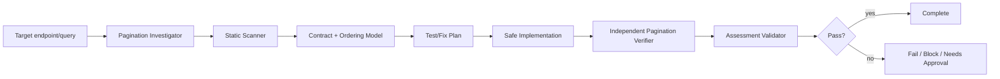

# Agent Pagination Contract Consistency Gate

A reusable AI engineering gate for reviewing paginated APIs and queries so that ordering, page boundaries, continuation semantics, and client-visible contracts remain correct under realistic data changes.

## Problem
Pagination bugs are often subtle: unordered queries can reshuffle items, non-unique sort keys can duplicate or skip rows, offset pagination can drift when data changes between requests, unbounded page sizes can overload the database, and cursor formats can accidentally expose internal or sensitive state. A handler can return valid-looking pages while clients still observe gaps, duplicates, broken continuation tokens, or silent contract drift.

## Purpose
This package combines deterministic scanning, structured agent investigation, bounded verification loops, explicit safety rules, and a machine-checkable assessment contract. It is designed to be copied into a repository with minimal customization.

## When to use
Use it when adding or changing REST/GraphQL list endpoints, EF Core/SQL pagination, cursor/keyset logic, default ordering, page-size limits, continuation token encoding, or pagination performance behavior. It is also useful when investigating reports of missing or duplicated list items.

## When not to use
Do not use scanner output as proof of a defect. Do not use this package to silently change a public pagination contract. Production configuration, deployment, schema changes, destructive data actions, and breaking API changes remain human-approved actions.

## Architecture


## Package tree
```text
agent-pagination-contract-consistency-gate/
├── README.md
├── config/
│   └── pagination-policy.json
├── schemas/
│   └── assessment.schema.json
├── scripts/
│   ├── scan-pagination.py
│   └── validate-assessment.py
├── skills/
│   └── pagination-assessment.md
├── rules/
│   └── pagination-safety.md
├── subagents/
│   ├── pagination-investigator.md
│   └── pagination-verifier.md
├── workflows/
│   └── pagination-gate.md
├── hooks/
│   └── lifecycle-hooks.md
├── examples/
│   └── assessment.json
└── tests/
    └── self-test.py
```

## Component responsibilities
`skills/pagination-assessment.md` contains the reusable investigation procedure. `rules/pagination-safety.md` defines enforceable MUST/MUST NOT/SHOULD rules. `subagents/pagination-investigator.md` owns context and hypothesis formation, while `subagents/pagination-verifier.md` independently verifies the result. `workflows/pagination-gate.md` defines the bounded end-to-end process. `hooks/lifecycle-hooks.md` defines deterministic pre-task, post-edit, and final validation actions. `scripts/scan-pagination.py` finds suspicious implementation patterns. `scripts/validate-assessment.py` enforces the final handoff contract. `tests/self-test.py` verifies both scripts. `config/pagination-policy.json` centralizes policy values and approval boundaries.

## Dependencies
Python 3.9+ is required for bundled scripts. No third-party Python packages are required. Repository-specific build/test/database tooling remains unchanged.

## Installation
Copy this directory into the target repository or agent-instruction location while preserving relative paths. Tighten `config/pagination-policy.json` if repository or organizational policies are stricter.

## Permissions
Default execution requires repository read access plus permission to run local, non-destructive tests/builds and optional disposable test database operations. Use least privilege. Production mutation is not required for the normal workflow.

## Usage
Run the static scanner:

```bash
python3 scripts/scan-pagination.py /path/to/repository --output pagination-scan.json
```

Exit code `0` means no heuristic findings, `1` means findings require contextual review, and `2` means invocation/input failure.

Then follow:

```text
skills/pagination-assessment.md
workflows/pagination-gate.md
rules/pagination-safety.md
```

Validate a completed assessment:

```bash
python3 scripts/validate-assessment.py assessment.json
```

Run the package self-test:

```bash
python3 tests/self-test.py
```

## Example invocation
Ask the agent to evaluate a concrete endpoint using this package, for example:

```text
Review GET /api/orders using agent-pagination-contract-consistency-gate. Trace request parameters through generated SQL, verify the complete ordering tuple and page-size bounds, test page boundaries and between-page mutation behavior, preserve the existing public contract unless approval is granted, and produce an assessment matching schemas/assessment.schema.json.
```

## Workflow
The investigator first maps the request contract to the actual query and response metadata. The scanner then identifies heuristic risks. Before edits, the agent defines boundary and duplicate/gap tests. Changes are kept minimal and stop at approval boundaries. The independent verifier reruns tests using observable item identities rather than item counts alone. Finally, the assessment validator proves that all required verification flags are present before a `pass` verdict is accepted.

## Approval boundaries
Explicit human approval is required before breaking API contract changes, database schema changes, production configuration changes, production deployment, destructive data operations, or equivalent irreversible actions. Agents must stop before those actions rather than silently increasing permissions.

## Failure and recovery
Transient tool or test-environment failures may be retried at most twice. Preserve command output, fixtures, and attempt number. Deterministic test/build failures require diagnosis or a code/configuration change before rerun. Permission/environment failures become `blocked`. Dangerous remediation becomes `needs-approval`. An unresolved pagination correctness failure remains `fail`.

## Verification model
Successful execution is not proof of pagination correctness. A `pass` assessment requires all of the following:

- the full ordering is deterministic and includes a unique tiebreaker where needed;
- duplicate/gap behavior is tested using item identities;
- boundary pages are tested;
- page size is bounded;
- continuation semantics are understood and safely represented;
- public pagination contract compatibility is confirmed;
- the independent verifier agrees with the evidence;
- the assessment passes `scripts/validate-assessment.py`.

Offset pagination must not be presented as mutation-stable unless the implementation and tests actually provide that guarantee. Cursor/keyset implementations must keep continuation predicates aligned with the complete ordering tuple, including direction and tiebreakers.

## Definition of Done
The target endpoint and query path are mapped; pagination style is identified; ordering and tiebreaker are verified; page size is bounded; scanner findings are reviewed; boundary and duplicate/gap tests pass or are explicitly blocked with evidence; contract compatibility is checked; independent verification is complete; required approvals exist; remaining risks are recorded; assessment validation succeeds; and no blocking failure remains for a `pass` verdict.

## Customization
Extend scanner patterns only for deterministic, high-signal repository conventions. Keep findings advisory. Add repository-specific status fields or stricter approval rules only when all referenced workflows, rules, and validators are updated consistently. Never weaken higher-level safety policy to make this package pass.
