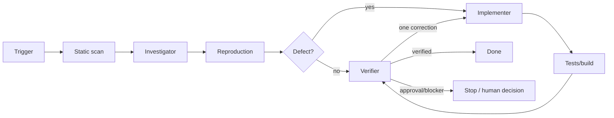

# Agent Pagination Cursor Consistency Gate

Reusable AI-engineering kit for preventing skipped rows, duplicate rows, infinite/unchanged cursors, unbounded page sizes and unsafe cursor parsing in paginated APIs.

## Problem and purpose
Pagination bugs often survive normal happy-path tests because they appear only when sort values tie, records mutate between requests, cursors are malformed, or ordering/predicate logic diverges. This kit combines deterministic scanning, structured investigation, bounded implementation and independent verification.

## When to use
Use on new or changed list endpoints, cursor/keyset pagination, migrations from offset pagination, duplicate/missing-row incidents, or PRs that modify filtering/order/page-size logic. Do not use it as proof that every static scanner hit is a defect; scanner results are investigation leads.

## Architecture


## Package tree
```text
agent-pagination-cursor-consistency-gate/
├── README.md
├── config/gate.yaml
├── schemas/finding.schema.json
├── scripts/scan-pagination.py
├── scripts/verify-fixture.py
├── examples/pagination-fixture.json
├── rules/pagination-safety.md
├── skills/investigate-pagination.md
├── subagents/pagination-investigator.md
├── subagents/pagination-implementer.md
├── subagents/pagination-verifier.md
├── hooks/pre-task.md
├── hooks/final-verification.md
└── workflows/pagination-gate.md
```

## Installation and dependencies
Copy the directory into the target repository. Python 3.9+ is sufficient for included scripts; they use only the standard library. Adapt `config/gate.yaml` include/exclude and maximum page size to the repository. Project-specific build/test tools remain the target repository's responsibility.

## Permissions
Core investigation needs repository read access and permission to run local tests. Implementation needs ordinary working-tree edit permission. No production, secret-management, infrastructure or database-write permission is required by this kit.

## Usage
From the copied package directory, scan a repository:

```bash
python scripts/scan-pagination.py --root /path/to/repository --out pagination-findings.json
```

Run the deterministic cursor fixture:

```bash
python scripts/verify-fixture.py --fixture examples/pagination-fixture.json
```

Give the agent the workflow in `workflows/pagination-gate.md`, rules in `rules/pagination-safety.md`, and the endpoint/change scope. The investigator owns evidence, the implementer owns the minimal correction, and the verifier independently owns completion status.

## Workflow and contracts
The workflow is Scan → Trace → Reproduce → Decide → Implement → Test → Independent Verify. Findings use `schemas/finding.schema.json` with status plus file/line evidence and recommendation. Static findings are never promoted to confirmed facts without tracing/reproduction evidence.

## Approval boundaries
Stop for explicit approval before breaking API/cursor semantics, database schema changes, production configuration changes, destructive data operations, secret/security changes, deployments, infrastructure changes, force pushes or other irreversible actions. Never increase permissions to unblock the workflow.

## Failure and recovery
Transient tool failures may be retried at most twice with logs preserved. Build/test failures are not blindly rerun: diagnose, perform at most one correction cycle when in scope, then rerun. Permission/environment failures stop with evidence. Repeated validation failure stops rather than looping.

## Verification
Success requires evidence that ordering is stable and total, a unique tie-breaker participates in cursor and seek predicate, page size is bounded, malformed cursors fail safely, next cursors advance, equal-sort boundaries do not duplicate/omit rows, final pages terminate, relevant project tests/build pass, and the diff contains no unintended edits.

## Definition of Done
The relevant path is traced; facts and hypotheses are separated; required reproduction exists; any correction is minimal; applicable checks pass; required approvals exist; remaining risks are documented; independent verifier status is `verified`; no blocking failure remains.

## Customization
Adjust scan extensions/exclusions and policy limits in `config/gate.yaml`. Extend scanner patterns only as heuristics; keep language/framework-specific correctness checks in repository tests. For snapshot-consistent feeds, add the repository's snapshot/version semantics to the rules and fixtures rather than weakening total-order requirements.
