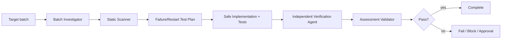

# Agent Partial Batch Processing Consistency Gate

A reusable AI engineering gate for proving that multi-item batch jobs handle partial failures, retries, restarts, checkpoints, and completion reporting without silently losing or duplicating work.

## Problem
Batch jobs often fail in the middle of processing. Without durable per-item outcomes and a safe checkpoint strategy, retries can duplicate successful items, skip failed items, or report the whole batch as successful even when only part of it completed.

## When to use
Use for scheduled imports, backfills, ETL jobs, paginated APIs, queue batches, file processors, fan-out workers, and any flow that processes multiple logical items per execution.

## When not to use
Do not use this package to justify destructive production replay, checkpoint rewriting, queue purging, or irreversible backfills without explicit approval.

## Architecture


## Package tree
```text
agent-partial-batch-processing-consistency-gate/
├── README.md
├── config/batch-consistency-policy.json
├── schemas/assessment.schema.json
├── scripts/scan-batch-consistency.py
├── scripts/validate-assessment.py
├── skills/batch-consistency-assessment.md
├── rules/batch-consistency-safety.md
├── subagents/batch-investigator.md
├── subagents/batch-verification-agent.md
├── workflows/batch-consistency-gate.md
├── hooks/lifecycle-hooks.md
├── examples/assessment.json
└── tests/self-test.py
```

## Components
`skills/batch-consistency-assessment.md` defines the reusable investigation procedure. `rules/batch-consistency-safety.md` defines enforceable safety boundaries. `subagents/batch-investigator.md` owns evidence collection and failure-window analysis, while `subagents/batch-verification-agent.md` independently challenges completion claims. `workflows/batch-consistency-gate.md` defines the bounded end-to-end process. `scripts/scan-batch-consistency.py` detects suspicious batch patterns heuristically, and `scripts/validate-assessment.py` enforces the final output contract. `tests/self-test.py` validates the bundled scripts. `config/batch-consistency-policy.json` centralizes retry and approval rules.

## Dependencies
Python 3.9+ for bundled scripts. Repository-specific build and test tooling remains unchanged. No third-party Python package is required.

## Installation
Copy this directory into the target repository or agent instruction directory and keep the relative paths intact. Adjust `config/batch-consistency-policy.json` only to make repository policies stricter or to add project-specific approval boundaries.

## Permissions
Default operation is read-only repository inspection plus local non-destructive tests/builds. Schema changes, production deployment/configuration, data deletion, queue purge/replay, breaking contracts, and irreversible backfills require explicit human approval.

## Usage
Run the static scanner:

```bash
python3 scripts/scan-batch-consistency.py /path/to/repository --output scan.json
```

Exit `0` means no heuristic findings, `1` means findings require review, and `2` means invalid input/invocation. Scanner output is not proof of a defect.

Follow `skills/batch-consistency-assessment.md` and `workflows/batch-consistency-gate.md`, then validate the final assessment:

```bash
python3 scripts/validate-assessment.py assessment.json
```

Run the package self-test:

```bash
python3 tests/self-test.py
```

## Required investigation model
For a batch, identify stable item identity, source/paging semantics, per-item side effects, retry scope, durable checkpoint behavior, concurrency limits, completion reporting, and failure policy. Explicitly reason about crashes before an item effect, after an item effect but before checkpoint advancement, and after checkpoint advancement but before batch completion reporting.

## Verification
Task execution is not proof of batch correctness. A `pass` assessment requires all four verification flags to be true: partial failure tested, retry scope tested, completion counts verified, and checkpoint behavior verified. The independent verifier must review evidence and rerun focused checks rather than accepting the implementing agent's claim.

Count reconciliation should make it possible to explain every discovered item as succeeded, failed, skipped, retried, or unresolved according to the business contract. Batch-level success without item-level reconciliation is insufficient.

## Retry and recovery
Automated investigative/test retries are limited to two transient reruns. Preserve failing item identity, checkpoint state, command output, and attempt number. Deterministic failures require diagnosis or a code/config change before rerun. Permission/environment failures become `blocked`; dangerous remediation becomes `needs-approval`; unresolved lost/duplicate item behavior remains `fail`.

## Approval boundaries
Stop before schema changes, production deployment/configuration, queue purge/replay, data deletion, breaking contracts, irreversible backfills, or any repository-specific dangerous action. Never silently increase privileges to unblock the workflow.

## Definition of Done
The source and stable item identity are known; item effects and checkpoint boundaries are mapped; scanner findings were reviewed; partial failure and restart/retry scenarios were tested or explicitly blocked with evidence; completion counts reconcile; checkpoint behavior is verified; independent verification completed; assessment validates; required approvals exist; remaining risks are recorded; and no blocking failure remains for a `pass` verdict.

## Customization
Add repository-specific scanner patterns only when they are deterministic enough to be useful. Keep heuristic results advisory. Tighten retry limits and approval boundaries in `config/batch-consistency-policy.json` without weakening organization-level safety requirements.
