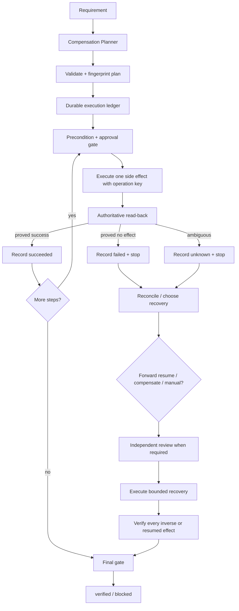

# Agent Partial Failure Compensation Gate

Reusable AI engineering kit for workflows that perform multiple external side effects and must survive partial success, timeout, crash, or ambiguous provider outcomes without duplicating work or rolling back the wrong state.

## Problem
A multi-step agent can create an account, update a ticket, call an API, change configuration, or deploy something successfully and then fail on a later step. The dangerous case is not only definite failure: a network timeout can leave the remote mutation committed while the client sees no response. Blind retry can duplicate effects; blind compensation can undo state that never existed or delete state created by someone else.

## Purpose
This package makes side-effect recovery explicit and evidence-bound. Every mutation has a stable operation key, precondition, postcondition evidence, compensation contract, approval classification, and durable ledger state. Unknown outcomes are reconciled before retry or compensation. High-risk recovery can require independent review, and dangerous actions remain behind human approval.

## When to use
Use for agent workflows that mutate two or more external systems or have multiple non-atomic steps: API provisioning, account/role changes, release automation, Git/ticket/provider workflows, cross-service operations, database-adjacent orchestration, infrastructure automation, billing-like side effects, or integrations where one step may commit while another fails.

## When not to use
Do not use this instead of a real database transaction for a single atomic database change. Do not invent compensation when the business operation is irreversible. For a simple read-only workflow, this gate is unnecessary.

## Architecture


## Package tree
```text
agent-partial-failure-compensation-gate/
├── README.md
├── config/
│   └── compensation-policy.json
├── schemas/
│   ├── execution-ledger.schema.json
│   ├── recovery-review.schema.json
│   └── workflow-plan.schema.json
├── scripts/
│   ├── evaluate-final-gate.py
│   ├── evaluate-recovery-gate.py
│   ├── fingerprint-plan.py
│   ├── record-step-result.py
│   └── validate-plan.py
├── skills/
│   ├── design-compensatable-workflow.md
│   └── recover-partial-failure.md
├── rules/
│   └── compensation-governance.md
├── subagents/
│   ├── compensation-planner.md
│   └── recovery-reviewer.md
├── workflows/
│   └── partial-failure-compensation-workflow.md
├── hooks/
│   └── compensation-lifecycle-hooks.md
├── templates/
│   └── workflow-plan.example.json
├── examples/
│   ├── execution-ledger.example.json
│   └── recovery-review.example.json
└── tests/
    └── smoke-test.py
```

## Dependencies
- Python 3.9+
- Python standard library only for bundled scripts/tests
- Project/provider-specific read-back APIs or queries for real reconciliation
- Durable storage for the runtime execution ledger

## Installation
Copy this directory into a repository or shared agent tooling folder. Keep the relative paths intact or update hook/workflow commands consistently.

Run package behavioral checks with:
```bash
python tests/smoke-test.py
```

## Configuration
`config/compensation-policy.json` defines:
- maximum transient retries per step: `1`;
- maximum recovery attempts: `2`;
- mandatory operation keys and pre/post evidence;
- unknown-outcome reconciliation requirement;
- independent review for `high` and `critical` risk;
- reverse-order compensation and compensation verification;
- actions requiring explicit human approval.

Do not increase retry budgets to hide provider ambiguity. Do not allow compensation of an `unknown` outcome.

## Core contracts
### Workflow plan
`schemas/workflow-plan.schema.json` describes the frozen execution intent. Each step records:
- stable `id`;
- action;
- unique `operation_key`;
- precondition;
- success evidence;
- compensation mode/action/verification;
- approval action when applicable.

### Execution ledger
`schemas/execution-ledger.schema.json` is durable runtime state. Outcomes are:
- `not-started`
- `succeeded`
- `failed`
- `unknown`
- `compensated`

`unknown` is a first-class state. It means the caller cannot yet prove whether the remote side effect happened.

### Recovery review
For high/critical work, `schemas/recovery-review.schema.json` binds an independent review to the exact plan and ledger fingerprints.

## Usage
### 1. Create and validate a plan
Start from `templates/workflow-plan.example.json`, replace example identities/revision, then:
```bash
python scripts/validate-plan.py \
  --plan workflow-plan.json \
  --policy config/compensation-policy.json \
  --output artifacts/plan-validation.json

python scripts/fingerprint-plan.py \
  workflow-plan.json \
  --output artifacts/plan-fingerprint.json
```
Do not edit the plan after review/execution starts without re-fingerprinting and re-binding the ledger/review.

### 2. Initialize a durable ledger
Create one ledger record per plan step, initially `not-started`, `attempts=0`, with the exact plan fingerprint and repository revision. `examples/execution-ledger.example.json` shows the shape.

### 3. Execute one step at a time
Immediately before a mutation:
1. refresh precondition evidence;
2. verify no earlier step is unresolved;
3. obtain explicit approval if `approval_action` is present;
4. execute using the stable operation key;
5. read back authoritative state.

Record the result:
```bash
python scripts/record-step-result.py \
  --plan workflow-plan.json \
  --ledger execution-ledger.json \
  --step-id create-account \
  --outcome succeeded \
  --precondition-evidence "identity-read:absent" \
  --postcondition-evidence "identity-read:acct-456" \
  --output execution-ledger.json
```
Only use `succeeded` when postcondition evidence proves it. Use `failed` only when provider semantics prove no effect occurred. Use `unknown` for ambiguous timeout/disconnect results.

### 4. Recover after partial failure
Follow `skills/recover-partial-failure.md` and `workflows/partial-failure-compensation-workflow.md`.

After reconciling all unknown outcomes, evaluate recovery readiness:
```bash
python scripts/evaluate-recovery-gate.py \
  --plan workflow-plan.json \
  --ledger execution-ledger.json \
  --policy config/compensation-policy.json \
  --review recovery-review.json \
  --implementation-owner implementation-agent \
  --output artifacts/recovery-gate.json
```
For low/medium risk, omit `--review` when policy does not require independent review.

Only `resume-ready` permits another recovery mutation.

### 5. Compensate safely
A compensation may run only for a step proven `succeeded`. Refresh state first, acquire any required human approval, execute the exact inverse, run its declared verification, then record the step as `compensated` with evidence.

By default compensation order is reverse execution order. If domain dependencies require another order, change the plan/policy deliberately and review the new fingerprint rather than improvising at runtime.

### 6. Final verification
Set the ledger to terminal `completed` only for verified forward success, or `compensated` after every required inverse is verified. Then run:
```bash
python scripts/evaluate-final-gate.py \
  --plan workflow-plan.json \
  --ledger execution-ledger.json \
  --policy config/compensation-policy.json \
  --output artifacts/final-gate.json
```
Only `status=verified` is completion evidence.

## Delegation
- **Compensation Planner** designs the side-effect/compensation contract but does not execute production mutation.
- **Execution agent** performs one bounded side effect at a time and writes evidence to the ledger.
- **Recovery Reviewer** independently evaluates high/critical recovery and cannot edit evidence to make it pass.
- Human/operator approval remains separate from agent review.

## Approval boundaries
Explicit human approval is required before production deployment, destructive SQL, database schema changes, data/file deletion, force push or Git history rewrite, infrastructure changes, secret changes, production configuration changes, breaking API contracts, security weakening, irreversible migrations, and large dependency upgrades.

Compensation is not exempt from approval simply because it is called a rollback. An inverse can be just as dangerous as the forward action.

## Failure and recovery semantics
- **Transient read/tool error before mutation:** retry once maximum.
- **Definite validation/business/permission failure:** do not blind retry.
- **Timeout/disconnect after mutation may have been sent:** record `unknown`; do not retry or compensate until authoritative reconciliation.
- **Failed compensation verification:** stop all automatic compensation and escalate.
- **Recovery attempt budget exhausted:** stop after two attempts by default.
- **Stale plan/repository/review fingerprint:** replan/review; do not reuse stale approval.
- **Permission failure:** stop; never silently elevate privileges.
- **Irreversible state:** use forward recovery or explicit human-operated remediation; do not invent an inverse.

## Verification
Execution is not verification. A verified workflow requires:
1. plan validation succeeded;
2. ledger is bound to current plan fingerprint and repository revision;
3. each operation key is stable and unique;
4. every succeeded step has authoritative postcondition evidence;
5. no step outcome remains `unknown`;
6. every compensation is verified;
7. retry/recovery budgets were not exceeded;
8. required independent review and human approvals are current;
9. final gate returns `verified`.

## Definition of Done
- Required context and affected systems were identified.
- Plan is complete and fingerprinted.
- Durable ledger contains every step.
- No unresolved failed/unknown/not-started state exists on the claimed terminal path.
- Each side effect or inverse has current evidence.
- Dangerous actions were explicitly approved.
- High/critical recovery had independent review where required.
- Remaining risks are documented and non-blocking.
- `scripts/evaluate-final-gate.py` exits 0 with `verified`.

## Portability
The core contracts and Python scripts are tool-neutral. They can be called from OpenAI Codex, Claude Code, Cursor, ChatGPT, GitHub Copilot, OpenCode, MCP-backed workflows, CI jobs, schedulers, or custom orchestration. Provider-specific adapters should translate remote state into pre/post evidence; they must not weaken unknown-outcome or compensation semantics.

## Customization
Customize action names, provider adapters, ledger storage, and domain-specific reconciliation. Keep these invariants stable: immutable plan binding, stable operation keys, explicit unknown state, read-back before retry/compensation, compensation only for proven effects, bounded retries/recovery, independent high-risk review, human approval for dangerous actions, and evidence-based final verification.
