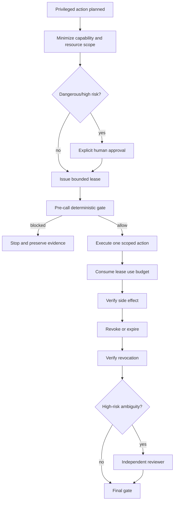

# Agent Permission Lease Expiry Guard

A reusable control plane for temporary elevated permissions in AI-assisted development and operations. It prevents an agent from turning a short-lived authorization into standing privilege, reusing a grant for a different operation, or continuing privileged actions after expiry/revocation/use exhaustion.

## Problem
Coding and operations agents frequently hit permission boundaries while deploying, modifying infrastructure, rotating secrets, publishing artifacts, managing repositories, or operating production systems. A naive recovery pattern is to grant a broad token or role and leave it available. That creates stale privilege, scope creep, replay risk, and weak auditability.

This kit models elevated privilege as a bounded **permission lease** tied to actor + operation + capability + resource + expiry + use budget.

## When to use
Use when an agent needs temporary access beyond baseline permissions, especially for production writes, repository administration, secret management, infrastructure, destructive data operations, security controls, or breaking changes.

Do not use this as a replacement for the underlying provider's IAM/RBAC system. The kit governs and verifies how temporary privileges are requested and consumed; provider-native scoped credentials remain authoritative.

## Architecture


## Package tree
```text
agent-permission-lease-expiry-guard/
├── README.md
├── config/permission-lease-policy.json
├── schemas/permission-lease.schema.json
├── schemas/privileged-action.schema.json
├── scripts/permission_lease.py
├── scripts/evaluate-permission-gate.py
├── scripts/consume-permission-lease.py
├── scripts/evaluate-final-gate.py
├── skills/request-and-bind-permission-lease.md
├── skills/revoke-and-verify-permission.md
├── rules/permission-lease-governance.md
├── subagents/permission-lease-coordinator.md
├── subagents/permission-lease-reviewer.md
├── workflows/permission-lease-workflow.md
├── hooks/permission-lease-hooks.md
├── templates/privileged-action.example.json
├── examples/review.example.json
├── examples/revocation-evidence.example.json
└── tests/smoke-test.py
```

## Dependencies
Python 3.10+ standard library only. No network dependency is required by the deterministic scripts. Provider-specific IAM issuance/revocation remains outside the core and should be integrated at the workflow boundary.

## Installation
Copy this directory into the repository. Edit `config/permission-lease-policy.json` to match organization risk categories and duration/use limits. Keep capability names and resource identities stable and explicit.

## Usage
Create an action contract from `templates/privileged-action.example.json`, then issue the smallest lease:

```bash
python scripts/permission_lease.py issue --actor release-agent --operation deploy-api-v42 --capability deployment.write --resource service:orders-api:production --risk production-write --seconds 900 --max-uses 1 --approved-by human-operator --approval-fingerprint <sha256> --out lease.json
```

Before every privileged call:

```bash
python scripts/evaluate-permission-gate.py --lease lease.json --action action.json
```

After the capability is exercised:

```bash
python scripts/consume-permission-lease.py --lease lease.json
```

At close, revoke/expire through the authoritative provider, update local state, record non-secret revocation evidence, and run the final gate.

## Status semantics
`active` means the lease may still be evaluated; it is not proof that a particular action is allowed. `expired`, `revoked`, and `consumed` are non-active. A privileged action is allowed only when actor, operation, capability, resource, expiry, and use budget all match at call time.

## Approval boundaries
Explicit human approval is required before production deployment/write, destructive SQL or data deletion, schema/infrastructure changes, secret changes, production configuration changes, breaking API contracts, security weakening, irreversible migrations, force-push/history rewriting, or similarly dangerous actions. The agent must stop before these actions until approval exists.

High-risk renewal or scope change requires independent review. A permission error never grants permission to widen the lease automatically.

## Retry and recovery
Validation and revocation lookup may retry at most twice for transient network/tool failures. Policy denial, expired lease, scope mismatch, actor mismatch, and exhausted use budget are not retryable without a newly authorized lease. Privileged mutations must not be blindly retried; reconcile their side effects first.

## Verification
Success requires evidence that:
- the lease covered exactly the executed actor/operation/capability/resource;
- it was valid at call time;
- use count was consumed correctly;
- the side effect was verified independently of the execution attempt where appropriate;
- the temporary privilege is non-active at completion;
- required approval and independent review exist;
- no raw credentials or secret values were written to artifacts.

Run the deterministic smoke test:
```bash
python tests/smoke-test.py
```

## Definition of Done
The operation has an explicit action contract, a least-privilege bounded lease, pre-call gate evidence, bounded use accounting, verified side-effect evidence, verified closure/revocation for high-risk privilege, required approval/review, and a final `verified` gate with no unresolved blocking risk.

## Portability
The core files are tool-neutral and can wrap OpenAI Codex, Claude Code, Cursor, ChatGPT, GitHub Copilot, OpenCode, CI bots, deployment agents, or custom orchestrators. Provider-specific credential issuance should be isolated in adapters rather than embedded in the core lease rules.
