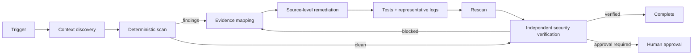

# Agent PII Log Redaction Gate

Reusable safety gate for AI-assisted development workflows that prevents personally identifiable information and secret-like values from leaking through logs, traces, diagnostic bundles, generated test artifacts, incident evidence, or agent handoffs.

## Problem
Modern development workflows increasingly feed logs and diagnostics to coding agents, issue trackers, CI artifacts, and external analysis tools. Logging changes can accidentally expose email addresses, phone numbers, bearer tokens, JWTs, connection-string secrets, payment-card-like values, API-key-like values, or network identifiers. Manual review is inconsistent, and downstream masking alone can leave unsafe copies in files or telemetry sinks.

This package combines deterministic scanning, source-oriented remediation, independent verification, bounded retries, explicit approval boundaries, and sanitized evidence contracts.

## When to use
Use after changing logging, telemetry, exception handling, request/response capture, serializers, HTTP middleware, API integrations, support-bundle generation, incident diagnostics, or before giving logs to an AI agent or external system.

## When not to use
This is not a replacement for enterprise DLP, production telemetry access control, retention policy, secret rotation, breach response, or legal/privacy review. It does not authorize reading or exporting production data.

## Architecture



## Package tree

```text
agent-pii-log-redaction-gate/
├── README.md
├── config/
│   └── redaction-policy.yaml
├── hooks/
│   └── lifecycle.md
├── rules/
│   └── pii-log-safety.md
├── schemas/
│   └── pii-gate-result.schema.json
├── scripts/
│   ├── pii_log_gate.py
│   └── verify_package.py
├── skills/
│   ├── pii-log-investigation.md
│   └── redaction-remediation.md
├── subagents/
│   ├── log-evidence-agent.md
│   └── security-verifier.md
├── workflows/
│   └── pii-log-redaction-gate.md
├── examples/
│   └── sample.log
└── tests/
    └── test_pii_log_gate.py
```

## Component responsibilities
- `skills/pii-log-investigation.md`: locate logging surfaces, scan evidence, and map findings to source code without exposing raw values.
- `skills/redaction-remediation.md`: choose and implement the narrowest safe remediation while preserving troubleshooting value.
- `rules/pii-log-safety.md`: enforceable safety, evidence, allowlist, and approval constraints.
- `subagents/log-evidence-agent.md`: read-only evidence owner.
- `subagents/security-verifier.md`: independent verifier; the remediation implementer is not the sole approver.
- `workflows/pii-log-redaction-gate.md`: bounded end-to-end process and failure paths.
- `hooks/lifecycle.md`: deterministic pre-task, post-generation, post-edit, and final verification hooks.
- `scripts/pii_log_gate.py`: scanner/redactor with safe report output and meaningful exit codes.
- `scripts/verify_package.py`: verifies required package files and guards against incomplete placeholders.
- `config/redaction-policy.yaml`: enabled detectors, severities, exclusions, and scoped allowlists.
- `schemas/pii-gate-result.schema.json`: scanner result contract.
- `tests/test_pii_log_gate.py`: scanner behavior tests.
- `examples/sample.log`: safe structured-log example.

## Installation
Requires Python 3.10+ and PyYAML. For development tests, install pytest.

```bash
python -m pip install pyyaml pytest
python scripts/verify_package.py
python -m pytest tests/test_pii_log_gate.py
```

## Configuration
Edit `config/redaction-policy.yaml` only when project-specific behavior is required. Keep exclusions narrow. Do not place actual secrets or real personal data in the policy. Treat high and critical categories as blocking by default.

The default policy detects email addresses, phone-like values, IPv4 addresses, JWTs, bearer tokens, Luhn-valid payment-card-like values, connection-string secrets, and API-key-like assignments. Regex detectors are intentionally conservative and may require scoped allowlisting for known synthetic values.

## Usage
Scan one or more local files:

```bash
python scripts/pii_log_gate.py \
  --policy config/redaction-policy.yaml \
  --input app.log trace.ndjson \
  --report pii-gate-report.json
```

Exit code `0` means no unapproved findings. Exit code `2` means findings blocked the gate. Missing/invalid runtime dependencies or policy errors terminate execution and must not be interpreted as a pass.

To redact a disposable local copy rather than only report findings:

```bash
python scripts/pii_log_gate.py \
  --policy config/redaction-policy.yaml \
  --input sanitized-copy.log \
  --report pii-gate-report.json \
  --redact
```

Prefer source-level prevention in application code over relying on this redaction mode for production output.

## Example invocation for an AI coding agent
Provide the agent with the affected logging change, generated local logs, this package, and the instruction to follow `workflows/pii-log-redaction-gate.md`. The agent should delegate evidence mapping to `log-evidence-agent`, implement only evidenced remediation, and hand final verification to `security-verifier`.

The agent must never paste a detected value into its reasoning artifacts or reports. Handoffs contain only type, severity, file, line, source component, confidence, remediation decision, and verification status.

## Workflow
1. Inspect repository structure and touched logging surfaces.
2. Generate representative local logs where safe.
3. Run deterministic scan and save the sanitized report.
4. Map findings to exact logging or serialization paths.
5. Prefer omit/tokenize/allowlist-at-source over generic downstream masking.
6. Add focused tests.
7. Regenerate logs and rescan.
8. Inspect the diff for logging expansion or weakened policy.
9. Run independent verification.
10. Complete only when all Definition of Done checks pass.

Identical transient tool/test failures may be retried once. Validation/security failures return to remediation rather than being repeatedly retried.

## Approval boundaries
Explicit human approval is required before changing production telemetry routing or retention, deleting evidence, rotating secrets, modifying production configuration, weakening security controls, exporting raw production logs, or granting broader data access. Agents must not increase permissions to unblock the workflow.

## Failure handling
- Scanner failure: preserve stderr, retry once only if the failure is demonstrably transient, then stop.
- Test failure: distinguish code failure from environment failure; only proven transient environment failures get one unchanged retry.
- Unresolved high/critical finding: block completion.
- Observability regression: revert the attempted remediation and redesign rather than shipping blind logging.
- Permission failure: stop and escalate; do not request or assume broader access.

## Verification
A successful run requires evidence, not merely generated code. Run:

```bash
python scripts/verify_package.py
python -m pytest tests/test_pii_log_gate.py
python scripts/pii_log_gate.py --policy config/redaction-policy.yaml --input examples/sample.log --report pii-gate-report.json
```

For a repository integration, also run project-specific build/test commands and scan representative outputs produced by the changed logging path.

## Definition of Done
- Relevant logging/telemetry surfaces were identified.
- Every blocking finding has been removed or explicitly approved through a narrow exception.
- Reports and handoffs contain no raw sensitive values.
- Focused tests pass.
- Representative logs pass the deterministic gate.
- The policy was not weakened solely to make the gate pass.
- Independent Security Verifier returns `verified`.
- Remaining risks are documented and non-blocking.
- No approval-required production or security action was performed automatically.

## Portability
The core workflow is tool-neutral and can be used with Codex, Claude Code, Cursor, ChatGPT, GitHub Copilot, OpenCode, CI jobs, or custom agents. Keep tool-specific adapters outside the core rules unless a platform requires them.

## Customization
Add project-specific patterns only when backed by representative synthetic fixtures and tests. Prefer structured logging field allowlists over ever-growing regex sets. For regulated environments, integrate this gate with the organization’s approved DLP and telemetry controls rather than treating local scanning as the sole control.
