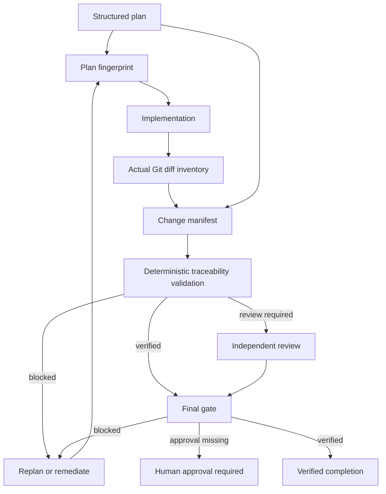

# Agent Plan–Diff Traceability Gate

A reusable, tool-neutral engineering kit that prevents AI-assisted implementations from silently drifting beyond the approved plan. It creates a machine-checkable chain from **plan item → allowed scope → actual changed file → acceptance criterion → evidence → approval/review → final verification**.

## Problem

Coding agents often start with a reasonable plan but discover new paths while implementing. A build can pass even when the final diff contains unrelated cleanup, generated files, lockfile changes, configuration edits, migrations, deleted files, or behavior changes that were never planned. A reviewer may then verify the implementation without realizing that the evidence and the approved scope no longer describe the same work.

This kit makes that mismatch explicit and fail-closed.

## Purpose

Use it to:

- freeze a structured plan before editing;
- bind every changed file to one or more genuine plan items;
- constrain each plan item to explicit path patterns;
- connect each change to observable acceptance criteria;
- account for every planned item at finalization;
- invalidate stale validation/review when plan or manifest content changes;
- require explicit approvals for dangerous categories;
- require independent review for high/critical-risk work;
- distinguish `executed` work from `verified` work.

## When to use

Use for feature implementation, bug fixes, refactoring, dependency changes, migrations, API work, configuration changes, multi-file agent tasks, PR preparation, and any workflow where an AI agent may make more edits than originally expected.

It is especially useful when the repository is already large enough that a reviewer cannot safely infer scope from a raw diff alone.

## When not to use

Do not use it as a replacement for requirements, tests, security review, database safety review, or human approval. It proves traceability of a diff to a plan; it does not prove that the business requirement itself is correct.

For a one-line exploratory edit that will be discarded and never merged, the overhead may not be justified.

## Architecture



## Component responsibilities

- **Change Mapper** builds the actual plan-to-diff mapping and runs deterministic validation.
- **Traceability Verifier** independently checks mappings/evidence and owns high-risk review.
- **Governance rules** prevent retroactive scope laundering, orphan changes, stale review reuse, and silent permission expansion.
- **Scripts** provide deterministic fingerprints, Git diff inventory, traceability validation, and final gating.
- **Hooks** define predictable lifecycle integration points.
- **Workflow** defines bounded retries, approval stops, failure paths, and Definition of Done.

## Package tree

```text
agent-plan-diff-traceability-gate/
├── README.md
├── config/
│   └── traceability-policy.json
├── examples/
│   ├── change-manifest.example.json
│   └── traceability-review.example.json
├── hooks/
│   └── traceability-hooks.md
├── rules/
│   └── plan-diff-governance.md
├── schemas/
│   ├── change-manifest.schema.json
│   ├── plan.schema.json
│   └── traceability-review.schema.json
├── scripts/
│   ├── collect-git-diff.py
│   ├── evaluate-final-gate.py
│   ├── fingerprint-plan.py
│   └── validate-traceability.py
├── skills/
│   ├── build-traceability-map.md
│   └── review-traceability.md
├── subagents/
│   ├── change-mapper.md
│   └── traceability-verifier.md
├── templates/
│   └── plan.example.json
├── tests/
│   └── smoke-test.py
└── workflows/
    └── plan-diff-traceability-workflow.md
```

## Installation

Copy this directory into the target repository. Core deterministic scripts require only Python 3.9+ standard library and Git. No Python packages are required.

The scripts are intentionally tool-neutral and can be invoked from Codex, Claude Code, Cursor, ChatGPT-based coding workflows, GitHub Copilot agents, OpenCode, CI jobs, or ordinary shell scripts.

## Configuration

Edit `config/traceability-policy.json` only through normal repository review. Important settings:

- `require_plan_fingerprint`: reject manifests built from another plan revision.
- `require_all_changed_files_mapped`: block orphan changed files.
- `require_all_plan_items_accounted_for`: ensure the final state explains every plan item.
- `max_changed_files_per_plan_item`: guard against overly broad plan items.
- `high_risk_categories`: categories that deserve stronger review.
- `approval_required_categories`: dangerous categories requiring explicit human approval.
- `require_independent_review_for_high_risk`: prevent the implementer from being the sole high-risk verifier.
- `max_transient_retries`: bounded retry policy; default `1`.

Do not loosen policy automatically because an implementation fails validation.

## Input contracts

### Plan

Start from `templates/plan.example.json` and conform to `schemas/plan.schema.json`.

Each plan item must have:

- stable `id`;
- concrete `intent`;
- observable `acceptance_criteria`;
- `allowed_paths` glob patterns;
- risk level;
- optional risk categories;
- explicit `requires_approval` flag.

### Change manifest

`schemas/change-manifest.schema.json` binds:

- task and actor;
- plan fingerprint;
- base/head revisions;
- every changed path and content fingerprint;
- mapped plan item IDs;
- acceptance criteria;
- reason for the change;
- risk categories and approval reference;
- final status/evidence for every plan item.

### Review

`schemas/traceability-review.schema.json` binds the reviewer verdict to both current plan and manifest fingerprints. Changing either artifact invalidates the previous review.

## Usage

### 1. Freeze and fingerprint the plan

```bash
python scripts/fingerprint-plan.py plan.json
```

Persist the returned SHA-256 value in the change manifest.

### 2. Implement only the planned scope

Follow `skills/build-traceability-map.md` and `rules/plan-diff-governance.md`. If new necessary work appears, stop and explicitly replan rather than broadening path scope after the fact.

### 3. Inventory the actual Git diff

```bash
python scripts/collect-git-diff.py <base-revision> <head-revision> > diff-inventory.json
```

The output includes adds, modifications, deletes, renames, and content fingerprints derived from the diff patch.

### 4. Build the change manifest

Map every diff entry to genuine plan item IDs and acceptance criteria. Use `examples/change-manifest.example.json` as a shape reference, but compute real fingerprints and evidence for the current task.

### 5. Validate traceability

```bash
python scripts/validate-traceability.py \
  plan.json \
  change-manifest.json \
  config/traceability-policy.json \
  > validation.json
```

Exit codes:

- `0`: deterministic traceability checks verified;
- `4`: review required because non-blocking traceability warnings remain;
- `5`: blocked by traceability/scope/approval/accounting failure;
- `2`: invalid input.

### 6. Review when required

Use `skills/review-traceability.md`. High/critical-risk work must not rely on the implementing actor as the sole verifier. Produce a current fingerprint-bound review using `examples/traceability-review.example.json` as the shape reference.

### 7. Run final gate

Without review:

```bash
python scripts/evaluate-final-gate.py \
  plan.json change-manifest.json validation.json \
  > final-gate.json
```

With review:

```bash
python scripts/evaluate-final-gate.py \
  plan.json change-manifest.json validation.json traceability-review.json \
  > final-gate.json
```

Only final status `verified` is evidence that this gate completed successfully.

## Example invocation for an AI coding agent

Give the agent the task requirements and instruct it to:

1. create/freeze `plan.json` before edits;
2. follow `workflows/plan-diff-traceability-workflow.md`;
3. obey `rules/plan-diff-governance.md`;
4. build `change-manifest.json` from the actual base-to-head diff;
5. preserve validation/review/final-gate outputs;
6. report implementation as executed but not verified until the final gate returns `verified`.

## Permissions

The deterministic scripts need read access to repository files and Git metadata. They do not deploy, delete, push, rewrite history, change infrastructure, or modify secrets.

Keep agent permissions least-privilege. A permission error does not authorize the agent to request or grant itself broader access automatically.

## Approval boundaries

Explicit human approval is required before:

- production deployment;
- destructive SQL;
- database schema changes;
- data or file deletion;
- force push or Git history rewriting;
- infrastructure changes;
- secret changes;
- production configuration changes;
- breaking API contracts;
- weakening security controls;
- irreversible migrations;
- large dependency upgrades.

The manifest stores approval references, but the package does not create approvals. It stops when an approval is missing.

## Failure and recovery

Failures are classified as follows:

- **Transient tool/I/O failure:** retry at most once while preserving the original error.
- **Validation failure:** do not retry blindly; fix mapping/scope/accounting or replan.
- **Stale fingerprint:** regenerate validation/review from current artifacts.
- **Missing approval:** stop with `approval-required` until a human explicitly approves.
- **Business/requirement conflict:** stop and return to planning.
- **High-risk self-review:** obtain an independent verifier.

Never use “retry until successful.”

## Verification model

This kit distinguishes:

- **Task executed:** code changes, commands, or tests have run.
- **Task verified successfully:** current plan and manifest fingerprints match; all changed files are mapped within allowed scope; plan items are accounted for; acceptance evidence is present; required approvals/reviews are valid; final gate returns `verified`.

A green build alone does not satisfy the second condition.

## Smoke test

Run:

```bash
python tests/smoke-test.py
```

The test exercises deterministic branches for:

- a clean verified mapping;
- an unmapped changed file;
- a changed path outside planned scope;
- high-risk self-review rejection.

It uses Python standard library only and does not require network access or a real application repository.

## Definition of Done

The package considers a governed implementation complete only when:

- the plan is structured and fingerprinted;
- the actual diff inventory is known;
- every changed file exists in the change manifest;
- every mapping is genuinely authorized by plan intent and allowed paths;
- every changed file cites relevant acceptance criteria;
- every plan item is accounted for;
- implemented plan items contain verification evidence;
- required approvals exist;
- required independent review is current and fingerprint-bound;
- no stale validation/review is reused;
- final gate status is `verified`;
- remaining non-blocking risks, if any, are explicitly documented.

## Customization

Adapt `allowed_paths`, risk categories, acceptance-evidence conventions, and policy thresholds to the repository. Keep the core invariant unchanged: **the final diff must be explainable by the current approved plan, and every verification claim must bind to the same plan and diff state.**
