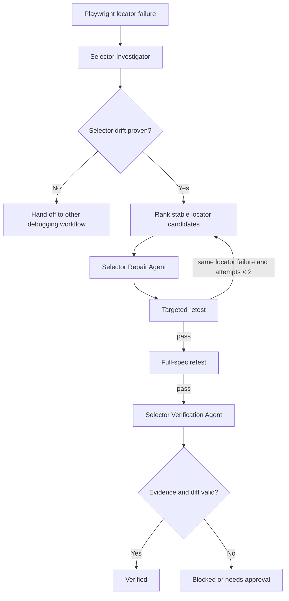

# Agent Playwright Selector Drift Recovery

Reusable AI engineering package for diagnosing and repairing Playwright test failures caused by locator/selector drift after UI or DOM changes.

## Problem

End-to-end tests often fail after harmless markup refactors because selectors depend on DOM position, generated classes, XPath, or other implementation details. An AI agent can easily make these failures worse by adding sleeps, weakening assertions, skipping tests, or changing production UI without proving that the selector was the actual root cause.

This package creates a bounded, evidence-driven repair loop that separates diagnosis, implementation, and independent verification.

## Purpose

Use this kit to:

- distinguish selector drift from product, data, timing, authentication, network, or environment failures;
- rank replacement locators using stable Playwright semantics;
- prevent brittle shortcuts;
- enforce targeted and full-spec retesting;
- preserve evidence across failed repair attempts;
- produce a structured repair report that can be validated deterministically.

## When to use

Use when a previously valid Playwright test now reports element-not-found, strict-mode ambiguity, or equivalent locator failures after a UI/DOM change.

## When not to use

Do not use this as the primary workflow when the failure is a genuine product defect, changed requirement, unstable test data, authentication issue, network failure, environment problem, or timing/concurrency defect unrelated to locator resolution.

## Architecture



## Package tree

```text
agent-playwright-selector-drift-recovery/
├── README.md
├── config/
│   └── selector-policy.yaml
├── schemas/
│   └── repair-report.schema.json
├── skills/
│   └── repair-selector-drift.md
├── rules/
│   └── selector-repair-rules.md
├── subagents/
│   ├── selector-investigator.md
│   ├── selector-repair-agent.md
│   └── selector-verification-agent.md
├── workflows/
│   └── selector-drift-recovery.md
├── hooks/
│   ├── pre-repair-scan.md
│   └── final-verification.md
├── scripts/
│   ├── scan-selectors.py
│   └── validate-repair-report.py
├── examples/
│   └── repair-report.example.json
└── tests/
    ├── fixture-brittle.spec.ts
    └── self-test.py
```

## Component responsibilities

- `config/selector-policy.yaml` defines locator preference, forbidden patterns, retry limit, status values, and approval boundaries.
- `schemas/repair-report.schema.json` documents the structured handoff/report contract.
- `skills/repair-selector-drift.md` is the reusable end-to-end procedure for an AI coding agent.
- `rules/selector-repair-rules.md` provides enforceable MUST/MUST NOT/SHOULD constraints.
- `subagents/selector-investigator.md` owns root-cause classification and candidate generation.
- `subagents/selector-repair-agent.md` owns the minimal edit and retest loop.
- `subagents/selector-verification-agent.md` independently validates evidence and rejects unsafe shortcuts.
- `workflows/selector-drift-recovery.md` coordinates the bounded execution lifecycle.
- `hooks/pre-repair-scan.md` invokes static selector risk scanning before editing.
- `hooks/final-verification.md` blocks completion unless report and retest evidence are valid.
- `scripts/scan-selectors.py` scans JavaScript/TypeScript test code for brittle locator patterns.
- `scripts/validate-repair-report.py` validates required report invariants and verified status conditions.
- `tests/self-test.py` verifies that the scanner detects the included brittle fixture and that the validator accepts a valid report.

## Installation

Copy this directory into the repository that contains the Playwright tests. Python 3.9+ is required for the deterministic scripts. The target project requires its existing Playwright runtime only when actual tests are executed.

No Python third-party packages are required.

## Configuration

Adjust `config/selector-policy.yaml` when repository conventions differ. Keep the repair-attempt limit bounded. If your project uses a dedicated `data-testid` convention, keep it below accessible semantic locators unless the product cannot expose stable semantics.

## Permissions

The workflow needs read/write access to test or page-object files and permission to execute the repository's existing Playwright tests.

It does not require production access. Agents must not elevate permissions automatically.

## Usage

### 1. Run the deterministic selector scan

```bash
python scripts/scan-selectors.py tests --json-out selector-scan.json
```

Exit codes:

- `0`: scan completed and no high-risk selector pattern was detected;
- `2`: scan completed and at least one high-risk selector pattern was found;
- other non-zero: execution error.

A risk finding is evidence for investigation, not proof that the failing selector is wrong.

### 2. Run the repair workflow

Give the AI agent:

- failing test file/name;
- Playwright error output;
- trace or screenshot if available;
- relevant test command;
- this package as its workflow/rule context.

The agent follows `skills/repair-selector-drift.md` and `workflows/selector-drift-recovery.md`.

### 3. Validate the repair report

```bash
python scripts/validate-repair-report.py repair-report.json
```

A report with `status: verified` is rejected unless both targeted and full-spec retests are `pass`.

### 4. Run package self-test

From the package root:

```bash
python tests/self-test.py
```

The self-test expects the scanner to return risk exit code `2` for `tests/fixture-brittle.spec.ts`, then verifies that a valid repair report passes the validator.

## Example invocation

```text
Use agent-playwright-selector-drift-recovery for the failing test
"can save account settings" in tests/account-settings.spec.ts.

Evidence:
- Playwright strict locator failure attached.
- Trace is available.
- Run command: npx playwright test tests/account-settings.spec.ts -g "can save account settings"

Follow the selector policy, preserve assertion intent, and stop after two repair attempts.
```

## Locator decision policy

Default preference order:

1. `getByRole`
2. `getByLabel`
3. `getByPlaceholder`
4. `getByText`
5. `getByTestId`
6. stable CSS only when semantic locators are not practical

The workflow rejects absolute XPath, `nth-child`, generated/hashed class chains, and `.nth()` when a stable semantic locator is available.

## Approval boundaries

Explicit human approval is required before any action that:

- deletes or skips a failing test;
- weakens an assertion solely to make the test pass;
- writes production test data;
- performs destructive test cleanup;
- weakens or disables a security check.

The agent stops before performing the action and sets the workflow to `needs-approval`.

## Failure and recovery

The repair loop allows at most two locator repair attempts.

Retry only when the same locator-resolution failure remains and new evidence supports another candidate. Preserve command output, candidate locator, trace/screenshot, and diff for every failed attempt.

Do not retry selector repairs for unrelated product, data, authentication, network, environment, or timing failures. Those failures terminate this workflow and should be handed to a more appropriate debugging process.

Transient tool execution may be retried once. Permission failures must not trigger privilege escalation.

## Verification

A task is executed when a locator edit was made. It is verified only when all of the following are true:

- selector drift was supported by evidence;
- the replacement locator uniquely identifies the intended element;
- targeted failing test passes;
- full containing spec passes;
- repair report validator passes;
- no test was skipped or assertion weakened to obtain a pass;
- no arbitrary sleep was introduced;
- no unrelated production change was included;
- independent verifier accepts the result.

## Definition of Done

The workflow is complete only when:

- failure classification and original locator are recorded;
- candidate selection is evidence-backed;
- change is minimal and policy-compliant;
- targeted and full-spec tests pass;
- final report is valid;
- independent verification is complete;
- required approvals, if any, were obtained before the dangerous action;
- no blocking ambiguity or unresolved high-risk condition remains.

## Customization

Common safe adaptations include changing repository test-root paths, adding organization-specific generated-class patterns to the scanner, or adjusting locator preference for an established test-id policy. Keep retry counts, verification requirements, and approval boundaries explicit when customizing.
