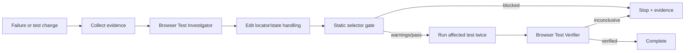

# Agent Playwright Selector Resilience Gate

Reusable implementation kit for AI-assisted Playwright maintenance. It prevents browser-test agents from replacing failures with brittle selectors, arbitrary sleeps, positional guesses, or weakened assertions, and requires repeatable evidence before a locator change is considered verified.

## Problem
Browser tests often fail after harmless DOM refactors, asynchronous UI changes, or ambiguous element matching. AI coding agents can quickly make a test green by generating XPath, CSS structure chains, `.nth()`, `waitForTimeout`, or weaker assertions. Those edits reduce test value and usually create the next flaky failure. This kit combines deterministic selector scanning with an evidence-first workflow and independent verification.

## When to use
Use when adding Playwright tests, repairing locator failures, reviewing AI-generated browser tests, refactoring page objects, investigating flaky UI tests, or changing shared locator helpers.

## When not to use
This kit is not a replacement for Playwright's runtime actionability checks, accessibility testing, full flake analysis, or product-level acceptance criteria. It does not prove that a selector is semantically correct merely because the static gate passes.

## Architecture



## Package tree

```text
agent-playwright-selector-resilience-gate/
├── README.md
├── config/policy.yaml
├── examples/brittle.spec.ts
├── examples/resilient.spec.ts
├── hooks/lifecycle.md
├── rules/playwright-resilience.md
├── schemas/selector-gate-result.schema.json
├── scripts/scan_selectors.py
├── scripts/verify_package.py
├── skills/failed-locator-recovery.md
├── skills/selector-hardening.md
├── subagents/browser-test-investigator.md
├── subagents/browser-test-verifier.md
├── templates/locator-evidence.md
├── tests/test_scan_selectors.py
└── workflows/selector-resilience-workflow.md
```

## Component responsibilities
- `skills/selector-hardening.md` defines the procedure for replacing unstable locators with semantic locators.
- `skills/failed-locator-recovery.md` separates locator defects from state/race, environment, and product defects.
- `rules/playwright-resilience.md` defines enforceable editing and verification boundaries.
- `subagents/browser-test-investigator.md` owns evidence collection and the proposed fix.
- `subagents/browser-test-verifier.md` independently verifies the change.
- `workflows/selector-resilience-workflow.md` defines bounded diagnosis, edit, retry, approval, and verification stages.
- `hooks/lifecycle.md` describes deterministic lifecycle integration points.
- `scripts/scan_selectors.py` performs static checks and never executes browser tests.
- `scripts/verify_package.py` verifies the required package manifest.
- `schemas/selector-gate-result.schema.json` defines the machine-readable gate result.
- `templates/locator-evidence.md` standardizes evidence and handoff data.

## Installation
Requires Python 3.9+ and PyYAML for the static gate, plus the host repository's existing Playwright setup.

```bash
python -m pip install pyyaml
```

Copy this directory into the target repository and adjust `config/policy.yaml` to match test-file locations and project conventions.

## Configuration
`config/policy.yaml` controls scan globs, exclusions, blocked locator patterns, warning patterns, warning thresholds, preferred locator families, and the action/assertion proximity check.

The default policy blocks DOM-position selectors such as `nth-child`, `nth-of-type`, and XPath. It warns about positional `.nth()` and text locators because they may be valid but require evidence. Example fixtures under `examples/` are excluded from normal scanning.

## Usage
Run the deterministic gate from the package root or point `--root` at a repository:

```bash
python scripts/scan_selectors.py \
  --root . \
  --policy config/policy.yaml \
  --output selector-gate.json
```

Exit codes:
- `0`: passed with no findings.
- `1`: warnings exist and require review.
- `2`: blocking selector policy violation.
- `3`: tool/configuration error.

The gate does not modify code and does not run Playwright.

## Example behavior
`examples/resilient.spec.ts` demonstrates semantic locators and a post-action assertion. `examples/brittle.spec.ts` intentionally contains blocked patterns for policy demonstration only and is excluded from normal scans.

## Workflow
1. Preserve a concrete failure, trace, screenshot, or deterministic test-change context.
2. Classify the issue as locator brittleness, state/race, product defect, environment failure, or ambiguous requirement.
3. Inspect accessible roles/names and existing page-object conventions.
4. Make the smallest stable test/helper change.
5. Run the static selector gate.
6. Review warnings; blocking findings stop the workflow.
7. Run the affected Playwright test twice.
8. Run dependent tests if a shared helper/page object changed.
9. Have the verifier inspect locator semantics, diff quality, and repeat-run evidence.
10. Complete only with `verified` evidence.

## Approval boundaries
Explicit human approval is required before changing production UI/API contracts, weakening externally visible behavior, altering production configuration/security controls, deleting meaningful test coverage, or performing broad shared-framework changes solely to satisfy browser tests. The agent must not increase tool or environment permissions to bypass a failure.

## Failure and recovery
A transient browser/tool startup failure may be retried once. A locator/state fix may be revised at most twice, and every revision must return through static scanning and repeated tests. Product defects, unknown expected behavior, policy blocks, and permission failures are not automatically retryable. Repeated failures preserve evidence and stop for escalation.

## Verification
Run package tests and manifest validation:

```bash
python -m unittest tests/test_scan_selectors.py
python scripts/verify_package.py
```

For a real repository task, these checks are necessary but not sufficient. The verifier must also confirm repeated Playwright test passes and inspect the diff for sleeps, retry inflation, assertion weakening, unrelated product changes, or unsupported positional identity.

## Definition of Done
The task is complete only when the expected behavior is known; failure/change evidence was collected; root cause is classified; no blocking static finding remains; warnings are reviewed; the affected test passes twice; dependent tests pass when shared helpers changed; assertions were not weakened; no unapproved product contract change occurred; and the independent verifier reports `verified`.

## Customization
Adjust `scan_globs`, `exclude_globs`, blocked/warning patterns, and thresholds for the repository. Add project-specific stable locator conventions such as approved `data-testid` naming. Keep static policy separate from agent instructions so the same gate can be used with Codex, Claude Code, Cursor, ChatGPT, GitHub Copilot, OpenCode, or other agents.
