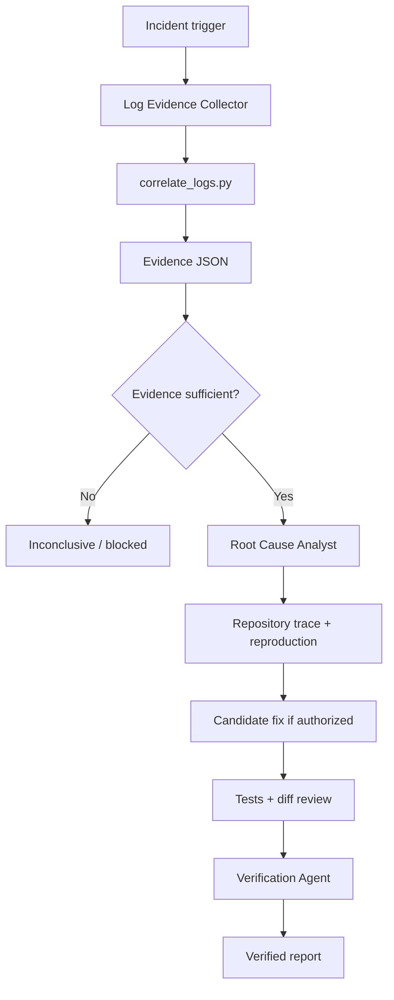

# Agent Production Log Correlation Root Cause Gate

A reusable AI-assisted incident-investigation package for correlating exported production logs across services, identifying the first abnormal event, validating root-cause hypotheses against repository behavior, and preventing unsupported causal claims.

## Problem
Production incidents often end with a visible exception far downstream from the real failure. Ad-hoc AI analysis can overfit to the last error, mix unrelated log lines, expose secrets, or claim causality from timing alone. This kit creates a bounded, read-only evidence pipeline before any root-cause conclusion is accepted.

## Purpose
Use this package to turn incident time ranges, trace/request identifiers, and exported logs into a redacted evidence bundle, then validate the failure mechanism with repository code and tests.

## When to use
Use for cross-service API failures, background-job incidents, queue-processing failures, timeout cascades, retry storms, dependency failures, and production errors where the root cause is uncertain.

## When not to use
Do not use this workflow to mutate production systems, deploy fixes, run destructive SQL, rotate secrets, change infrastructure, or perform irreversible remediation. Those actions require explicit human approval outside this gate.

## Architecture



## Package tree

```text
agent-production-log-correlation-root-cause-gate/
├── README.md
├── config/
│   └── correlation-policy.yaml
├── skills/
│   ├── log-correlation-investigation.md
│   └── root-cause-validation.md
├── rules/
│   └── investigation-safety.md
├── subagents/
│   ├── log-evidence-collector.md
│   ├── root-cause-analyst.md
│   └── verification-agent.md
├── workflows/
│   └── incident-root-cause-workflow.md
├── hooks/
│   └── lifecycle.md
├── scripts/
│   ├── correlate_logs.py
│   └── verify_package.py
├── schemas/
│   └── evidence.schema.json
├── templates/
│   └── root-cause-report.md
├── examples/
│   └── sample-logs.jsonl
└── tests/
    └── test_correlate_logs.py
```

## Components
- `config/correlation-policy.yaml` defines preferred correlation keys, time-window limits, retry limits, redaction keys, and output paths.
- `skills/log-correlation-investigation.md` defines the evidence-collection procedure.
- `skills/root-cause-validation.md` defines how a causal claim is validated against code and tests.
- `rules/investigation-safety.md` enforces read-only production behavior and evidence discipline.
- `subagents/` separates evidence collection, causal reasoning, and independent verification.
- `workflows/incident-root-cause-workflow.md` defines bounded execution, retries, checkpoints, failure paths, and Definition of Done.
- `hooks/lifecycle.md` defines deterministic lifecycle checks.
- `scripts/correlate_logs.py` parses JSON/JSONL exports, redacts secret-like fields, filters by time/correlation key, orders events, and marks the first abnormal event.
- `scripts/verify_package.py` verifies required package files and performs basic evidence-shape/redaction validation.
- `schemas/evidence.schema.json` defines the evidence contract.
- `templates/root-cause-report.md` defines the final investigation artifact.

## Installation
Requires Python 3.10+ for the included scripts. The core agent instructions are tool-neutral and can be adapted to Codex, Claude Code, Cursor, ChatGPT, GitHub Copilot, OpenCode, or another coding agent.

Copy the package into the target repository and adjust `config/correlation-policy.yaml` only where the host system uses different correlation fields or redaction keys.

## Permissions
The workflow needs read access to repository files and exported logs. Production systems should remain read-only. Local build/test permissions are permitted when validating a candidate fix in a non-production environment.

## Usage
Export the relevant logs to a safe workspace first. Then run:

```bash
python scripts/correlate_logs.py \
  --input logs/api.jsonl logs/orders.jsonl logs/payments.jsonl \
  --start 2026-08-21T07:55:00Z \
  --end 2026-08-21T08:10:00Z \
  --key trace_id \
  --value trace-123 \
  --output artifacts/log-correlation-evidence.json
```

If no explicit key/value is provided, the script selects the first available preferred key in this order: `trace_id`, `request_id`, `correlation_id`, `operation_id`.

Run package/evidence verification:

```bash
python scripts/verify_package.py --root . --evidence artifacts/log-correlation-evidence.json
```

Run tests:

```bash
python -m pytest tests/test_correlate_logs.py
```

## Example invocation for an agent

```text
Investigate this incident using workflows/incident-root-cause-workflow.md.
Use config/correlation-policy.yaml and rules/investigation-safety.md.
First produce artifacts/log-correlation-evidence.json.
Do not claim root cause until the evidence bundle is sufficient.
If a fix is authorized, implement only the smallest safe change, run focused and relevant broader tests, then hand off to the Verification Agent.
Stop before any approval-required production action.
```

## Workflow
The gate follows:

```text
Trigger
  ↓
Input validation
  ↓
Redacted log correlation
  ↓
Evidence checkpoint
  ↓
Hypothesis formation
  ↓
Repository trace
  ↓
Non-production validation/reproduction
  ↓
Smallest safe fix if authorized
  ↓
Tests + diff review
  ↓
Independent verification
  ↓
Complete / blocked / inconclusive
```

Investigation-window expansion is limited to two justified expansions. Log/tool transient retries are limited to two attempts. Candidate fix/test loops are limited to two retries. Permission and environment failures do not count as fix retries and must stop until conditions change.

## Approval boundaries
Explicit human approval is required before production deployment, production configuration changes, database schema/data changes, destructive SQL, deletion, secret rotation, infrastructure changes, force push/history rewrite, security-control weakening, breaking API contracts, or irreversible migrations.

## Failure handling
Missing logs produce `blocked` or `inconclusive`, with the missing source/time range recorded. Ambiguous correlation remains `inconclusive`. A failed candidate fix preserves test output and is not reported as verified. Repeated failures stop after the configured bounded retry count.

## Verification
Completion is evidence-based. A root cause is only `verified` when the incident evidence is linked to a specific failure mechanism and reproduction or deterministic validation confirms that mechanism. Otherwise use `probable`, `possible`, or `inconclusive`.

The Verification Agent must independently check:
- evidence/source integrity;
- causal consistency;
- redaction and secret safety;
- focused and broader test results when changes exist;
- absence of unrelated diff changes;
- approval boundaries;
- remaining risks and missing evidence.

## Definition of Done
The task is complete only when the evidence artifact exists and is redacted, the first abnormal event is identified or explicitly inconclusive, causal claims reference evidence, authorized code changes have regression coverage and passing relevant tests, independent verification is complete, approval-required actions remain stopped pending approval, and remaining risks or missing evidence are documented.

## Customization
Adjust the correlation fields, time windows, maximum event count, and redaction keys in `config/correlation-policy.yaml`. Keep the core rules unchanged unless the host repository has stricter safety requirements. Project-specific build, formatting, test, and observability commands should be added to the host repository's execution instructions rather than hard-coded into the reusable core.
