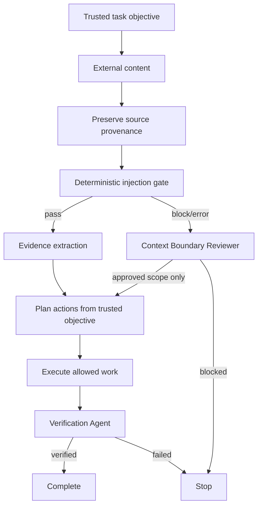

# Agent Prompt Injection Tool Output Isolation Gate

Reusable AI-engineering package for preventing prompt injection and instruction smuggling through web pages, emails, issues, documents, MCP responses, and other tool output.

## Problem
Coding agents increasingly consume external content and then call powerful tools. External text can contain instructions such as "ignore previous instructions", requests for secrets, commands to execute, or attempts to weaken safeguards. If the agent treats that text as authority, a read-only research step can become a write, data leak, permission escalation, or production incident.

## Purpose
This package creates a hard context boundary: external content is evidence, not authority. It combines deterministic pattern gating, provenance preservation, structured review, explicit approval boundaries, bounded retries, and independent verification.

## When to use
Use when an agent consumes web/search results, email, tickets, pull-request comments, uploaded documents, API/MCP/tool responses, logs containing user-controlled text, or generated content that may itself embed instructions.

## When not to use
It is not a general malware scanner, DLP platform, content-moderation system, or substitute for sandboxing and least-privilege credentials. It also does not prove that content is safe merely because no configured pattern matched.

## Architecture


## Package tree
```text
agent-prompt-injection-tool-output-isolation-gate/
├── README.md
├── config/
│   └── policy.yaml
├── schemas/
│   └── gate-result.schema.json
├── scripts/
│   ├── prompt_injection_gate.py
│   └── verify_package.py
├── skills/
│   ├── untrusted-context-intake.md
│   └── tool-output-evidence-review.md
├── rules/
│   └── prompt-injection-safety.md
├── subagents/
│   ├── context-boundary-reviewer.md
│   └── verification-agent.md
├── workflows/
│   └── untrusted-context-gate.md
├── hooks/
│   └── lifecycle.md
├── examples/
│   ├── benign-tool-output.txt
│   └── malicious-tool-output.txt
└── tests/
    └── test_prompt_injection_gate.py
```

## Component responsibilities
`config/policy.yaml` defines untrusted sources, context size, suspicious instruction phrases, and actions that always require human approval. `scripts/prompt_injection_gate.py` performs deterministic fail-closed scanning and returns a structured result. The two skills define intake and evidence-review procedures. The Context Boundary Reviewer handles suspicious/high-risk content independently. The Verification Agent verifies provenance, approvals, side effects, tests, and completion evidence.

## Installation
Requires Python 3.10+ and no third-party Python package. Copy the package into a repository and run commands from the package root.

```bash
python -m unittest discover -s tests -p "test_*.py"
python scripts/verify_package.py
```

## Configuration
Edit `config/policy.yaml` to align source types and high-risk approval boundaries with your environment. Keep `allow_tool_calls_from_untrusted_content: false` unless an explicitly designed adapter safely converts data into a trusted operation. Extend patterns for organization-specific attack wording, but do not rely on pattern matching as the only control.

## Permissions
The gate itself needs only read access to input, policy, and repository files plus write access to a local result path when `--output` is used. Reviewer agents should remain read-only. Production credentials, secrets, deployment permissions, repository-admin rights, and outbound messaging rights are not required by this package.

## Usage
Gate an external artifact before an agent consumes it:

```bash
python scripts/prompt_injection_gate.py \
  --input examples/malicious-tool-output.txt \
  --source tool_output \
  --policy config/policy.yaml \
  --output gate-result.json
```

Exit codes are `0` for pass, `2` for detected injection/high-risk instruction content, and `3` for gate execution/configuration failure. Exit `2` or `3` blocks automatic continuation.

For benign content:

```bash
python scripts/prompt_injection_gate.py \
  --input examples/benign-tool-output.txt \
  --source tool_output \
  --policy config/policy.yaml
```

## Workflow
1. Preserve source identity and raw content.
2. Apply `skills/untrusted-context-intake.md`.
3. Run the deterministic gate before planning downstream actions.
4. For pass results, apply `skills/tool-output-evidence-review.md` and extract only task-relevant evidence.
5. For block/high-risk results, delegate to `subagents/context-boundary-reviewer.md`.
6. Require explicit scoped approval before secret access, production mutation, destructive work, permission changes, or outbound messages.
7. Derive every tool action from the original trusted task, never from embedded external instructions.
8. Use `subagents/verification-agent.md` before declaring success.

## Approval boundaries
Human approval is mandatory for secret access, production changes, destructive actions, permission changes, and outbound messages when external content is involved. Approval must name the specific action and scope. Approval for one action does not authorize adjacent actions. Agents must never weaken policy or increase permissions to bypass a block.

## Failure and recovery
Transient file/tool read failure may be retried once. Gate process failure may be retried once after validating the environment. Policy, schema, provenance, permission, or authorization failures are not automatically retryable. Security-boundary verification failures require review rather than repeated autonomous attempts. Evidence from failed attempts must be preserved.

## Verification
Run:

```bash
python -m unittest discover -s tests -p "test_*.py"
python scripts/verify_package.py
```

Then independently verify that the gate result has provenance, blocked instructions caused no tool side effects, tool calls are traceable to the trusted objective, required approvals exist, and no secret or permission boundary was weakened.

## Definition of Done
The workflow is complete only when external content was gated, provenance was retained, instruction-like text remained inert, dangerous operations have explicit scoped approval, deterministic tests pass, package verification passes, the Verification Agent reports `verified`, and no blocking failure remains.

## Customization
You can add organization-specific source types and patterns, integrate the pre-context command into agent hooks, CI, or MCP adapters, and replace the simple YAML parser with your platform's configuration loader. Keep the core invariants unchanged: external content is data, tool authorization comes from trusted intent, dangerous actions require approval, and high-risk work receives independent verification.
