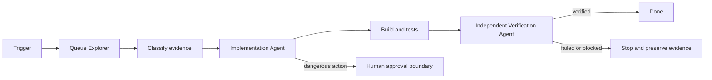

# Agent Queue Poison Message Quarantine Gate

Reusable, tool-neutral kit for investigating and preventing poison-message retry loops in queue consumers while preserving evidence, throughput and replay safety.

## Problem
A deterministic bad message or handler defect can be retried indefinitely, consume worker capacity, amplify downstream load, hide healthy messages, or cause duplicate side effects. Ad-hoc fixes often delete the message, broaden retries, or replay it without proving idempotency.

## When to use
Use for repeated consumer failures, dead-letter growth, retry storms, queue-handler changes, acknowledgement changes, or replay preparation. Do not use it as an automated production replay/deletion system.

## Architecture


## Package tree
```text
agent-queue-poison-message-quarantine-gate/
├── README.md
├── config/gate.yaml
├── schemas/finding.schema.json
├── skills/investigate-poison-message.md
├── skills/design-quarantine-path.md
├── rules/queue-safety.md
├── subagents/queue-explorer.md
├── subagents/implementation-agent.md
├── subagents/verification-agent.md
├── workflows/poison-message-gate.md
├── hooks/pre-task.md
├── hooks/final-verification.md
├── scripts/scan_queue_handlers.py
├── scripts/verify_package.py
└── templates/investigation-report.md
```

## Installation and dependencies
Copy this directory into the target repository or keep it as a shared engineering kit. Python 3.9+ is required for deterministic scripts; the Markdown workflow is agent/tool neutral. No broker credential is required by the kit and no secret belongs in its files.

## Configuration
Edit `config/gate.yaml` only to match established system policy. Defaults use five delivery attempts, at most three transient retries, raw-payload storage disabled, replay disabled, human approval required, and replay batch size capped at 25. Changing production broker settings remains an approval-required operation regardless of local configuration.

## Usage
1. Read `rules/queue-safety.md`.
2. Run the pre-task hook and inspect `queue-gate-findings.json`.
3. Queue Explorer follows `skills/investigate-poison-message.md` and records evidence using `templates/investigation-report.md`.
4. Implementation Agent follows `skills/design-quarantine-path.md` and `workflows/poison-message-gate.md`.
5. Run project-specific build/tests.
6. Verification Agent performs `hooks/final-verification.md` independently.

Example scanner invocation: `python scripts/scan_queue_handlers.py . --output queue-gate-findings.json`.

## Permissions and approval boundaries
Core investigation requires repository read access and local test execution. Editing requires normal repository write access only. Production replay, deployment, deletion, broker retry/retention changes, infrastructure/configuration changes, secret changes, permission escalation and breaking schema/API changes require explicit human approval. Agents stop before performing them.

## Failure and recovery
Transient verification-tool failures get one retry. Implementation test failures allow at most two fix/test cycles. Permission failures stop without privilege escalation. Unknown failure classification or unproven idempotency blocks replay. Every failed cycle preserves evidence instead of replacing it with a success claim.

## Verification
Success requires evidence that retry is finite, terminal quarantine exists, sensitive payloads are not persisted by default, duplicate/replay behavior is safe, acknowledgement ordering is correct, relevant build/tests pass, scanner findings are resolved or justified, and the independent verifier returns `verified`. `scripts/verify_package.py` checks required kit artifacts and placeholder-free content.

## Definition of Done
Required context and handler path are evidenced; failure classification is explicit; bounded retry and quarantine behavior are implemented or proven already present; idempotency/duplicate delivery is verified; relevant tests/build pass; no dangerous action occurred without approval; remaining risks are recorded; independent verification succeeds.

## Portability
The skills, rules and workflow can be used by Codex, Claude Code, Cursor, ChatGPT, GitHub Copilot, OpenCode or another coding agent. Broker-specific commands belong in the target repository or an explicitly approved adapter; this kit intentionally does not assume Azure Service Bus, RabbitMQ, Kafka, SQS or another provider.
