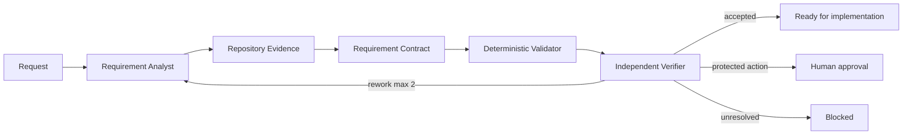

# Agent Requirement Ambiguity Gate

A reusable pre-implementation gate that prevents coding agents from silently inventing missing requirements. It converts a request plus repository evidence into a structured, independently verified requirement contract before source edits begin.

## Problem
AI coding agents can turn an underspecified request into plausible code while making hidden decisions about scope, compatibility, errors, persistence, authorization, migrations, or public contracts. The code may build yet implement the wrong behavior. This kit makes those decisions explicit and blocks implementation when ambiguity is material.

## When to use
Use before feature implementation, bug fixes with unclear intended behavior, cross-module refactors, integrations, migrations, API/data changes, or operational changes. Skip the full gate for trivial mechanical edits whose requested behavior, scope, and verification are already explicit.

## Architecture


## Package tree
```text
agent-requirement-ambiguity-gate/
├── README.md
├── config/ambiguity-gate.yaml
├── schemas/requirement-contract.schema.json
├── templates/requirement-contract.example.json
├── scripts/validate-requirement-contract.py
├── scripts/check-package.py
├── skills/requirement-clarification.md
├── skills/repository-evidence.md
├── rules/requirement-safety.md
├── subagents/requirement-analyst.md
├── subagents/requirement-verifier.md
├── workflows/ambiguity-gate-workflow.md
└── hooks/hooks.md
```

## Responsibilities
- `skills/requirement-clarification.md`: turns requests into testable contracts.
- `skills/repository-evidence.md`: gathers targeted evidence without indiscriminate repository loading.
- `rules/requirement-safety.md`: enforceable implementation and approval boundaries.
- `subagents/requirement-analyst.md`: owns decomposition and contract creation.
- `subagents/requirement-verifier.md`: independently challenges readiness.
- `workflows/ambiguity-gate-workflow.md`: bounded end-to-end lifecycle and recovery.
- `scripts/validate-requirement-contract.py`: deterministic readiness checks.
- `scripts/check-package.py`: deterministic package completeness check.

## Installation
Copy the folder into a repository, for example `.ai/agent-requirement-ambiguity-gate/`. Requires Python 3.9+ for validation scripts. Core instructions are tool-neutral and can be used with Codex, Claude Code, Cursor, ChatGPT, GitHub Copilot, OpenCode, or another agent capable of repository read/search and task-local artifact creation.

## Configuration
Adjust `config/ambiguity-gate.yaml` only when your repository has stricter thresholds or additional protected actions. Defaults require zero blockers and zero high-risk assumptions for readiness and permit at most two analyst/verifier replan cycles.

## Permissions
During this gate, grant read/search access plus permission to run non-destructive build/tests and write a task-local contract. Do not grant production deployment, destructive database, secret-management, infrastructure, or history-rewrite permissions merely to clarify a requirement.

## Usage
Start from `templates/requirement-contract.example.json`, replace its task data, then follow `workflows/ambiguity-gate-workflow.md`.

Validate:
```bash
python scripts/validate-requirement-contract.py path/to/requirement-contract.json
```

Verify package installation:
```bash
python scripts/check-package.py
python scripts/validate-requirement-contract.py templates/requirement-contract.example.json
```

An implementation agent may proceed only after deterministic validation and independent verification accept a `ready` contract.

## Input/output contract
Required contract fields include task, trigger, in/out scope, acceptance criteria, assumptions with risk/evidence, open questions with blocking status/owner, evidence, overall risk, optional approval reasons, and gate status. The canonical structure is `schemas/requirement-contract.schema.json`.

## Approval boundaries
Human approval is mandatory before breaking API contracts, database schema changes, production configuration changes, security-control changes, destructive operations, irreversible migrations, or large dependency upgrades. The gate stops at `needs-approval`; it never performs those actions itself.

## Failure and recovery
Transient read/tool failures may be retried once. Verifier-requested rework is bounded to two cycles. Missing permissions, unresolved business decisions, conflicting authoritative evidence, or exhausted retries produce `blocked`. Evidence and verifier findings are preserved so the next owner can resume without reconstructing the investigation.

## Verification
Task execution and task verification are separate. A contract is verified only when the deterministic validator passes, cited material evidence is checked, no hidden blocker/high-risk assumption remains, approval classification is correct, and the independent verifier accepts it.

## Definition of Done
- Required context and repository evidence were gathered.
- Acceptance criteria are concrete and testable.
- Facts, assumptions, questions, decisions, and evidence remain distinct.
- `ready` contains zero blocking questions and zero high-risk assumptions.
- Validator exits 0.
- Independent verifier accepts the contract.
- Approval-required work is stopped rather than executed.
- Remaining non-blocking risks are documented.

## Customization
Repositories can add protected-action markers, domain-specific evidence types, or stricter readiness thresholds. Keep deterministic checks in scripts/config and semantic judgment in skills/subagents. Do not weaken the zero-blocker rule simply to make an autonomous run continue.
