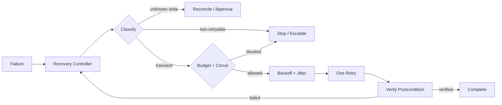

# Agent Retry Budget & Circuit Breaker Gate

A reusable safety/reliability kit for preventing AI coding agents and tool-using workflows from turning transient failures into infinite loops, request storms, duplicate side effects, or permission-bypass attempts.

## Problem and trigger
Use this kit when an agent may repeat failed commands, API/tool calls, CI operations, background jobs, or integration requests. Ad-hoc instructions such as “retry if it fails” are unsafe because failure classes differ and state-changing calls can have ambiguous outcomes.

Do not use the deterministic runner for non-idempotent writes unless duplicate prevention/reconciliation has already established that repetition is safe.

## Architecture


## Package tree
```text
agent-retry-budget-circuit-breaker-gate/
├── README.md
├── config/policy.json
├── hooks/recovery-hooks.md
├── rules/retry-safety.md
├── schemas/recovery-decision.schema.json
├── scripts/retry_gate.py
├── scripts/validate_policy.py
├── skills/failure-classification.md
├── subagents/recovery-controller.md
├── tests/test_retry_gate.py
└── workflows/bounded-recovery.md
```

## Installation
Requires Python 3.9+. Copy the directory into a repository. No runtime Python packages are required. `pytest` is required only to run the included tests.

Validate configuration:
```bash
python scripts/validate_policy.py config/policy.json
```

Run tests:
```bash
python -m pytest tests/test_retry_gate.py
```

## Configuration
`config/policy.json` defaults to three total attempts, exponential delay starting at 500 ms, 5 s cap, 20% jitter, and a circuit threshold of five consecutive dependency failures with a 60-second cool-down. Customize conservatively. The retryable HTTP list is classification input, not proof that a state-changing request is safe to repeat.

## Usage
First have the Recovery Controller classify the failure using the Skill and Rules. For a deterministic command already proven safe to repeat:
```bash
python scripts/retry_gate.py --policy config/policy.json --evidence .ai-retry-evidence.json -- python -m pytest tests/unit
```
The runner returns 0 on success and 20 when the retry budget is exhausted. Each attempt is recorded in the evidence file.

## Workflow and responsibilities
The execution agent performs work and captures the original failure. `subagents/recovery-controller.md` independently decides whether recovery is allowed. `workflows/bounded-recovery.md` owns the end-to-end state machine. `hooks/recovery-hooks.md` describes deterministic lifecycle gates. The JSON schema standardizes recovery decisions between agents.

## Permissions and approval boundaries
Read-only inspection and local validation use least privilege. Explicit human approval is required before repeated production writes, deployments, destructive actions, secret or permission changes, irreversible operations, or unsafe non-idempotent retries. The controller must never increase its own permissions.

## Failure handling
Transient failures may consume the bounded budget. Validation, permission and business-rule failures stop immediately. Environment failures are corrected outside the retry loop. Unknown-outcome writes must be reconciled before repetition. Budget exhaustion or an open circuit escalates with evidence rather than resetting the loop.

## Verification
A successful command execution is not sufficient. Verify the operation-specific postcondition separately, inspect `.ai-retry-evidence.json`, confirm attempt count did not exceed policy, confirm required approval exists, and confirm no duplicate side effect occurred.

## Definition of Done
Recovery is complete only when the policy validates; the failure was classified; every attempt has evidence; no nested loop reset the budget; required approval was obtained; the intended postcondition is verified or the operation is explicitly escalated; and no unresolved duplicate-side-effect risk remains.

## Portability
The Markdown procedures are tool-neutral and can be loaded by Codex, Claude Code, Cursor, ChatGPT, Copilot, OpenCode, or another agent. Keep provider-specific retry metadata handling in the integration layer; do not weaken the core budget, evidence, reconciliation, and approval rules.
