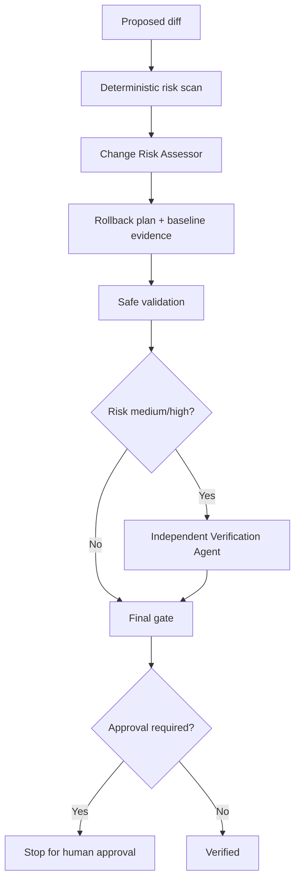

# Agent Rollback Readiness Gate

A reusable AI engineering package that prevents risky changes from being treated as deployable until their rollback path is explicit, evidence-backed, bounded, and independently verified when risk is material.

## Problem

AI coding agents can implement correct-looking changes while overlooking the operational question that matters during failure: can the change be reversed safely? `git revert` is insufficient for schema, data, configuration, infrastructure, security, and contract changes. This package introduces a deterministic pre-change scan plus agent workflow for proving rollback readiness before dangerous execution.

## When to use

Use before releases, migrations, production configuration changes, infrastructure changes, security-control changes, broad refactors, dependency upgrades, data transformations, or other changes with meaningful rollback risk.

## When not to use

Do not use this as a substitute for deployment tooling, backups, disaster recovery, database migration discipline, or change-management policy. It also does not grant permission to perform production actions.

## Architecture



## Package tree

```text
agent-rollback-readiness-gate/
├── README.md
├── config/
│   └── rollback-readiness.json
├── examples/
│   └── sample-assessment.json
├── hooks/
│   └── pre-change-gate.md
├── rules/
│   └── rollback-safety.md
├── schemas/
│   └── assessment.schema.json
├── scripts/
│   ├── assess-changes.py
│   └── verify-package.py
├── skills/
│   └── assess-rollback-readiness.md
├── subagents/
│   ├── change-risk-assessor.md
│   └── verification-agent.md
├── tests/
│   └── test_assess_changes.py
└── workflows/
    └── rollback-readiness.md
```

## Component responsibilities

- `config/rollback-readiness.json` defines deterministic risk categories, scores, approval categories, required evidence, and retry limits.
- `scripts/assess-changes.py` evaluates changed file paths from a Git diff and emits structured JSON.
- `schemas/assessment.schema.json` defines the assessment output contract.
- `rules/rollback-safety.md` defines mandatory, forbidden, and preferred behavior.
- `skills/assess-rollback-readiness.md` provides the reusable assessment procedure.
- `subagents/change-risk-assessor.md` owns initial evidence-backed risk analysis.
- `subagents/verification-agent.md` independently verifies medium/high-risk work.
- `workflows/rollback-readiness.md` coordinates the bounded end-to-end gate.
- `hooks/pre-change-gate.md` defines deterministic blocking behavior before dangerous execution.
- `scripts/verify-package.py` validates package completeness and internal references.
- `tests/test_assess_changes.py` exercises deterministic scoring behavior.
- `examples/sample-assessment.json` shows a valid assessment shape.

## Dependencies

Core runtime requirements:

- Python 3.9+
- Git
- No third-party Python packages

Optional: a JSON Schema validator if you want automated schema validation in CI.

## Installation

Copy this directory into your repository, for example `.ai/agent-rollback-readiness-gate/`. Keep internal relative paths together. If you relocate scripts or config independently, update the hook/workflow commands accordingly.

## Configuration

Edit `config/rollback-readiness.json` to match repository conventions. Typical customization points are risk thresholds, file/path patterns, category weights, approval-required categories, and required rollback evidence.

Do not lower approval boundaries merely to make the gate pass. Organization policy should override package defaults where stricter.

## Usage

From the package root:

```bash
python scripts/assess-changes.py \
  --base origin/main \
  --head HEAD \
  --config config/rollback-readiness.json \
  --output .ai/rollback-assessment.json
```

Exit codes:

- `0`: scan completed and no configured approval-required category was detected.
- `2`: scan completed and at least one approval-required category was detected.
- `3`: Git/config/tool error prevented assessment.

An exit code of `0` does not mean the change is fully verified. Continue through the workflow and collect rollback evidence.

## Example invocation for an AI coding agent

> Assess rollback readiness for the diff from `origin/main` to `HEAD`. Follow `rules/rollback-safety.md`, run the deterministic scanner, trace schema/data/config/security/deployment impact, write a concrete rollback procedure, and use the Verification Agent for medium/high risk. Stop before every approval-required action.

## Workflow

Follow `workflows/rollback-readiness.md`:

1. Run deterministic scan.
2. Have the Change Risk Assessor validate classifications and blast radius.
3. Produce rollback procedure and baseline evidence.
4. Run safe build/test/non-production validation.
5. Use the independent Verification Agent for medium/high risk.
6. Stop for explicit human approval when required.
7. Finish only as `verified`, `blocked`, or `needs-approval`.

All retry loops are bounded to two attempts for the same retryable failure.

## Approval boundaries

Explicit human approval is required before dangerous actions including production deployment, destructive SQL, database schema/data mutation, infrastructure changes, secret changes, production configuration changes, breaking API contracts, weakening security controls, irreversible migrations, force push/history rewriting, and configured approval categories.

Agents must stop before execution and must never silently increase permissions.

## Failure handling

- Transient tool/process failure: preserve evidence and retry at most twice.
- Build/test failure: mark blocked and preserve logs.
- Permission failure: stop; do not escalate privileges automatically.
- Environment mismatch: stop unless an equivalent safe verification signal is available.
- Irreversible data behavior: mark rollback unavailable and require an explicit forward-fix decision.
- Missing required rollback evidence: block readiness.

## Verification

Run package checks:

```bash
python scripts/verify-package.py
python -m unittest tests/test_assess_changes.py
```

For an actual change, verification should additionally include the repository's relevant build, tests, static analysis, migration dry-run, configuration validation, API-contract checks, and/or non-production rollback exercise as appropriate.

## Permissions

The assessment phase requires read access to repository content and local execution of Git/Python/build/test commands. It does not require production credentials. Production-affecting permissions should remain outside the agent unless separately approved and explicitly granted.

## Definition of Done

A change is rollback-ready only when:

- required context was gathered;
- the deterministic assessment exists;
- changed areas and operational risks are evidenced;
- rollback procedure, owner, verification command, and data-loss statement exist;
- relevant build/tests/safety checks passed;
- medium/high risk received independent verification;
- required human approval exists before any dangerous action;
- unresolved risks are documented;
- no blocking failure remains.

## Customization

Adapt path patterns and risk weights to your stack. Examples:

- .NET/EF Core: add project-specific migration and contract folders.
- Kubernetes/Helm: add environment-specific values and manifest directories.
- Terraform/Bicep: tune infrastructure path patterns.
- Node/Python: add lockfiles and migration framework conventions.
- Monorepos: add service ownership or domain boundaries to the risk mapping.

Keep the deterministic scanner conservative and let agents add repository-specific evidence rather than silently weakening the configured gate.
