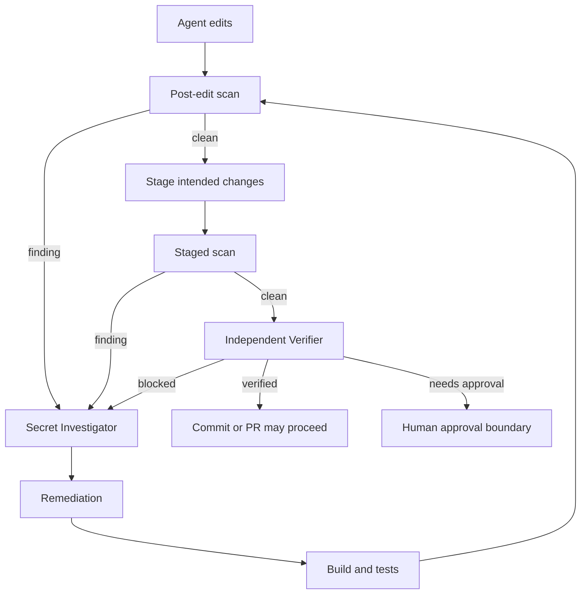

# Agent Secret Exposure Diff Gate

Reusable safety kit that prevents AI-assisted edits from leaking credentials into Git diffs, commits, or pull requests. It combines deterministic scanning, bounded investigation/remediation, independent verification, explicit approval boundaries, and portable agent instructions.

## Problem
Coding agents can accidentally paste API keys, tokens, private keys, passwords, connection strings, or high-entropy credentials into source, fixtures, generated configuration, logs, or documentation. A normal code review can miss these values, especially when changes are large. This kit scans only newly added diff lines, blocks high/critical findings, and requires evidence-based remediation before work is considered verified.

## When to use
Use after agent edits, before commit/PR preparation, during automated review, or whenever generated code/configuration handles credentials. It is suitable for local repositories and CI wrappers. Do not treat it as a replacement for organization-wide secret scanning or incident response for credentials already exposed upstream.

## Architecture


## Package tree
```text
agent-secret-exposure-diff-gate/
├── README.md
├── config/
│   └── secret-policy.yaml
├── hooks/
│   └── lifecycle.md
├── rules/
│   └── secret-safety.md
├── schemas/
│   └── scan-result.schema.json
├── scripts/
│   ├── secret_diff_gate.py
│   └── verify_package.py
├── skills/
│   ├── secret-diff-investigation.md
│   └── secret-remediation.md
├── subagents/
│   ├── independent-verifier.md
│   └── secret-investigator.md
├── templates/
│   └── allowlist-entry.json
├── tests/
│   └── test_secret_diff_gate.py
└── workflows/
    └── secret-exposure-gate.md
```

## Dependencies
- Git
- Python 3.10+
- PyYAML (`pip install pyyaml`)
- pytest for package tests (`pip install pytest`)

The scanner does not require network access or cloud credentials.

## Installation
Copy this directory into the target repository or merge its folders into an existing agent-instructions area. Keep `config/secret-policy.yaml` close to the scripts, or pass an explicit policy path.

Run:
```bash
python scripts/verify_package.py
pytest tests/test_secret_diff_gate.py
```

## Configuration
`config/secret-policy.yaml` defines blocking severities, regex detectors, entropy thresholds, ignored paths, maximum scanned file size, and the allowlist path. Tune path exclusions for build output but do not reduce severity or detector coverage solely to unblock a change.

The allowlist must be a JSON array matching `templates/allowlist-entry.json`. Entries are intentionally narrow: path + detector ID + SHA-256 hash. Prefer changing synthetic fixtures so they cannot resemble live credentials. High/critical exceptions should receive independent review.

## Usage
Scan working-tree additions:
```bash
python scripts/secret_diff_gate.py \
  --policy config/secret-policy.yaml \
  --output secret-scan-result.json
```

Scan the exact staged commit boundary:
```bash
python scripts/secret_diff_gate.py \
  --policy config/secret-policy.yaml \
  --staged \
  --output secret-scan-result.json
```

Exit codes:
- `0`: no blocking finding.
- `2`: blocking secret finding detected.
- `3`: scanner/configuration/environment failure.

The result file contains metadata and value hashes only; detected secret values are not written to the report.

## Agent responsibilities
`subagents/secret-investigator.md` owns classification and remediation recommendations. `subagents/independent-verifier.md` must independently verify high/critical findings, remediation results, and exception evidence. The implementing agent must not be the only verifier for high-risk findings.

## Workflow
Follow `workflows/secret-exposure-gate.md` and `skills/secret-diff-investigation.md`. Confirmed secrets are handled with `skills/secret-remediation.md`. Hooks in `hooks/lifecycle.md` define the deterministic post-edit and pre-commit gates.

Retries are bounded: one retry for a transient scanner/environment failure and one corrective retry for a remediation-caused build/test failure. A second failure of the same class stops the workflow and preserves evidence.

## Approval boundaries
Explicit human approval is required before:
- rotating production credentials,
- changing CI/vault/secret-store permissions,
- rewriting Git history,
- force-pushing,
- weakening scanner detectors/severity/entropy thresholds,
- accepting a high/critical exception when safer remediation exists.

If a real credential was already committed or pushed, stop normal remediation and escalate for credential rotation and repository-history incident handling.

## Verification
A task is **executed** when the scanner and remediation steps ran. A task is **verified successfully** only when:
- the exact intended diff scope scans clean,
- affected build/tests pass,
- scanner result contains no blocking findings,
- no secret value appears in reports,
- the Git diff contains no unintended change,
- an independent verifier returns `verified`,
- no approval-required action remains unresolved.

Run package-level checks:
```bash
python scripts/verify_package.py
pytest tests/test_secret_diff_gate.py
```

## Failure handling
Scanner error: preserve stderr and command, fix the local environment, retry once, then stop. Finding detected: classify without copying the value, remediate, retest, and rescan. Permission failure: stop rather than escalating permissions. Secret already pushed: stop and escalate. Ambiguous exception: status is `needs-approval`, not success.

## Definition of Done
- Required repository context was gathered.
- Working-tree and/or staged scope was explicitly selected.
- All blocking findings were resolved or appropriately escalated.
- Relevant tests/build passed after remediation.
- Exact final scope scanned clean.
- Independent verification completed.
- No secrets were printed or stored in generated evidence.
- No dangerous action occurred without approval.
- `scripts/verify_package.py` passes and all documented files exist.

## Portability
Core instructions are tool-neutral and can be used with Codex, Claude Code, Cursor, ChatGPT, GitHub Copilot, OpenCode, or other agents that can read repository files and execute local commands. Tool-specific hook wiring belongs in the host repository; the deterministic Python scanner remains the source of truth for this kit.
