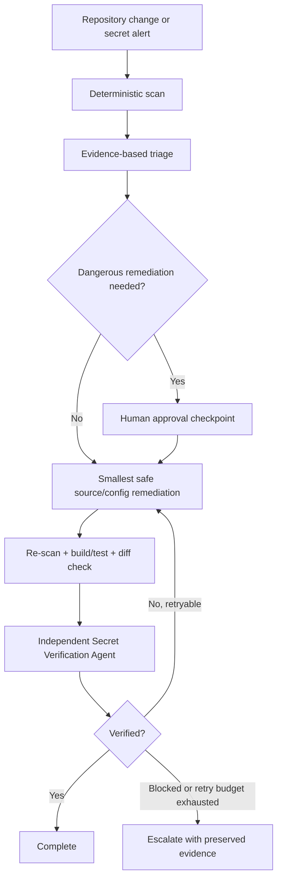

# Agent Secret Exposure Prevention Gate

Reusable AI engineering package for detecting, triaging, remediating, and independently verifying accidental secret exposure in a repository without leaking the secret during the investigation.

## Problem
AI-assisted coding can accidentally introduce API keys, tokens, passwords, private keys, or credential-like values into source code, configuration, fixtures, logs, generated patches, or documentation. A simple regex scan is not enough: the workflow also needs redaction, evidence-based triage, bounded retries, approval boundaries, remediation guidance, and independent verification.

## Purpose
Use this package as a repository gate before commits, pull requests, releases, or after any agent-generated change that might contain credentials. It combines a deterministic scanner with agent procedures and safety rules.

## When to use
- A secret scanner or CI job reports a credential-like value.
- An AI coding agent edited configuration, authentication, deployment, integration, test-fixture, or documentation files.
- A developer notices a token/password/private key in a diff.
- A repository is being prepared for commit, PR, release, or external sharing.

## When not to use
- Do not use this package to validate whether a credential is active by calling a provider without authorization.
- Do not use it as a replacement for a managed secret store, provider-native secret scanning, or organization security policy.
- Do not use it to automatically rotate credentials, rewrite Git history, force-push, deploy, or alter production configuration.

## Architecture


## Package tree
```text
agent-secret-exposure-prevention-gate/
├── README.md
├── config/
│   └── secret-scan.json
├── hooks/
│   └── pre-commit-secret-scan.md
├── rules/
│   └── secret-protection.md
├── schemas/
│   └── secret-scan-report.schema.json
├── scripts/
│   ├── scan-secrets.py
│   └── verify-package.py
├── skills/
│   └── secret-exposure-triage.md
├── subagents/
│   └── secret-verifier.md
├── templates/
│   └── allowlist.example.json
└── workflows/
    └── secret-exposure-response.md
```

## Component responsibilities
- `scripts/scan-secrets.py` performs deterministic repository scanning and writes only redacted evidence plus stable fingerprints.
- `config/secret-scan.json` controls file scope, size limits, entropy threshold, blocking severity, and scan-error budget.
- `skills/secret-exposure-triage.md` defines the investigation and remediation procedure.
- `rules/secret-protection.md` defines enforceable safety and approval behavior.
- `workflows/secret-exposure-response.md` defines the complete bounded response loop.
- `subagents/secret-verifier.md` provides independent post-remediation verification.
- `hooks/pre-commit-secret-scan.md` describes the deterministic gate for commit/PR preparation.
- `schemas/secret-scan-report.schema.json` defines the scanner output contract.
- `templates/allowlist.example.json` shows a narrow fingerprint-based exception format.
- `scripts/verify-package.py` checks package completeness, JSON validity, scanner integration, and README file references.

## Dependencies
- Python 3.10 or newer.
- Optional Git for repository status/diff checks used by the workflow.
- No third-party Python packages are required by the included scripts.

## Installation
Copy this directory into the target repository, for example under `.ai/agent-secret-exposure-prevention-gate/`, or keep it in a shared engineering-kit directory. Core instructions are tool-neutral and can be used with coding agents that can read files and run local commands.

If the package is copied under a subdirectory, pass the target repository root to the scanner rather than scanning only the package directory.

## Configuration
Edit `config/secret-scan.json` only when the repository requires different file extensions, generated-directory exclusions, file-size limits, entropy thresholds, or blocking severity.

The default scanner blocks `high` and `critical` findings. Broad detector suppression is intentionally unsupported. For a verified false positive, copy `templates/allowlist.example.json` to a repository-specific file, replace the example entry, and pass it explicitly with `--allowlist`. Keep entries scoped to an exact path, detector, and fingerprint.

## Permissions
The normal workflow requires only repository read/write access needed for the intended code remediation and permission to execute local non-destructive commands. It does not require production, secret-store, or cloud-administration privileges.

Never increase permissions automatically. Credential rotation/revocation, production secret/config changes, Git-history rewriting, force push, security-control weakening, deletion of remote artifacts, and deployment require explicit human approval.

## Usage
From this package directory, scan a repository:

```bash
python scripts/scan-secrets.py \
  --root /path/to/repository \
  --config config/secret-scan.json \
  --output /tmp/secret-scan-report.json
```

With an explicitly maintained allowlist:

```bash
python scripts/scan-secrets.py \
  --root /path/to/repository \
  --config config/secret-scan.json \
  --allowlist /path/to/repository/.secret-scan-allowlist.json \
  --output /tmp/secret-scan-report.json
```

Exit codes:
- `0`: scan completed with no blocking finding.
- `2`: one or more configured blocking findings exist.
- `3`: scanner/configuration failure or the scan-error budget was exhausted.

## Example agent invocation
```text
Use agent-secret-exposure-prevention-gate on the current repository.
Follow rules/secret-protection.md and workflows/secret-exposure-response.md.
Run the deterministic scanner first, keep all evidence redacted, remediate only the smallest safe source/config change, stop before any rotation/history/prod action that needs approval, then hand off to subagents/secret-verifier.md for independent verification.
```

## Workflow
1. Capture repository state without editing files.
2. Run `scripts/scan-secrets.py`.
3. Triage each finding using `skills/secret-exposure-triage.md`.
4. Determine the exposure surface: working tree, Git history, CI logs/artifacts, PR/issue text, or deployed configuration.
5. Stop for explicit approval before dangerous actions.
6. Apply the smallest safe source/config remediation.
7. Re-run the scanner, relevant build/tests, and `git diff --check`.
8. Use `subagents/secret-verifier.md` for independent verification.
9. Retry only within the limits in `workflows/secret-exposure-response.md`; otherwise escalate with evidence preserved.

## Approval boundaries
Human approval is mandatory before:
- Credential rotation or revocation.
- Production secret-store or configuration changes.
- Git-history rewriting or force push.
- Deleting remote CI artifacts, files, or data.
- Production deployment.
- Breaking API/security changes used as remediation.
- Weakening a detector or security control to bypass a finding.

The workflow may still complete a safe local code cleanup while marking historical or remote exposure as unresolved.

## Failure handling
- Transient scanner/tool failure: maximum 2 retries.
- Build/test failure caused by remediation: maximum 1 evidence-driven fix-and-retest cycle.
- Independent verification failure: maximum 1 remediation cycle before escalation.
- Permission or approval failure: no automatic retry or privilege escalation.
- Scan errors: stop when `max_scan_errors` from `config/secret-scan.json` is reached.

All retries preserve previous reports, stderr, command exit codes, and diff evidence.

## Verification
Package structure verification:

```bash
python scripts/verify-package.py
```

Task verification requires:
- The deterministic scan completed.
- No unapproved blocking high/critical finding remains in the verified scope.
- Generated reports contain only redacted evidence and fingerprints, not full candidate values.
- Relevant tests/build pass when source behavior changed.
- `git diff --check` passes and unrelated risky edits are absent.
- Independent verification reports `passed`.
- Historical, CI, artifact, PR/issue, or deployed exposure is explicitly documented if it remains unresolved.

The JSON output contract is documented by `schemas/secret-scan-report.schema.json`.

## Definition of Done
The task is done only when all applicable conditions are true:
- Required repository context and initial evidence were captured.
- Findings were classified with redacted evidence and confidence.
- Safe remediation exists in the repository where needed.
- No blocking secret remains in the verified scan scope except an explicitly reviewed exception.
- Relevant build/tests and diff checks passed.
- Independent verification passed.
- Required approvals were obtained for dangerous actions that were actually performed.
- Remaining remote/history exposure is documented and is not falsely represented as resolved.
- Retry budgets are not exceeded and no blocking failure remains hidden.

## Customization
- Add repository-specific file extensions or generated directories in `config/secret-scan.json`.
- Add detectors to `scripts/scan-secrets.py` when your organization uses a recognizable credential format.
- Keep new detectors deterministic and ensure reports continue to use redacted evidence.
- Integrate `hooks/pre-commit-secret-scan.md` into Git hooks or CI without changing its blocking semantics.
- Keep organization-specific approval policy in a separate adapter/rules file if needed; do not weaken the core secret-protection rules.
