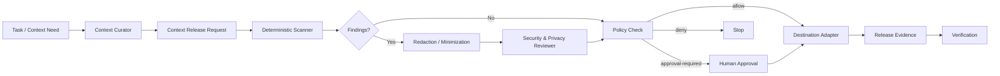

# Agent Sensitive Context Sanitizer

A portable safety kit for preventing secrets, personally identifiable information (PII), confidential identifiers, and restricted repository data from being sent unintentionally to AI models, tools, subagents, logs, or external services.

## Problem

AI-assisted development frequently moves repository text across boundaries: source files become prompts, logs become debugging context, tickets become agent memory, and tool outputs become subagent inputs. A useful coding agent can therefore leak sensitive data even when the requested development task itself is harmless.

The core failure mode is not only secret detection. Teams also need a repeatable decision process answering:

1. What context is actually necessary?
2. Which destination will receive it?
3. What sensitivity classes are present?
4. What can be redacted or minimized safely?
5. Which items require human approval or must never cross the boundary?
6. How do we prove the released context was sanitized rather than merely assumed safe?

This kit creates a release gate between context collection and context transmission.

## When to use

Use this package when an agent or automation is about to send repository-derived or user-derived content to another execution boundary, including:

- cloud-hosted AI models;
- remote MCP servers or external tools;
- third-party APIs;
- specialist subagents with broader or different permissions;
- issue trackers, chat systems, telemetry, or logs;
- code-review bots and research agents;
- incident/debugging workflows containing production logs;
- generated prompts assembled from files, environment output, or database samples.

It is especially useful in repositories containing credentials, customer data, HR data, production logs, private certificates, tenant identifiers, internal URLs, or proprietary code.

## Architecture



The design deliberately separates responsibilities:

- **Skills** define how to classify context and prepare a safe release.
- **Rules** enforce non-negotiable boundaries.
- **Context Curator** selects the minimum useful context and records the intended destination.
- **Privacy & Security Reviewer** challenges ambiguous classifications and proposed overrides.
- **Scripts** perform deterministic scanning, redaction, and report verification.
- **Hooks** ensure the gate runs at predictable lifecycle points.
- **Workflow** controls retries, approvals, escalation, and Definition of Done.

## Package structure

```text
agent-sensitive-context-sanitizer/
├── README.md
├── config/
│   └── sensitivity-policy.json
├── hooks/
│   └── context-boundary-hooks.md
├── rules/
│   └── sensitive-context-boundary.md
├── schemas/
│   └── sanitization-report.schema.json
├── scripts/
│   ├── scan-sensitive-context.py
│   ├── redact-context.py
│   └── verify-sanitization-report.py
├── skills/
│   ├── context-sensitivity-classification.md
│   └── safe-context-release.md
├── subagents/
│   ├── context-curator.md
│   └── privacy-security-reviewer.md
├── templates/
│   └── context-release-request.example.json
└── workflows/
    └── sensitive-context-release-gate.md
```

## Installation

Copy the folder into a repository, for example:

```text
.ai/agent-sensitive-context-sanitizer/
```

Requirements:

- Python 3.9+
- no third-party Python packages
- an agent/tool adapter that can run a pre-send gate before external context transmission

The core workflow is tool-neutral. Product-specific hooks should call the deterministic scripts rather than reimplementing policy logic inside a prompt.

## Configuration

The default policy lives at:

```text
config/sensitivity-policy.json
```

Optional environment variables:

- `AGENT_SENSITIVITY_POLICY` — override policy path.
- `AGENT_SANITIZATION_REPORT` — default report path used by adapters.

The policy contains detector settings, destination trust levels, severity defaults, and release rules. Customize the policy for your organization rather than hard-coding vendor or repository assumptions into the scripts.

No secret values are required by this package.

## Usage

### 1. Prepare a candidate context file

Example:

```text
.agent-context/candidate.txt
```

### 2. Scan it

```bash
python .ai/agent-sensitive-context-sanitizer/scripts/scan-sensitive-context.py \
  --input .agent-context/candidate.txt \
  --destination external-model \
  --output .agent-context/sanitization-report.json
```

The scanner records offsets, categories, severities, and detector names. It does **not** copy detected raw values into the report.

### 3. Redact detected spans

```bash
python .ai/agent-sensitive-context-sanitizer/scripts/redact-context.py \
  --input .agent-context/candidate.txt \
  --report .agent-context/sanitization-report.json \
  --output .agent-context/released.txt
```

### 4. Verify the evidence

```bash
python .ai/agent-sensitive-context-sanitizer/scripts/verify-sanitization-report.py \
  --report .agent-context/sanitization-report.json \
  --released .agent-context/released.txt
```

Only after verification passes should the destination adapter transmit `released.txt`.

## Workflow

1. Define the exact destination and purpose.
2. Collect the minimum context needed for that purpose.
3. Produce a context release request.
4. Run deterministic scanning.
5. Redact or minimize detected material.
6. Escalate ambiguous, high-risk, or override cases to the Privacy & Security Reviewer.
7. Require explicit human approval for any policy override that would disclose restricted material.
8. Verify the sanitization report against the released content.
9. Transmit only the verified released artifact.
10. Record release evidence without storing raw sensitive values.

The workflow distinguishes:

- **Prepared** — context has been collected and processed.
- **Released** — a destination actually received the sanitized artifact.
- **Verified** — the release artifact and report passed deterministic checks and all required approvals were satisfied.

## Safety

### Default behavior

- Raw private keys and clearly identified credentials are never released to external destinations.
- High-risk or ambiguous material is blocked or requires human review according to policy.
- Reports store hashes/offsets and classification metadata, not detected raw values.
- The scanner never transmits data and never modifies the source input.
- Redaction writes to a separate output path by default.

### Explicit human approval required

Require a human checkpoint before:

- overriding a `deny` or `approval-required` classification;
- sending customer/employee PII to a new destination;
- sending production configuration, secret-bearing logs, database exports, or private certificates externally;
- widening a destination from internal/trusted to external/untrusted;
- weakening detector or release policy;
- introducing a new external processor for restricted context.

The approval must refer to the exact destination, purpose, artifact hash, and override reason. A previous approval is not a blanket future exemption.

## Verification

A run is verified only when:

- the release request names a destination and purpose;
- the scanner completed successfully;
- all report findings have a deterministic disposition;
- the released artifact does not contain any spans classified for redaction;
- any required approval is recorded outside the sensitive payload;
- the verification script exits successfully;
- the destination adapter transmits the verified artifact, not the original candidate file.

A generated sanitized file alone is not proof that the task is safe.

## Failure and recovery

- **Scanner operational failure:** retry once after fixing input/policy path; stop after the second failure.
- **Invalid policy/report:** do not transmit; fix configuration and rerun from scanning.
- **Ambiguous classification:** one semantic review cycle; unresolved ambiguity becomes approval-required or deny.
- **Redaction verification failure:** regenerate once from the original candidate and current report; if it fails again, stop.
- **Destination changed:** invalidate the prior release decision and rerun the gate.
- **Source context changed:** rerun scanning; previous report is stale.
- **Denied disclosure:** do not retry with another tool or subagent to bypass policy.

## Customization

The easiest extension points are:

1. `config/sensitivity-policy.json` — add organization-specific detectors, severity mappings, and destination rules.
2. `skills/context-sensitivity-classification.md` — add semantic categories such as legal privilege or regulated health data.
3. `hooks/context-boundary-hooks.md` — map lifecycle events from Cursor, Codex, Claude Code, Copilot, OpenCode, CI jobs, or custom agents.
4. `subagents/privacy-security-reviewer.md` — add organization-specific escalation criteria.
5. Destination adapters — keep them thin: they should consume only artifacts that already passed the release gate.

The deterministic scripts should remain independent of any single AI vendor so the same boundary can protect multiple agent systems.