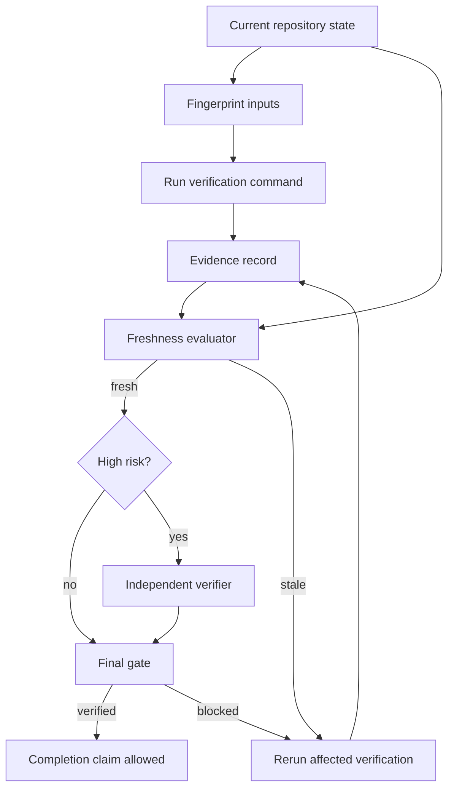

# Agent Test Evidence Freshness Gate

Prevent AI coding agents from claiming a current change is verified using green build/test evidence produced for an older revision, base branch, dependency/configuration state, or environment.

## Problem
AI-assisted workflows often execute tests, then continue editing, rebasing, regenerating code, changing dependencies, or modifying test configuration. The earlier green result may still be present in chat/CI artifacts and is easy to reuse as if it proves the final state. This package makes verification evidence revision-bound and deterministically invalidates stale passes.

## Purpose
Provide a tool-neutral workflow and executable gate that binds verification evidence to exact repository state and required inputs, forces targeted revalidation after material changes, and requires independent review for configured high-risk categories.

## When to use
- Before an agent says a task is complete or verified.
- During test-fix-retest or plan-execute-review loops.
- Before PR merge/release readiness.
- After edits made following a successful test run.
- After rebase/base-branch movement.
- After dependency lockfile, build/test config, generated-input, or relevant environment changes.
- When consuming CI results generated earlier in a long-running agent session.

## When not to use
Do not use this as a replacement for selecting the right tests, designing good tests, validating test oracles, production monitoring, or approval controls. It answers whether evidence is still applicable to the exact current state, not whether the verification command itself is sufficient or correct.

## Architecture


## Package tree
```text
agent-test-evidence-freshness-gate/
├── README.md
├── config/
│   └── freshness-policy.json
├── examples/
│   └── freshness-review.example.json
├── hooks/
│   └── test-evidence-freshness-hooks.md
├── rules/
│   └── test-evidence-freshness-rules.md
├── schemas/
│   ├── evidence-record.schema.json
│   └── freshness-review.schema.json
├── scripts/
│   ├── evaluate-final-gate.py
│   ├── evaluate-freshness.py
│   └── fingerprint-inputs.py
├── skills/
│   ├── capture-verification-evidence.md
│   └── revalidate-verification-evidence.md
├── subagents/
│   ├── evidence-curator.md
│   └── evidence-verifier.md
├── templates/
│   └── evidence-record.example.json
├── tests/
│   └── smoke-test.py
└── workflows/
    └── test-evidence-freshness-workflow.md
```

## Component responsibilities
- `config/freshness-policy.json`: freshness window, revision/input/environment binding, high-risk review policy, retry and dangerous-action boundaries.
- `scripts/fingerprint-inputs.py`: hashes exact revisions plus selected files and key/value inputs into a deterministic fingerprint.
- `scripts/evaluate-freshness.py`: compares stored evidence with current revision/base/input/environment state and returns `fresh` or `stale` with reasons.
- `scripts/evaluate-final-gate.py`: requires all consumed evidence to be fresh and enforces high-risk independent review.
- `schemas/`: machine-readable evidence and review contracts.
- `skills/`: reusable capture and revalidation procedures.
- `subagents/`: separate evidence curation from high-risk independent verification.
- `hooks/`: lifecycle integration points for pre-test, post-test, post-edit/rebase, and pre-completion checks.
- `tests/smoke-test.py`: offline Python stdlib smoke coverage for fresh/stale/review-required branches.

## Dependencies
Python 3.9+ using only the standard library. Git and project-specific build/test tools are expected in the host repository.

## Installation
Copy this directory into the target repository. Run scripts from the package root or adjust paths in your host workflow. No secrets are required.

## Configuration
Edit `config/freshness-policy.json` to match project risk. Important fields:
- `max_evidence_age_seconds`: maximum wall-clock age before evidence is stale even if revision/input bindings still match.
- `require_exact_revision`: require exact source revision equality.
- `require_input_fingerprint`: require current deterministic input hash to match.
- `require_environment_fingerprint_for`: categories that need environment identity.
- `high_risk_categories`: evidence types that require an independent reviewer.
- `invalidate_on_changed_inputs`: documented invalidation classes for agent behavior.
- `max_transient_retries`: default bounded retry count.

Changing policy is itself a reason to re-evaluate existing evidence.

## Permissions
Core scripts only read files and write explicitly requested output JSON. They do not deploy, mutate databases, delete data/files, rewrite Git history, change infrastructure/secrets, or modify production configuration. Agents must stop for explicit human approval before actions listed in policy `approval_required_actions`.

## Usage
### 1. Capture current revisions
```bash
HEAD_REV=$(git rev-parse HEAD)
BASE_REV=$(git rev-parse origin/main)
```

### 2. Fingerprint verification inputs
Choose inputs that materially affect the command, for example lockfiles and test/build configuration:
```bash
python3 scripts/fingerprint-inputs.py \
  --revision "$HEAD_REV" \
  --base-revision "$BASE_REV" \
  --file Directory.Packages.props \
  --file tests/Auth.Tests/Auth.Tests.csproj \
  --value target-framework=net10.0 \
  --output evidence/inputs.json
```

### 3. Run the actual verification
```bash
dotnet test tests/Auth.Tests/Auth.Tests.csproj --no-restore
```
Create an evidence record from `templates/evidence-record.example.json`, replacing all example revision/hash/time/result/artifact fields with real values.

### 4. Check freshness
```bash
python3 scripts/evaluate-freshness.py \
  --evidence evidence/unit-auth-service.json \
  --policy config/freshness-policy.json \
  --current-revision "$HEAD_REV" \
  --current-base-revision "$BASE_REV" \
  --current-input-fingerprint <sha256> \
  --output evidence/unit-auth-service.evaluation.json
```
For integration/E2E/performance evidence, also pass `--current-environment-fingerprint <sha256>` when required by policy.

Exit codes:
- `0`: evidence is fresh.
- `2`: evidence is stale/non-passing.
- `1`: runtime/input parsing error.

### 5. Revalidate after every material change
After any edit, rebase, dependency/configuration change, relevant environment change, or policy change, recompute current state and rerun the evaluator. A previous pass must not be refreshed by merely editing `observed_at`.

### 6. Final gate
Low-risk example:
```bash
python3 scripts/evaluate-final-gate.py \
  --evaluation evidence/unit-auth-service.evaluation.json \
  --policy config/freshness-policy.json
```
For a high-risk category, create a review matching `schemas/freshness-review.schema.json` and bind it to the exact current evaluation fingerprint and revision:
```bash
python3 scripts/evaluate-final-gate.py \
  --evaluation evidence/security.evaluation.json \
  --policy config/freshness-policy.json \
  --review evidence/security.review.json \
  --actors implementing-agent,test-agent
```

## Workflow
See `workflows/test-evidence-freshness-workflow.md`. The core cycle is capture state -> execute -> capture evidence -> evaluate -> invalidate on change -> targeted rerun -> independent high-risk review -> final gate. Retry loops are bounded; deterministic failures are not retried blindly.

## Approval boundaries
This package never treats fresh test evidence as approval for dangerous actions. Explicit human approval is still required before production deployment, destructive SQL/data changes, schema changes, force push/history rewrite, infrastructure/secret/production-config changes, breaking API contracts, irreversible migrations, large dependency upgrades, or weakening security controls.

## Failure and recovery
- **Stale source/base/input:** identify the invalidating change and rerun affected verification.
- **Evidence too old:** rerun; do not refresh timestamps manually.
- **Environment mismatch:** rerun in the intended environment or block.
- **Failed/unknown result:** preserve evidence and remediate/reconcile; never infer pass.
- **Transient tool/CI metadata failure:** retry at most once by default and retain the first failure.
- **High-risk review failure:** return to remediation; reviewer must remain independent.
- **Permission failure:** stop; do not silently escalate privileges.

## Verification
Run the offline smoke test:
```bash
python3 tests/smoke-test.py
```
It exercises a fresh low-risk pass, stale revision, stale input fingerprint, low-risk final verification, and high-risk review requirement. The repository artifact includes this test; a host should execute it after copying/customizing the package.

## Definition of Done
The workflow may report `verified` only when:
1. Required verification commands actually executed.
2. Every consumed record is `passed`.
3. Every record is fresh for the exact current source/base revision.
4. Current relevant inputs match the stored fingerprint.
5. Required environment identity matches.
6. Required high-risk independent review is approved and current.
7. Final gate returns `verified`.
8. Remaining risks are recorded.
9. No dangerous action was performed without explicit approval.

`Task executed` and `Task verified successfully` are distinct states.

## Customization
Add project-specific verification categories or different environment fingerprint generation outside the core scripts. Keep the central invariants: immutable state binding, deterministic invalidation, bounded retries, independent high-risk review, and no metadata-only refresh of stale evidence.