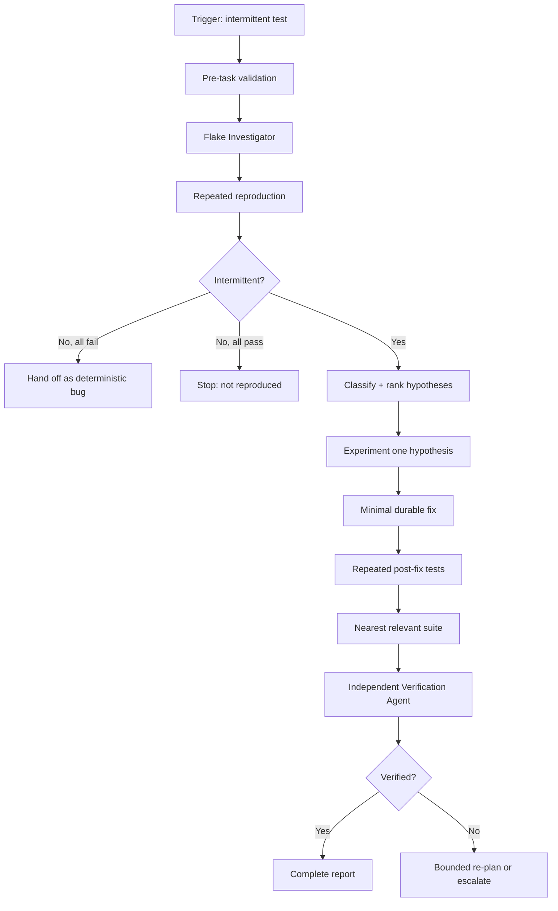

# Agent Test Flake Triage Loop

Reusable AI engineering kit for diagnosing and fixing intermittent automated-test failures without hiding them behind retries, sleeps, skipped tests, or weakened assertions.

## Problem
Flaky tests waste CI time and erode trust because the same test can pass and fail without a meaningful code change. Ad-hoc investigation often introduces masking fixes instead of proving the actual source of nondeterminism.

## Purpose
This package gives coding agents a bounded, evidence-first workflow to reproduce a flake, classify likely causes, test hypotheses one at a time, implement the smallest durable fix, and independently verify that the failure is gone.

## When to use
Use when a unit, integration, API, UI, Playwright, or end-to-end test intermittently fails locally or in CI, especially around timing, concurrency, shared state, ordering, external dependencies, random data, or environment differences.

## When not to use
Do not use this as the primary workflow for a consistently failing deterministic test, a production incident, or a test that cannot be run safely outside production. Deterministic failures should be handled by a normal bug-fix workflow.

## Architecture



## Package tree

```text
agent-test-flake-triage-loop/
├── README.md
├── config/
│   └── flake-triage.yaml
├── hooks/
│   ├── post-change.md
│   └── pre-task.md
├── rules/
│   └── test-flake-safety.md
├── schemas/
│   └── investigation-handoff.schema.json
├── scripts/
│   ├── inspect-test-history.py
│   └── run-flake-loop.sh
├── skills/
│   ├── minimize-and-fix.md
│   └── reproduce-and-classify.md
├── subagents/
│   ├── flake-investigator.md
│   └── verification-agent.md
├── templates/
│   └── triage-report.md
├── tests/
│   └── verify-package.sh
└── workflows/
    └── test-flake-triage.md
```

## Component responsibilities
- `config/flake-triage.yaml`: retry budgets, classifications, approval boundaries, and evidence paths.
- `rules/test-flake-safety.md`: enforceable safety rules preventing test masking and unsafe operations.
- `skills/reproduce-and-classify.md`: evidence-first reproduction and classification procedure.
- `skills/minimize-and-fix.md`: bounded hypothesis testing and minimal durable fix procedure.
- `subagents/flake-investigator.md`: investigation owner; gathers evidence without making initial edits.
- `subagents/verification-agent.md`: independent verifier that cannot edit implementation code.
- `workflows/test-flake-triage.md`: complete orchestration, checkpoints, retries, failure paths, and Definition of Done.
- `hooks/pre-task.md`: validates repository state and command safety before execution.
- `hooks/post-change.md`: runs diff inspection, repeated target tests, nearby suite, and verifier handoff.
- `scripts/run-flake-loop.sh`: deterministic repeated execution with per-run logs and pass/fail summary.
- `scripts/inspect-test-history.py`: converts repetition evidence into a compact JSON summary.
- `schemas/investigation-handoff.schema.json`: structured contract between investigation and implementation.
- `templates/triage-report.md`: final evidence-based report format.
- `tests/verify-package.sh`: validates package files, JSON/Python/Bash syntax, references, and omission markers.

## Installation
Copy this directory into the repository where an AI coding agent can read project instructions. No agent vendor is required; the workflow is tool-neutral.

Required local tools for deterministic scripts:
- Bash
- Python 3
- Git for repository-state and diff checks
- The project's own test/build tooling

Make scripts executable after copying if your environment requires it:

```bash
chmod +x scripts/run-flake-loop.sh tests/verify-package.sh
```

## Configuration
Edit `config/flake-triage.yaml` only when project-specific policy requires different bounded attempt counts or additional approval-sensitive actions. Defaults are:
- 5 reproduction attempts
- 10 post-fix verification attempts
- 2 retries for transient tool failures
- 3 hypotheses per triage cycle
- 2 re-plan cycles after rejected verification

Evidence is stored under `.ai/flake-triage/evidence`; the final report is `.ai/flake-triage/report.md`.

## Permissions
Use least privilege. The workflow requires only repository read/write access and permission to run non-destructive local build/test commands. It does not require production credentials.

Explicit human approval is required before:
- production configuration changes
- major dependency upgrades
- destructive data changes
- test quarantine

The global rules additionally prohibit destructive Git/database/infrastructure actions and secret exposure.

## Usage
Start with the workflow and provide a concrete test command plus any failure evidence.

Example invocation to an AI coding agent:

```text
Use agent-test-flake-triage-loop/workflows/test-flake-triage.md.
Target test: CheckoutServiceTests.Should_not_duplicate_charge
Command: dotnet test tests/Checkout.Tests --filter FullyQualifiedName~Should_not_duplicate_charge
Failure evidence: CI run intermittently fails with a duplicate-key exception.
Investigate, preserve evidence, test hypotheses one at a time, implement only an evidence-backed minimal fix, and stop at approval boundaries.
```

For manual repeated reproduction:

```bash
./scripts/run-flake-loop.sh \
  --attempts 5 \
  --output-dir .ai/flake-triage/evidence/reproduction \
  -- dotnet test tests/Checkout.Tests --filter FullyQualifiedName~Should_not_duplicate_charge
```

Summarize the runs:

```bash
python3 scripts/inspect-test-history.py \
  .ai/flake-triage/evidence/reproduction/summary.tsv \
  --json-out .ai/flake-triage/evidence/reproduction/summary.json
```

## Workflow behavior
1. Record the initial repository state and exact test command.
2. Reproduce repeatedly before editing.
3. Classify the failure and rank at most three evidence-backed hypotheses.
4. Test one falsifiable hypothesis at a time.
5. Implement the smallest durable fix only after evidence supports a cause.
6. Run the target repeatedly after the change.
7. Run the nearest relevant suite once.
8. Have the independent verifier inspect evidence and diff.
9. Complete the triage report or stop with a precise blocked/escalation status.

## Failure handling
- Transient tool failures: retry at most twice and preserve each error.
- All reproduction runs fail: classify as likely deterministic and hand off.
- All reproduction runs pass: stop as `not-reproduced`; do not speculate.
- Three unsupported hypotheses: stop as `needs-investigation`.
- Rejected verification: re-plan at most twice using new evidence.
- Permission/environment failure: stop as `blocked`.
- Approval-sensitive action: stop as `needs-approval` before executing it.

There is no unbounded retry-until-green loop.

## Verification
A task is not considered verified merely because code changed or one test run passed. Completion requires:
- original intermittent failure evidence preserved
- root cause connected to evidence
- no test disabling, assertion weakening, arbitrary sleep, or retry-only masking fix
- 10 configured post-fix target runs with zero failures
- nearest relevant suite passing
- final diff reviewed and scoped
- independent verifier status `verified`
- remaining risks documented

Validate the kit itself with:

```bash
./tests/verify-package.sh
```

## Definition of Done
- Required repository/test context was gathered.
- Original failure evidence exists.
- Facts, hypotheses, and decisions are separated.
- Root cause is evidence-backed.
- Minimal durable change exists when a fix is possible.
- Repeated post-fix validation passes.
- Relevant suite passes.
- Independent verification succeeds.
- Required approval has been obtained for any approval-sensitive action, or the workflow stops before it.
- Final report records evidence, verification, and remaining risks.
- No blocking failure remains.

## Customization
Adjust retry budgets and approval categories in `config/flake-triage.yaml`. Keep the safety principle intact: extra retries may gather evidence, but retries must never become the only mechanism that makes a flaky test appear fixed. Project-specific agents can map these files into Codex, Claude Code, Cursor, ChatGPT, GitHub Copilot, OpenCode, or another coding-agent environment while preserving the same workflow contracts and stop conditions.
