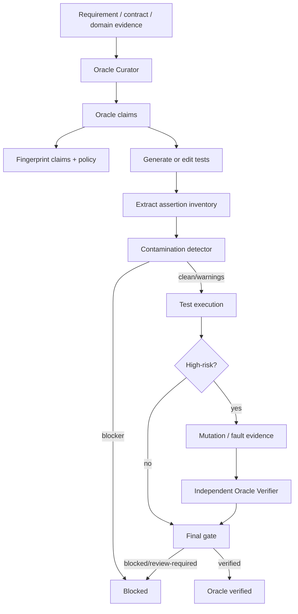

# Agent Test Oracle Contamination Guard

A reusable guardrail package for AI-assisted test generation that prevents tests from merely copying the current implementation and then using those mirrored assertions as proof that the implementation is correct.

## Problem
AI coding agents can create tests that pass but have a contaminated oracle. Common failure modes include:

- Copying a constant directly from the implementation into the expected value.
- Calling the same private helper in both production code and test expectation.
- Recording current output as a golden snapshot without independent validation.
- Recreating the same formula or branch logic inside the test.
- Generating tests after reading the implementation but without binding assertions to requirements or domain rules.
- Using the same agent as implementer and sole high-risk verifier.

The result is a test suite that verifies consistency with the current code, not correctness against an independent behavior contract.

## Purpose
This package introduces an evidence-first workflow:

1. Derive oracle claims from independent sources.
2. Bind claims and policy with deterministic fingerprints.
3. Generate or edit tests from those claims.
4. Inventory assertions.
5. Detect implementation-mirroring contamination.
6. Require mutation/fault evidence for high-risk behavior.
7. Require independent review when configured.
8. Fail closed unless the final oracle gate is verified.

## When to use
Use for AI-generated or AI-modified tests involving:

- Bug fixes and regression tests.
- Feature acceptance criteria.
- Refactors where behavior must stay stable.
- Authorization/security behavior.
- Money, pricing, limits, quotas, or billing rules.
- Public API contracts.
- Data migrations or irreversible behavior.
- Production incident fixes.
- Any test where a false-positive assertion would create meaningful risk.

## When not to use
Do not use this package as a replacement for:

- Test framework execution.
- Coverage analysis.
- Full mutation frameworks.
- Requirement management.
- Human product/domain decisions when requirements are ambiguous.

It complements those systems by governing oracle provenance and verification strength.

## Architecture



## Package tree

```text
agent-test-oracle-contamination-guard/
├── README.md
├── config/
│   └── oracle-policy.json
├── schemas/
│   ├── oracle-claim.schema.json
│   ├── oracle-report.schema.json
│   └── oracle-review.schema.json
├── scripts/
│   ├── detect-oracle-contamination.py
│   ├── evaluate-oracle-gate.py
│   ├── extract-test-assertions.py
│   └── fingerprint-oracle.py
├── skills/
│   ├── derive-independent-oracle.md
│   └── review-test-oracle.md
├── rules/
│   └── test-oracle-governance.md
├── subagents/
│   ├── oracle-curator.md
│   └── oracle-verifier.md
├── workflows/
│   └── test-oracle-workflow.md
├── hooks/
│   └── test-oracle-hooks.md
├── templates/
│   └── oracle-claim.example.json
├── examples/
│   └── oracle-review.example.json
└── tests/
    └── smoke-test.py
```

## Dependencies
Core deterministic scripts require only Python 3.9+ standard library.

The host repository may use any testing stack. Mutation evidence is intentionally tool-neutral. For high-risk claims, provide a JSON file shaped as:

```json
{"mutants": 5, "killed": 4}
```

The policy decides the minimum mutant count and kill ratio.

## Installation
Copy this directory into the target repository, for example under `.ai/agent-test-oracle-contamination-guard/` or `ai/guards/agent-test-oracle-contamination-guard/`.

No secrets are required.

## Configuration
Edit `config/oracle-policy.json` only through normal repository review. Important settings:

- `independent_sources`: source types that may qualify as external truth.
- `implementation_sources`: source types that are explicitly non-independent.
- `risk.high_risk_tags`: behavior tags that deserve stronger governance.
- `mutation.required_for_risk`: risk levels that require mutation/fault evidence.
- `mutation.minimum_kill_ratio`: minimum accepted killed/total mutant ratio.
- `retry.transient_tool_retry_max`: bounded retry count; default is 1.
- `approval_required_actions`: operations that must stop for human approval.

Changing policy changes the policy fingerprint and therefore invalidates stale reviews.

## Permissions
The package itself only needs repository read/write access for generated artifacts and permission to execute local tests/scripts.

Use least privilege. Do not grant production, database, secret, deployment, infrastructure, or Git-history rewrite permissions merely to make this gate pass.

## Usage

### 1. Create oracle claims
Follow `skills/derive-independent-oracle.md` and create a JSON array following `schemas/oracle-claim.schema.json`.

Example source: `templates/oracle-claim.example.json`.

### 2. Fingerprint claims and policy

```bash
python scripts/fingerprint-oracle.py \
  --claims artifacts/oracle-claims.json \
  --policy config/oracle-policy.json \
  --output artifacts/oracle-fingerprint.json
```

### 3. Generate/edit tests and inventory assertions

```bash
python scripts/extract-test-assertions.py \
  --repo . \
  --output artifacts/assertions.json
```

The scanner recognizes common assertion-style lines across Python, C#, TypeScript/JavaScript, Java, and Kotlin. It is deliberately conservative; it produces evidence for the gate rather than claiming to be a full parser.

### 4. Detect contamination

```bash
python scripts/detect-oracle-contamination.py \
  --claims artifacts/oracle-claims.json \
  --assertions artifacts/assertions.json \
  --policy config/oracle-policy.json \
  --output artifacts/contamination.json
```

Exit code `1` means deterministic blockers were found.

### 5. Run normal tests
Run the host repository's normal unit/integration/E2E test commands. Record their result separately. A green test run is `executed`, not yet `oracle-verified`.

### 6. Produce mutation evidence when required
Use the repository's mutation framework or deliberate fault injection. Save:

```json
{"mutants": 10, "killed": 8}
```

Mutation tooling is intentionally not bundled because language/framework choice belongs to the host repository.

### 7. Independent review when required
Follow `skills/review-test-oracle.md` and create a document following `schemas/oracle-review.schema.json`.

The reviewer must bind the exact current `oracle_fingerprint`. For high-risk work the reviewer must differ from the implementation owner.

### 8. Final gate

```bash
python scripts/evaluate-oracle-gate.py \
  --claims artifacts/oracle-claims.json \
  --contamination artifacts/contamination.json \
  --policy config/oracle-policy.json \
  --mutation artifacts/mutation.json \
  --review artifacts/oracle-review.json \
  --implementation-owner implementation-agent \
  --output artifacts/oracle-gate.json
```

Exit code `0` means `status=verified`. Any other gate status must not be reported as successfully verified.

## Example invocation for a low-risk test
Low-risk claims with no contamination warnings may omit mutation and review:

```bash
python scripts/evaluate-oracle-gate.py \
  --claims artifacts/oracle-claims.json \
  --contamination artifacts/contamination.json \
  --policy config/oracle-policy.json \
  --output artifacts/oracle-gate.json
```

## Status semantics

- `verified`: oracle provenance and configured verification requirements passed.
- `review-required`: deterministic blockers are absent but required human/independent review is not yet supplied.
- `blocked`: contamination, stale evidence, mutation failure, self-review, rejected review, or another hard condition prevents verification.

These statuses do not replace the host test result. Keep `task executed` and `task verified successfully` separate.

## Approval boundaries
Explicit human approval is required before any policy-listed dangerous action, including production deployment, breaking public contract, database schema or destructive data change, security weakening, and force push.

This package never grants those permissions and never silently widens scope.

## Failure and recovery

### Missing independent source
Stop with unresolved oracle provenance. Do not use current implementation behavior as the fallback truth source.

### Contamination blocker
Preserve the report. Correct the claim/test from independent evidence. Validation failures have zero automatic retries.

### Transient tool failure
Retry at most once. Preserve the first failure evidence. Repeated failure stops the workflow.

### Mutation threshold failure
Preserve surviving-mutant evidence. Improve oracle/test coverage or clarify behavior. Do not lower policy automatically.

### Stale fingerprint
Regenerate contamination/review from the current claim+policy set.

### Ambiguous requirement
Escalate to a human/product/domain decision. Do not let the implementation choose the requirement by default.

## Verification
The deterministic final gate checks:

- Current oracle fingerprint matches contamination evidence.
- Current policy fingerprint matches contamination evidence.
- No deterministic contamination blockers remain.
- Required mutation evidence exists.
- Minimum mutant count and kill ratio are satisfied.
- Required independent review exists.
- Review is bound to the current oracle fingerprint.
- Reviewer is distinct from implementation owner when required.
- Review verdict is approved.

## Smoke test
Run from the package root:

```bash
python tests/smoke-test.py
```

The smoke test covers:

1. Low-risk independent oracle → verified.
2. Current-implementation-derived oracle → contamination blocked.
3. High-risk oracle without mutation evidence → blocked.
4. High-risk self-review → blocked.
5. High-risk independent review with adequate mutation evidence → verified.

The smoke test uses only Python standard library and temporary files.

## Definition of Done
A task using this package is oracle-verified only when:

- Required behavior claims exist.
- Each claim has identifiable evidence and provenance.
- High-risk behaviors have independent evidence.
- Test assertions were inventoried after edits.
- Contamination detector has no blockers.
- Normal host tests were executed separately.
- Required mutation/fault evidence satisfies policy.
- Required independent review is approved and current.
- Final gate exits 0 with `status=verified`.
- Remaining non-blocking risks are documented.
- No dangerous action bypassed required human approval.

## Customization
You can safely customize:

- Accepted independent source types.
- High-risk tags.
- Mutation thresholds.
- Review requirements.
- Host test and mutation commands in your repository-level workflow.

Do not customize away the central invariant: **the source of expected behavior must be independently traceable from the implementation whose correctness the test is supposed to prove.**
