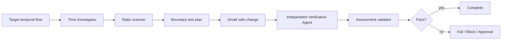

# Agent Timezone Date Boundary Regression Gate

A reusable engineering gate for detecting and verifying regressions caused by timezone conversion, local-clock assumptions, date truncation, DST transitions, and ambiguous date-range boundaries.

## Problem
Date/time bugs often pass normal tests but fail near midnight, month/year transitions, daylight-saving changes, or when code runs in a different server timezone. Common causes include `DateTime.Now`, unspecified timestamps, manual offset arithmetic, truncating to a date before timezone conversion, and inconsistent inclusive/exclusive range rules.

## When to use
Use for scheduling, expiry, reporting periods, billing windows, daily jobs, calendar behavior, API date filters, audit timestamps, or any code that converts/stores/compares temporal values.

## When not to use
Do not use to justify rewriting production timestamps, changing production timezone configuration, or altering API/storage contracts without explicit approval.

## Architecture


## Package tree
```text
agent-timezone-date-boundary-regression-gate/
├── README.md
├── config/time-policy.json
├── schemas/assessment.schema.json
├── scripts/scan-time-risks.py
├── scripts/validate-assessment.py
├── skills/time-boundary-assessment.md
├── rules/time-safety.md
├── subagents/time-investigator.md
├── subagents/verification-agent.md
├── workflows/time-boundary-gate.md
├── hooks/lifecycle-hooks.md
├── examples/assessment.json
└── tests/self-test.py
```

## Components
`skills/time-boundary-assessment.md` defines the reusable investigation procedure. `rules/time-safety.md` contains enforceable behavior. `subagents/time-investigator.md` owns semantic discovery and evidence collection while `subagents/verification-agent.md` independently verifies the result. `workflows/time-boundary-gate.md` defines the bounded end-to-end flow. `scripts/scan-time-risks.py` detects suspicious temporal patterns; scanner findings are hypotheses, not confirmed defects. `scripts/validate-assessment.py` enforces the final output contract. `tests/self-test.py` validates both scripts. `config/time-policy.json` centralizes required zones, boundary cases, retry budget, and approval boundaries.

## Dependencies
Python 3.9+ for the bundled scripts. No third-party Python packages are required. Repository-specific test/build tools remain unchanged.

## Installation
Copy this directory into a repository or agent instruction directory while preserving relative paths. Tighten `config/time-policy.json` when repository or organization policy is stricter.

## Permissions
Default operation is read-only repository inspection plus local, non-destructive testing/build execution. Database schema changes, production configuration/deployment, stored-data rewrites, and breaking API changes require explicit human approval.

## Usage
Run the static scanner:

```bash
python3 scripts/scan-time-risks.py /path/to/repository --output scan.json
```

Exit `0` means no heuristic findings, `1` means findings need review, and `2` means invalid invocation/input.

Follow the procedure in `skills/time-boundary-assessment.md` and the workflow in `workflows/time-boundary-gate.md`. Validate the final assessment:

```bash
python3 scripts/validate-assessment.py assessment.json
```

Run package self-test:

```bash
python3 tests/self-test.py
```

## Temporal model
Before editing code, classify every relevant value as an instant, local date, local datetime, duration, or recurring civil time. Establish the authoritative business timezone and canonical storage representation. Do not treat machine-local time as business semantics.

For instant ranges, prefer explicit interval rules such as half-open `[start, end)` when compatible with the contract. For local-date concepts, avoid manufacturing UTC-midnight values before applying the intended timezone.

## Verification
Execution alone is not proof of correctness. A `pass` assessment requires all three verification flags to be true: multi-zone testing, boundary-case testing, and round-trip verification.

At minimum, exercise UTC, `Asia/Ho_Chi_Minh`, and a DST-observing zone such as `America/New_York` unless the repository has stricter or more relevant zones. Include day, month, and year boundaries and relevant DST transitions. Record exact inputs, zone IDs, expected values, and observed values.

Round-trip checks should verify that storage and API serialization preserve the intended semantic value: the same instant for instant-based fields, or the same local date/local datetime contract when that is the actual domain concept.

## Retry and recovery
Transient tool/test/environment failures may be retried at most twice. Preserve timestamp, timezone, command, output, and attempt number. Deterministic failures require diagnosis or a code/config change before rerun. Unknown business timezone or ambiguous contract becomes `blocked`; dangerous remediation becomes `needs-approval`; reproducible regressions remain `fail`.

## Approval boundaries
Stop before database schema changes, production timezone/configuration changes, production deployment, rewriting stored timestamps, breaking API contracts, or other irreversible operations. Never silently expand permissions.

## Definition of Done
Temporal values are semantically classified; authoritative timezone and storage semantics are known; scanner findings are reviewed; required zones and boundaries are tested; round trips are verified; focused tests/build pass; diff review finds no unrelated changes; independent verification completes; assessment validates; required approvals exist; remaining risks are documented; and no blocking failure remains for `pass`.

## Customization
Replace or add required test zones in `config/time-policy.json` to match the product's real user/business regions. Add scanner patterns only when they provide deterministic value. Keep heuristic results advisory and use repository code, tests, logs, and contracts as evidence.
