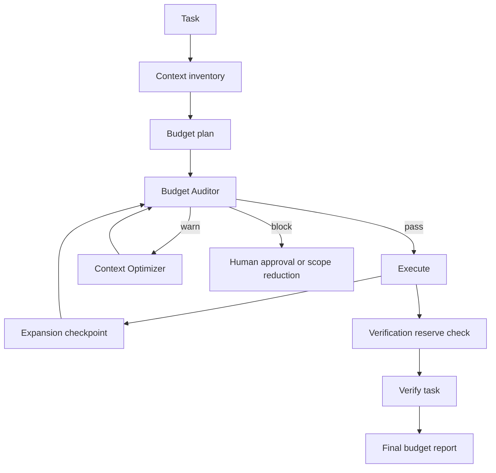

# Agent Token Budget Enforcement Gate

Reusable guardrail for AI engineering workflows that prevents a task from silently consuming excessive tokens, losing critical context during emergency compaction, or exhausting verification budget before correctness is proven.

## Problem
Long-running coding agents commonly expand repository context, duplicate evidence across handoffs, and spend verification tokens during implementation. Cost rises, latency grows, and the agent may later discard important safety or acceptance evidence simply to fit the context window.

## Purpose
This kit introduces explicit stage budgets, deterministic enforcement, bounded context compaction, independent auditing, approval boundaries, and reproducible budget reports.

## When to use
Use for large-repository changes, multi-agent tasks, incident investigation, long test-fix loops, research-heavy implementation, or any workflow with a meaningful model/token ceiling.

## When not to use
Do not use token limits as a reason to weaken security checks, remove acceptance criteria, skip required tests, or compress a tiny task that already fits comfortably in context.

## Architecture


## Package tree
```text
agent-token-budget-enforcement-gate/
├── README.md
├── config/policy.yaml
├── schemas/budget-report.schema.json
├── scripts/token_budget_gate.py
├── scripts/verify_package.py
├── skills/token-budget-audit.md
├── skills/context-compaction.md
├── rules/token-budget-safety.md
├── subagents/budget-auditor.md
├── subagents/context-optimizer.md
├── workflows/token-budget-enforcement.md
├── hooks/lifecycle.md
├── examples/usage.json
└── tests/test_token_budget_gate.py
```

## Components
`token-budget-audit` defines how to measure and gate usage. `context-compaction` defines evidence-preserving reduction. The Budget Auditor independently evaluates usage while the Context Optimizer is limited to two compaction passes. `token_budget_gate.py` provides deterministic policy enforcement and meaningful exit codes.

## Installation
Copy the directory into a repository. Python 3.9+ is sufficient; the gate intentionally avoids third-party dependencies. Adjust `config/policy.yaml` to match the model, organization budget, and task size.

## Configuration
The default policy limits task input to 24k, planning to 6k, execution context to 32k, verification to 8k, and total task usage to 70k. Warning begins at 75% of total budget. Change values deliberately rather than letting an agent raise them automatically.

## Permissions
The core gate needs read access to policy/usage files and write access only to its report path. It does not require network, Git, production, database, or secret permissions.

## Usage
Create a usage JSON matching `examples/usage.json`, then run:

```bash
python scripts/token_budget_gate.py --policy config/policy.yaml --usage examples/usage.json --out budget-report.json
```

Exit codes: `0` means pass/warn and a report was produced; `2` means invalid input; `3` means the task is blocked by stage or total budget.

Verify the copied package itself with:

```bash
python scripts/verify_package.py
python -m unittest tests/test_token_budget_gate.py
```

## Workflow
Follow `workflows/token-budget-enforcement.md`: inventory required context, allocate budget, run the pre-execution audit, compact only when justified, re-audit after meaningful expansion, preserve verifier budget, and finish with evidence-based task verification.

## Approval boundaries
Explicit human approval is required to raise a blocked budget, reduce acceptance scope, discard safety-critical evidence, or change production/security behavior to save tokens. An override must record reason, temporary ceiling, and scope. Agents must never silently increase budget or permissions.

## Failure handling
Invalid usage or policy errors stop execution. A transient gate-tool failure may be retried once with identical inputs. Context compaction is capped at two passes. If the task remains blocked, reduce scope or obtain human approval rather than looping.

## Verification
A run is verified only when usage input is valid, the policy is loaded, the budget report is reproducible, required task tests/checks still run, and no required evidence disappeared during compaction. Token compliance alone is not proof that the engineering task succeeded.

## Definition of Done
- Required task context was inventoried.
- Stage and total usage were recorded.
- Final gate result is `pass`, or a scoped human override exists.
- No automatic compaction exceeded two passes.
- Acceptance, security, approval, and verification evidence remain traceable.
- Underlying engineering verification completed successfully.
- `scripts/verify_package.py` confirms every referenced kit file exists.

## Customization
Tune budgets per model or repository size, but keep the four-stage accounting model and approval boundary. Tool-specific token counters may feed the usage JSON; keep the core gate and handoff contracts tool-neutral so the package remains usable with Codex, Claude Code, Cursor, ChatGPT, Copilot, OpenCode, or other agents.
