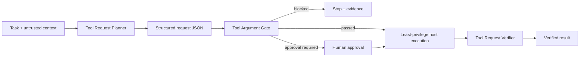

# Agent Tool Argument Sanitization Gate

Reusable safety gate for AI agents that convert untrusted task text into tool arguments. The kit intercepts proposed tool calls before execution, validates structured arguments, blocks shell metacharacter chaining, path traversal, suspicious secrets, destructive commands, and routes high-risk commands to explicit human approval.

## Problem
AI agents frequently assemble tool arguments from repository files, logs, issue text, webpages, user content, generated plans, and other untrusted sources. Even when the tool itself is legitimate, unsafe argument construction can turn a benign task into command injection, destructive file operations, credential leakage, unintended remote changes, or permission escalation. Prompt instructions alone do not create an execution boundary.

## Purpose
Provide a deterministic pre-execution gate plus an evidence-based workflow that separates planning, approval, execution, and verification. The gate never executes the requested tool.

## When to use
Use for coding agents, incident agents, CI diagnosis agents, repository maintenance agents, infrastructure assistants, database assistants, or any workflow where an LLM can produce shell commands, file paths, Git commands, deployment commands, database CLI arguments, HTTP tool parameters, or other high-impact tool inputs.

## When not to use
This is not a sandbox, shell parser, endpoint authorization system, malware detector, or substitute for OS/container/database/cloud least privilege. Static validation must be combined with host-level permissions and structured tool APIs.

## Architecture



## Package tree

```text
agent-tool-argument-sanitization-gate/
├── README.md
├── config/
│   └── policy.yaml
├── examples/
│   ├── blocked-request.json
│   └── safe-request.json
├── hooks/
│   └── lifecycle.md
├── rules/
│   └── tool-argument-safety.md
├── schemas/
│   ├── gate-result.schema.json
│   └── tool-request.schema.json
├── scripts/
│   ├── tool_argument_gate.py
│   └── verify_package.py
├── skills/
│   ├── high-risk-command-review.md
│   └── tool-request-validation.md
├── subagents/
│   ├── tool-request-planner.md
│   └── tool-request-verifier.md
├── templates/
│   └── tool-request.json
├── tests/
│   └── test_tool_argument_gate.py
└── workflows/
    └── gated-tool-execution.md
```

## Component responsibilities
`skills/tool-request-validation.md` defines the normal pre-execution procedure. `skills/high-risk-command-review.md` defines the human approval packet for commands that are risky but not automatically forbidden. `rules/tool-argument-safety.md` provides enforceable boundaries. The planner creates the minimum structured request; the verifier independently reproduces the gate and checks postconditions. `scripts/tool_argument_gate.py` performs deterministic static checks and never executes the tool.

## Installation
Requires Python 3.9+ and PyYAML.

```bash
python -m pip install pyyaml
```

Copy this package into the target repository or shared agent tooling repository.

## Configuration
Edit `config/policy.yaml`. The default policy defines shell-like tools, forbidden shell metacharacters, forbidden command prefixes, approval-required command prefixes, path traversal controls, argument size limits, and secret-like patterns.

The defaults are intentionally conservative. Add project-specific commands and tool names rather than weakening checks globally. Keep actual credentials out of the policy and request artifacts.

## Input contract
Create a request matching `schemas/tool-request.schema.json`:

```json
{
  "tool": "shell",
  "arguments": {
    "command": "git status --short"
  },
  "intent": "Inspect repository state",
  "environment": "development"
}
```

## Usage
Run the gate before handing the request to the real tool adapter:

```bash
python scripts/tool_argument_gate.py \
  --request examples/safe-request.json \
  --policy config/policy.yaml \
  --repo-root . \
  --output gate-result.json
```

Exit codes are `0` for `passed`, `2` for `blocked`, `4` for `approval_required`, and `3` for gate/configuration errors. The output always contains `executed: false` because the script never executes tools.

Run the blocked example:

```bash
python scripts/tool_argument_gate.py --request examples/blocked-request.json --policy config/policy.yaml --repo-root .
```

The example is rejected for destructive command usage and parent traversal.

## Workflow
Follow `workflows/gated-tool-execution.md`:

1. Gather only necessary context.
2. Plan the minimum structured request.
3. Validate its schema.
4. Run the static gate.
5. Stop on `blocked`.
6. Require explicit human approval on `approval_required`.
7. Execute only through the host's least-privilege tool layer.
8. Independently verify postconditions.

Never feed a `blocked` request to the real tool. Never interpret `approval_required` as approval.

## Hooks
`hooks/lifecycle.md` defines four blocking lifecycle hooks: pre-tool gating, post-edit invalidation and re-gating, pre-approval execution validation, post-execution verification, plus package installation verification.

The most important integration point is the pre-tool hook. It must sit between agent generation and actual tool execution.

## Permissions
The planner needs repository read/search access and permission to write request artifacts. It does not need production mutation permissions. The verifier should use read-only inspection capabilities where possible. Dangerous execution remains controlled by the host tool layer and human approval process.

Never automatically broaden filesystem, Git, cloud, Kubernetes, database, shell, or network permissions to make a request succeed.

## Approval boundaries
Explicit human approval is required before production deployment/configuration, destructive SQL, database schema changes, data/file deletion, force push or history rewrite, infrastructure mutation, secret changes, security-control weakening, irreversible migration, large dependency upgrade, or any command classified by `approval_required_commands`.

Approval must reference the exact request artifact and target. Any material argument/tool/target change invalidates prior approval and requires a new gate result.

## Failure and recovery
Gate/configuration failure blocks execution and may be retried once with unchanged inputs if the failure is transient. Tool execution may be retried once only when the operation is proven idempotent. If a non-idempotent action returns an ambiguous result, inspect state using read-only tools instead of blindly retrying. Permission failures stop and escalate; policy or permissions must never be silently weakened.

Verification mismatch blocks completion. Automatic rollback is not assumed because rollback itself may be destructive; use the approved compensation procedure when applicable.

## Verification
Run package tests:

```bash
python -m unittest tests/test_tool_argument_gate.py
python scripts/verify_package.py
```

For a real task, package tests are necessary but not sufficient. `subagents/tool-request-verifier.md` must confirm that the actual request matched the gated artifact, required approval matched the target, execution output is understood, and read-only postcondition checks confirm the intended effect.

## Gate limitations
The scanner is intentionally simple and deterministic. It does not fully parse every shell dialect or understand every tool's semantics. Use dedicated structured tools wherever possible. For generic shell access, combine this package with process isolation, restricted service accounts, filesystem/network boundaries, and command allowlists.

A static pass means only that configured checks did not block the arguments. It does not prove the operation is semantically correct or safe in every environment.

## Definition of Done
A tool task is complete only when the target and repository root were explicit; the exact structured request was gated; no blocked request executed; required approval matched the exact request; permissions remained least-privileged; execution outcome is known; independent verification passed; and unresolved risks are documented.

“Request generated”, “gate passed”, and “tool returned success” are not equivalent to verified completion.

## Customization
Add tool-specific policies for your environment. Typical extensions include explicit command allowlists, URL/domain allowlists for HTTP tools, Kubernetes namespace restrictions, Git branch protections, database read-only enforcement, file extension/path allowlists, and AST-aware shell parsing. Keep these additions in configuration or dedicated deterministic adapters rather than embedding vendor-specific assumptions into the core workflow.

The package is tool-neutral and can be adapted to OpenAI Codex, Claude Code, Cursor, ChatGPT, GitHub Copilot, OpenCode, MCP-based agents, or custom orchestration systems as long as the host can intercept proposed tool calls before execution.
