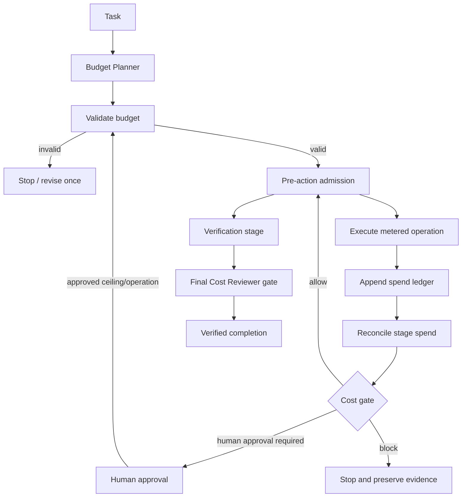

# Agent Tool Cost Budget Governor

A reusable, tool-neutral governance kit for keeping AI-agent workflows inside explicit task, stage, retry, and verification budgets without sacrificing required correctness checks.

## Problem
Agent workflows can silently become expensive through repeated model calls, large-context retrieval, paid tools, multi-agent delegation, failed retries, or escalation to more capable models. Cost controls are often informal, which makes it easy to exceed expected spend or consume the budget needed for final verification.

This kit treats cost as an enforceable execution constraint. It requires a validated budget before metered work, records actual spend including failed billable attempts, protects verification reserve, and gates continuation when soft or hard thresholds are reached.

## Purpose
Use this package to make AI-assisted work economically bounded and auditable while keeping correctness verification mandatory.

It provides:
- pre-task budget planning;
- stage and task ceilings;
- retry accounting;
- protected verification reserve;
- actual-spend ledger reconciliation;
- explicit `allow`, `human-approval-required`, and `block` decisions;
- independent cost review;
- deterministic scripts and smoke tests.

## When to use
Use when a workflow may invoke paid models, API/tool calls, multi-agent delegation, browser/research operations, large-context analysis, repeated retries, or other metered resources.

## When not to use
Do not use this as a replacement for vendor billing controls, financial accounting, security permissions, or task correctness testing. It governs workflow admission and evidence; it does not discover live vendor prices automatically.

## Architecture



## Component responsibilities
- `skills/budget-planning.md`: creates a bounded budget before execution.
- `skills/spend-reconciliation.md`: reconciles actual spend and evaluates continuation.
- `rules/cost-governance.md`: enforceable MUST/MUST NOT/SHOULD constraints.
- `subagents/budget-planner.md`: owns planning but cannot approve overruns.
- `subagents/cost-reviewer.md`: independently reviews spend evidence.
- `workflows/cost-governed-agent-execution.md`: end-to-end lifecycle.
- `hooks/hooks.md`: pre-task, pre-retry, post-stage, pre-verification, and final hooks.
- `config/cost-policy.json`: default ceilings/retry/approval policy.
- `schemas/budget-plan.schema.json`: budget-plan contract.
- `schemas/spend-ledger.schema.json`: actual-spend ledger contract.
- `scripts/validate_budget.py`: deterministic semantic validation.
- `scripts/reconcile_spend.py`: computes task/stage actuals, reserve, retry, and unexplained-spend evidence.
- `scripts/evaluate_spend_gate.py`: returns `allow`, `human-approval-required`, or `block`.
- `templates/budget-plan.json`: copy-ready budget plan.
- `examples/spend-ledger.json`: example actual-spend ledger.
- `tests/smoke_test.py`: verifies pass, approval-required, and blocked paths.

## Package tree

```text
agent-tool-cost-budget-governor/
├── README.md
├── skills/
│   ├── budget-planning.md
│   └── spend-reconciliation.md
├── rules/
│   └── cost-governance.md
├── subagents/
│   ├── budget-planner.md
│   └── cost-reviewer.md
├── workflows/
│   └── cost-governed-agent-execution.md
├── hooks/
│   └── hooks.md
├── scripts/
│   ├── validate_budget.py
│   ├── reconcile_spend.py
│   └── evaluate_spend_gate.py
├── config/
│   └── cost-policy.json
├── schemas/
│   ├── budget-plan.schema.json
│   └── spend-ledger.schema.json
├── templates/
│   └── budget-plan.json
├── examples/
│   └── spend-ledger.json
└── tests/
    └── smoke_test.py
```

## Installation
Requires Python 3.9+ and only the Python standard library for executable checks.

Copy this directory into the target repository. No model-vendor SDK is required by the core package.

## Configuration
Edit `config/cost-policy.json`:
- `currency`: accounting currency used by the plan and ledger.
- `soft_limit_ratio`: threshold that requires review/approval before further spend.
- `minimum_verification_reserve_ratio`: minimum portion of task ceiling protected for verification.
- `max_retries_per_operation`: global retry cap.
- `allow_unknown_cost_operations`: safe default is `false`.
- `approval_required_cost_classes`: operation classes requiring approval.
- `high_cost_operation_threshold`: configured per-operation threshold.

Repository-specific vendor pricing should be maintained outside the core package and supplied to the Budget Planner. Do not invent or hard-code secret credentials.

## Permissions
Core scripts require only read access to plan/policy/ledger files and write access to the chosen reconciliation output. They do not invoke external models or tools and perform no destructive actions.

Any real production deployment, schema change, secret/config change, force push, destructive SQL, or other dangerous action still requires the repository's explicit human approval rules independent of this cost gate.

## Usage
Start from the template:

```bash
cp templates/budget-plan.json budget-plan.json
```

Validate before metered execution:

```bash
python scripts/validate_budget.py \
  --plan budget-plan.json \
  --policy config/cost-policy.json
```

Append one ledger entry after every metered operation, including failed attempts that incur cost.

Reconcile actual spend:

```bash
python scripts/reconcile_spend.py \
  --plan budget-plan.json \
  --ledger spend-ledger.json \
  --policy config/cost-policy.json \
  --out reconciliation.json
```

Evaluate the current gate:

```bash
python scripts/evaluate_spend_gate.py \
  --plan budget-plan.json \
  --ledger spend-ledger.json \
  --policy config/cost-policy.json
```

Check a proposed next operation before executing it:

```bash
python scripts/evaluate_spend_gate.py \
  --plan budget-plan.json \
  --ledger spend-ledger.json \
  --policy config/cost-policy.json \
  --next-stage execute \
  --next-operation implementation-model
```

Exit codes from the gate:
- `0`: `allow`
- `3`: `human-approval-required`
- `1`: `block`
- `2`: tool/input loading failure

Run the deterministic smoke test:

```bash
python tests/smoke_test.py
```

## Example invocation for an agent

> Before using any metered model or tool, apply `workflows/cost-governed-agent-execution.md`. Create and validate a budget plan, record actual spend after every billable attempt, preserve the verification reserve, and stop on any approval-required or blocking gate.

## Workflow
1. Budget Planner decomposes the task and reserves verification budget.
2. `validate_budget.py` verifies plan semantics.
3. Orchestrator checks admission before each metered action.
4. Actual spend is appended to the ledger.
5. Cost Reviewer reconciles spend at stage boundaries.
6. Soft-limit or expensive escalation stops for explicit human approval.
7. Hard-limit, retry, reserve, unexplained-spend, or invalid-ledger failures block execution.
8. Mandatory verification uses the protected verification stage.
9. Final cost gate must return `allow` before the workflow may be declared verified.

## Approval boundaries
Human approval is required before:
- increasing the task budget;
- admitting unknown-cost paid operations when policy blocks them;
- executing configured high-cost operations/escalations;
- continuing after a soft-limit review when the workflow needs more spend;
- any dangerous operational action required by repository policy.

Approval must name the task, ceiling/operation approved, approver, timestamp, and reason. Agents must never silently elevate permissions or budgets.

## Failure handling
- Invalid plan: preserve validator output, revise once, then stop.
- Invalid/unavailable cost telemetry: retry collection once only for a transient failure; otherwise block.
- Stage/task hard-limit violation: block immediately.
- Verification reserve violation: block non-verification continuation.
- Retry cap exceeded: block.
- Unplanned ledger operation: block until explained and reconciled.
- Soft threshold/high-cost operation: return `human-approval-required` rather than automatically continuing.

There are no infinite recovery loops.

## Verification
Cost governance is verified when:
- the budget plan validates;
- every metered operation is accounted for;
- failed billable attempts remain visible;
- no duplicate operation-attempt keys exist;
- task/stage hard limits are respected;
- retry caps are respected;
- verification reserve was not consumed by non-verification work;
- mandatory verification ran;
- the final deterministic gate returns `allow`.

`Task executed` is not equivalent to `Task verified successfully`.

## Definition of Done
The topic-specific workflow is done only when:
- a valid budget plan exists;
- actual spend ledger is complete;
- reconciliation contains no blocking anomaly;
- required approvals exist;
- no hard-limit/retry/reserve violation remains;
- required correctness verification completed;
- final gate status is `allow`;
- remaining pricing assumptions or cost risks are documented.

## Safety
The kit uses least privilege and never performs paid or destructive actions itself. Unknown vendor pricing is not guessed. A budget is a ceiling, not a spending target. Cost savings must never be achieved by silently removing mandatory security, testing, or verification work.

## Customization
- Add repository-specific operation classes and price metadata outside core logic.
- Tune soft-limit and verification-reserve ratios per workload.
- Add adapters that translate provider usage telemetry into `spend-ledger.schema.json` while leaving the core workflow unchanged.
- Add CI hooks that run validators/reconciliation for generated ledgers.
- Extend ledger `units` with tokens, requests, pages, seconds, or other provider-specific usage metadata without changing cost-gate semantics.

The core remains portable across Codex, Claude Code, Cursor, ChatGPT, GitHub Copilot, OpenCode, and other agents because model/tool integration is separated from budget and ledger contracts.
